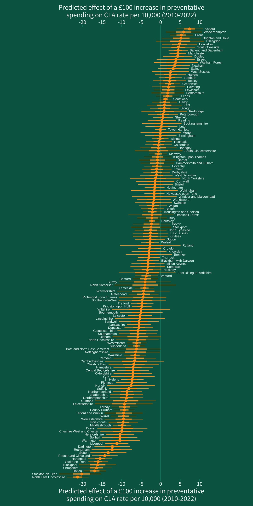

class: middle, title
background-size: contain


<br><br>

# Overview and Introduction
#### SMI105: Week 1

<br><br>

**Dr. Calum Webb**<br>
Sheffield Methods Institute, the University of Sheffield<br>
[c.j.webb@sheffield.ac.uk](mailto:c.j.webb@sheffield.ac.uk)

```{r setup, include=FALSE}
options(htmltools.dir.version = FALSE)

# These packages are required for creating the slides
# Many will need to be installed from Github
library(icons)
library(tidyverse)
library(xaringan)
library(xaringanExtra)
library(xaringanthemer)

# Defaults for code
knitr::opts_chunk$set(
  fig.width=9, fig.height=3.5, fig.retina=3,
  out.width = "100%",
  cache = FALSE,
  echo = TRUE,
  message = FALSE, 
  warning = FALSE,
  fig.show = TRUE,
  hiline = TRUE
)

# set global theme for ggplot to make background #F8F8F8F8 (off white),
# but otherwise keep all ggplot themes default (better for teaching)
theme_set(
  theme(plot.background = element_rect(fill = "#F8F8F8", colour = "#F8F8F8"), 
        panel.background = element_rect(fill = "#F8F8F8", colour = "#F8F8F8"),
        legend.background = element_rect(fill = "#F8F8F8", colour = "#F8F8F8")
        )
  )

```

```{r xaringan-tile-view, echo=FALSE}
# Use tile overview by hitting the o key when presenting
xaringanExtra::use_tile_view()
```

```{r xaringan-logo, echo=FALSE}
# Add logo to top right
xaringanExtra::use_logo(
  image_url = "header/smi-logo-white.png",
  exclude_class = c("inverse", "hide_logo"), 
  width = "180px", position = css_position(top = "1em", right = "2em")
)
```

```{r xaringan-themer, include=FALSE, warning=FALSE}

# Set some global objects containing the colours
# of the university's branding
primary_color <- "#131E29"
secondary_color <- "#440099"
tuos_blue <- "#9ADBE8"
white = "#F8F8F8"
tuos_yellow <- "#FCF281"
tuos_purple <- "#440099"
tuos_red <- "#E7004C"
tuos_midnight <- "#131E29"

# The bulk of the styling is handled by xaringanthemer
style_duo_accent(
  primary_color = "#131E29",
  secondary_color = "#440099",
  colors = c(tuos_purple = "#440099", 
             grey = "#131E2960", 
             tuos_blue ="#9ADBE8",
             tuos_mint = "#00CE7C",
             ac_yellow = '#FEC740'),
  header_font_google = xaringanthemer::google_font("Source Serif Pro", "600", "600i"),
  text_font_google   = xaringanthemer::google_font("Source Sans Pro", "300", "300i", "600", "600i"),
  code_font_google   = xaringanthemer::google_font("Lucida Console"),
  header_h1_font_size = "2rem",
  header_h2_font_size = "1.5rem", 
  header_h3_font_size = "1.25rem", 
  text_font_size = "0.9rem",
  code_font_size = "0.65rem", 
  code_inline_font_size = "0.85rem",
  inverse_text_color = "#9ADBE8", 
  background_color = "#F8F8F8", 
  text_color = "#131E29", 
  link_color = "#005A8F", 
  inverse_link_color = "#F8F8F8",
  text_slide_number_color = "#44009970",
  table_row_even_background_color = "transparent", 
  table_border_color = "#44009970",
  text_bold_font_weight = 600
)

```


```{r xaringan-panelset, echo=FALSE}
# Allow for adding panelsets (see example on slide 2)
xaringanExtra::use_panelset()
```

```{r xaringanExtra, echo = FALSE}
# Adds white progress bar to top
xaringanExtra::use_progress_bar(color = "#F8F8F8", location = "top")
```

```{r xaringan-extra-styles, echo = FALSE}
# Allow for code to be highlighted on hover
xaringanExtra::use_extra_styles(
  hover_code_line = TRUE,         #<<
  mute_unhighlighted_code = TRUE  #<<
)
```

```{r share-again, echo=FALSE}
# Add sharing links and other embedding tools
xaringanExtra::use_share_again()
```

```{r xaringanExtra-search, echo=FALSE}
# Add magnifying glass search function to bottom left for quick
# searching of slides
xaringanExtra::use_search(show_icon = TRUE, auto_search = FALSE)
```

---

class: middle, inverse

# Sign in

---

class: middle

## Learning outcomes

.panelset[

.panel[.panel-name[What will I learn?]

By the end of this week you will:

* Lecture: How the module will operate, where to find more information, how to navigate the module resources, and what we will be doing each week.

* Lecture: What is data visualisation, why do we do it, why does it matter, and how will we approach it?

* Workshop: First steps in `ggplot2` and `R`: how do we create visualisations of data in `R`

]
]


---

class: middle

# Who are we?

.pull-left[

<br>

.center[

## Calum Webb

[c.j.webb@sheffield.ac.uk](mailto:c.j.webb@sheffield.ac.uk)

Research on poverty and the child welfare system in the UK using secondary survey and administrative data in `R`. My most recent project has been about how investment in services for children improves their welfare and safety.

]
]


.pull-right[

.center[

## Lowenna Jones

Lowenna's research focuses on regulation of chemical risk, particularly within the United Kingdom (UK) following the UK's departure from the European Union (EU) (i.e., Brexit).


---

## Kate Montague-Hellen

Kate’s PhD research project aims to explore the impact of an untreated chronic cancer diagnosis on patients, their expectations, and support needs in the first year following diagnosis.


]

]


---

class: inverse, middle


# Here's some data visualisation I've done in my own work and hobbies


---

class: hide-logo
background-color: #006353

.pull-left[

.center[

```{r, echo = FALSE, out.width = '50%'}



```
]

]

.pull-right[
.center[

```{r, echo = FALSE, out.width = '80%'}


```

]
]


---

class: hide-logo
background-color: #00AD92

.center[

```{r, echo = FALSE, out.width = '95%'}


```
]

---

class: hide-logo
background-color: #EADCC9

.center[

```{r, echo = FALSE, out.width = '80%'}


```
]


---

class: hide-logo
background-color: #FBFAE7


.center[

```{r, echo = FALSE, out.width = '50%'}


```
]

### .right[.ac_yellow[I did a lot of Animal Crossing visualisation over the pandemic...]]

---

class: hide-logo
background-color: #FBFAE7

.center[

```{r, echo = FALSE, out.width = '100%'}


```
]

### .right[.ac_yellow[Like...]]

---

class: hide-logo
background-color: #FBFAE7

.center[

```{r, echo = FALSE, out.width = '70%'}


```
]

### .right[.ac_yellow[A lot.]]


---

class: hide-logo, middle
background-color: #000000

.pull-left-small[


<br><br><br><br><br><br><br><br><br><br><br><br><br>

.center[

```{r, echo = FALSE, out.width = '100%'}


```
]

]

.pull-right-big[
.center[

```{r, echo = FALSE, out.width = '90%'}


```

]
]

---

class: inverse, middle

.pull-left[

<br><br><br><br><br><br><br>

# Enough about me, let me ask something about you.

Go to [Wooclap.com](https://app.wooclap.com/FNJKHC) and enter code: **.tuos_blue[FNJKHC]**

]

.pull-right[

.center[

```{r, echo = FALSE, out.width = '100%'}


```

]

]


---

class: inverse, middle

#### Part I

# Overview of the module: How will it work?


---

class: middle

# By the end of this module, you should know about:

.pull-left[

<br>

* The **theory** of data visualisation
* The **practice** of data visualisation
* How to be **critical** about both the theory and practice of data visualisation

To do that, you will be learning how to *create* data visualisations using `R`, how to *design* data visualisations using best practice, and how to be *critical* of the data visualisations you make and see.

We don't assume you know anything about data visualisation, coding, or information design before starting this class!

]

.pull-right[

.center[

```{r, echo = FALSE, out.width = "60%"}


```

]


]


---

class: middle

# By the end of this module, you should know about:

.pull-left[

<br>

* The **theory** of data visualisation
  * **Why is the data visualised in the way it is?**
* The **practice** of data visualisation
  * **How are key ideas implemented to create effective data visualisation?**
* How to be **critical** about both the theory and practice of data visualisation
  * **What is the impact of the things we visualise and the way we visualise them on society and culture?**

.grey[To do that, you will be learning how to *create* data visualisations using `R`, how to *design* data visualisations using best practice, and how to be *critical* of the data visualisations you make and see.

We don't assume you know anything about data visualisation, coding, or information design before starting this class!]

]

.pull-right[

.center[

```{r, echo = FALSE, out.width = "60%"}


```

]


]


---

class: middle

# Logistics

* **Two** teaching sessions per week: 1 hour lecture & 1.5 hour practical workshop

--

* **Lectures** will mostly focus on theory and critical awareness
    * 4pm - 4:50pm Sheffield University Management School, MS Lowe Memorial LT03 (Uphill from the Wave) (Tuesdays, Week 1-5, 7-11)

--

* **Workshops** will focus on the practice of creating data visualisations
    * 09:00-10:30/10:30-12:00/12:00-13:30 in The Wave, Computer Room 2A (Thursdays Week 1-5, 7-11), check your timetable for group allocation.

--

* Slides and worksheets will be posted on Blackboard, usually worksheets will be posted after the workshops.

* Lectures will be recorded either via Encore Lecture Capture or Blackboard Collaborate. **We do our best to ensure all lectures are recorded, but cannot guarantee this.**

---

class: middle, inverse

# Lecture recordings and uploaded worksheets are <u>not</u> a replacement for attending lectures and worksheets.

---

class: middle, inverse

# If attendance at lectures and workshops becomes very poor, we will stop providing lecture recordings. 


---

class: middle

# Weekly Tasks

* For most weeks there are **core** and **supplementary** tasks. 

  * **You are required to complete core weekly tasks**. These are *formative* (ungraded) assessments; you will receive group feedback in the weekly workshops to help you improve and prepare for your *summative* (graded) assessments.
  
  * A full breakdown of all weekly tasks and topics is available [in the module handbook/resource list](https://calumwebb.co.uk/teaching/smi105-content/reading-list/).
  
  * You are not required to complete the supplementary tasks, but you will probably do better in your assessment if you do.
  
---

class: middle, inverse

## This is a 10-credit module and therefore it is expected it will require 100 study hours per student. Formal teaching hours for this module will take 25 hours (lectures and workshops). Therefore, as a rough guide, this means you should expect to devote around 5 hours of study time per week to this module during a 15-week semester.


---

class: middle

# Assessment

.pull-left[

There are two assessments:

* **Assessment 1**: due in November, is worth **30% of final grade**. You will be provided with some real contemporary social science data and asked to produce several different graphs and reflect on what they tell us about the topic.


* **Assessment 2**: due in January, is worth **70% of final grade**. You will be asked to critique and reflect on a published article that contains a data visualisation, and consider how it might be improved. Then, you will need to improve it using the same or related data, explaining the decisions you took.

]

.pull-right[

.center[

```{r, echo = FALSE, out.width = "60%"}


```

]


]


---

class: middle

# Getting help with your studies

.pull-left[

* **Consultation and Feedback hours**

I run two Consultation and Feedback hours per week, you can ask me questions about SMI105.

If you want to book an appointment with me, please use the calendar [here](https://calendar.app.google/3N7v2r6zPYFo4SL7A) or on Blackboard.

* **Piazza Discussion Board**

If you have any questions about the module or any tasks, including errors with `R` code, you can post for help on [the Piazza Discussion Board](https://piazza.com/shef.ac.uk/fall2024/smi105). This is accessible through Blackboard. Also, try to help other students with their questions — it will help you learn!


]

.pull-right[

.center[

```{r, echo = FALSE, out.width = "60%"}


```

]


]


---

class: middle


# Additional Resources & Workshops from the University 

.pull-left[

## [Library](https://www.sheffield.ac.uk/library/study/workshops)

Research Skills and Critical Thinking (RSCT) workshops:

* [Discovering Information: Getting Started](https://www.sheffield.ac.uk/library/study/workshops)
* [Discovering Information: A masterclass](https://www.sheffield.ac.uk/library/study/workshops)

Online resources:

* [How to read a journal article](https://xerte.shef.ac.uk/play.php?template_id=788#page1)
* [Active reading for understanding](https://xerte.shef.ac.uk/play.php?template_id=1076)
* [Tutorials A-Z](https://www.sheffield.ac.uk/library/study/tutorials)


]

.pull-right[

## [301 Skills Centre](https://students.sheffield.ac.uk/301)

* [Academic skills refresher](https://301skills.shef.ac.uk/events/361/upcoming)
* [Reading and note-taking at university](https://301skills.shef.ac.uk/events/263/upcoming)
* [Managing your time and avoiding distractions](https://301skills.shef.ac.uk/events/71/upcoming)
* Study Skills 1-to-1s

## [M.A.S.H.](https://www.sheffield.ac.uk/mash)

[Statistics resources](https://www.sheffield.ac.uk/mash/stats-resources):

* [First steps in R](https://www.sheffield.ac.uk/mash/stats-resources/r)
* [R/Excel/SPSS for Ultra-Beginners](https://students.sheffield.ac.uk/mash/workshops/stats)
* [1-to-1 Support](https://students.sheffield.ac.uk/mash/bookings)

]


---

class: inverse, middle

.pull-left[

<br><br><br><br>

# Let's take a quick tour of the Blackboard page for SMI105

]


.pull-right[

.center[

```{r, echo = FALSE, out.width = "60%"}


```

]


]


---

class: inverse, middle

#### Part II

# Introduction to Data Visualisation


---

background-color: #ffffff

class: middle

.pull-left[

<br><br><br><br>

# What is the purpose of data visualisation? Why do we do it?

* Re-open the [wooclap.com](https://app.wooclap.com/FNJKHC?from=event-page) app and go to Question/Activity 2

]

.pull-right[

.center[

```{r, echo = FALSE, out.width = '100%'}


```

]

]

---


.pull-left-small[

# Data Visualisation 1

**What is the main purpose?**

]

.pull-right-big[

<br>

```{r, echo = FALSE, fig.height=4.5, fig.width=7, out.height=450, out.width=700}

inflation_2y <- tibble(
  year = factor(c("2022", "2023"), levels = c("2022", "2023")),
  inflation = c(7.9, 6.8)
)

inflation_2y %>%
  ggplot() +
  geom_col(aes(x = year, y = inflation)) +
  geom_text(aes(x = year, y = inflation-0.5, label = paste0(inflation, "%")),
            colour = "#f0f0f0", size = 16, vjust = 1) +
  geom_text(aes(x = year, y = inflation+1.3, label = paste0(year)),
            colour = tuos_midnight, size = 16, vjust = 1) +
  ggtitle("Inflation fell year-on-year to 6.8%") +
  theme(title = element_text(size = 14, face = "bold"),
        axis.ticks.x = element_blank(),
        axis.text.x = element_blank()) +
  ylab("Inflation (%)") +
  xlab("")


```

]

.footnote[Wooclap event code: app.wooclap.com/FNJKHC (Activity 2)]

---


.pull-left-small[

# Data Visualisation 1

**What is the main purpose?**

* To communicate information.


]

.pull-right-big[

<br>

```{r, echo = FALSE, fig.height=4.5, fig.width=7, out.height=450, out.width=700}

inflation_2y <- tibble(
  year = factor(c("2022", "2023"), levels = c("2022", "2023")),
  inflation = c(7.9, 6.8)
)

inflation_2y %>%
  ggplot() +
  geom_col(aes(x = year, y = inflation)) +
  geom_text(aes(x = year, y = inflation-0.5, label = paste0(inflation, "%")),
            colour = "#f0f0f0", size = 16, vjust = 1) +
  geom_text(aes(x = year, y = inflation+1.3, label = paste0(year)),
            colour = tuos_midnight, size = 16, vjust = 1) +
  ggtitle("Inflation fell year-on-year to 6.8%") +
  theme(title = element_text(size = 14, face = "bold"),
        axis.ticks.x = element_blank(),
        axis.text.x = element_blank()) +
  ylab("Inflation (%)") +
  xlab("")


```

]


.footnote[Wooclap event code: app.wooclap.com/FNJKHC (Activity 2)]

---

class: hide-logo, inverse
background-color: #006353


.pull-left-small[

# Data Visualisation 2

**.tuos_blue[What is the main purpose?]**

* To communicate information


]

.pull-right-big[

<br>

```{r, echo = FALSE, out.width = "90%"}


```

]

.footnote[Wooclap event code: app.wooclap.com/FNJKHC (Activity 2)]


---

class: hide-logo, inverse
background-color: #006353


.pull-left-small[

# Data Visualisation 2

**.tuos_blue[What is the main purpose?]**

* To communicate information

* To tell a story


]

.pull-right-big[

<br>

```{r, echo = FALSE, out.width = "90%"}


```

]

.footnote[Wooclap event code: app.wooclap.com/FNJKHC (Activity 2)]


---

background-color: #ffffff

.pull-left-small[

# Data Visualisation 3

**.tuos_blue[What is the main purpose?]**

* To communicate information

* To tell a story

]

.pull-right-big[

<br><br><br><br><br><br>

On a piece of paper in your notebook (if you have one), or by drawing with your finger or describing to your neighbour, draw a representation of the following table to illustrate the difference between "Party A"'s £2million commitment to spending and "Party B"'s £2billion commitment to spending.

```{r, echo = FALSE}

party_commitments <- tibble(
  Party = c("Party A", "Party B"),
  `Spending Commitment` = c("£2million", "£2billion")
)

knitr::kable(party_commitments)

```

]

.footnote[Wooclap event code: app.wooclap.com/FNJKHC (Activity 2)]


---

background-color: #ffffff

.pull-left-small[

# Data Visualisation 3

**.tuos_blue[What is the main purpose?]**

* To communicate information

* To tell a story

* To use our visual sense to understand data, detect patterns, etc., rather than language and logical processing

]

.pull-right-big[

<br>

```{r, echo = FALSE, fig.height=4.5, fig.width=7, out.height=450, out.width=700}


library(gganimate)

party_spend <- tibble(
  party = factor(c("Party A", "Party B"), levels = c("Party B", "Party A")),
  spending_promise = c(2000000, 2000000000)
)

party_spend_animated <- tibble(
  spending_promise = c(seq(0, 2000000, 100000), seq(0, 2000000, 100000),
                       seq(2000000, 2000000000, 20000000), rep(2000000, length(seq(2000000, 2000000000, 20000000))) ),
  ) %>%
  mutate(
    frame = c(1:length(seq(0, 2000000, 100000)), 1:length(seq(0, 2000000, 100000)), length(seq(2000000, 2000000, 100000))+1:length(seq(2000000, 2000000000, 20000000)), length(seq(2000000, 2000000, 100000))+1:length(seq(2000000, 2000000000, 20000000) ) ),
    party = c(rep("Party A", length(seq(0, 2000000, 100000))), rep("Party B", length(seq(0, 2000000, 100000))), rep("Party B", length(seq(2000000, 2000000000, 20000000))), rep("Party A", length(seq(2000000, 2000000000, 20000000))) )
  )

p <- party_spend_animated %>%
  mutate(party = factor(party, levels = c("Party B", "Party A"))) %>%
  ggplot() +
  geom_col(aes(y = party, x = spending_promise), fill = tuos_purple) +
  facet_wrap(~frame, scales = "free_x") +
  scale_x_continuous(labels = scales::label_dollar(prefix = "£")) +
  ylab("") +
  xlab("Spending Manifesto Promise") +
  theme(
    plot.background = element_rect(fill = "#ffffff", colour = "#ffffff"),
    panel.background = element_rect(fill = "#ffffff", colour = "#ffffff"),
    axis.title = element_text(size = 12, colour = tuos_purple),
    axis.text =  element_text(size = 10, colour = tuos_purple),
    axis.line = element_line(colour = tuos_purple),
    panel.grid = element_line(colour = tuos_purple)
  )

options(gganimate.nframes = 244)

p_anim <- p + facet_null() +
  transition_time(frame) +
  view_follow() +
  ease_aes('linear')

animate(p_anim,
        end_pause = 30)

```

]

.footnote[Wooclap event code: app.wooclap.com/FNJKHC (Activity 2)]


---

class: hide-logo, inverse
background-color: #000000

.pull-left-small[

# Data Visualisation 4

**.tuos_blue[What is the main purpose?]**

* To communicate information

* To tell a story

* To use our visual sense to understand data, detect patterns, etc., rather than language and logical processing

]


.pull-right-big[

.center[

```{r, echo = FALSE, out.width = '80%'}


```
]


]


.footnote[Wooclap event code: app.wooclap.com/FNJKHC (Activity 2)]


---

class: hide-logo, inverse
background-color: #000000

.pull-left-small[

# Data Visualisation 4

**.tuos_blue[What is the main purpose?]**

* To communicate information

* To tell a story

* To use our visual sense to understand data, detect patterns, etc., rather than language and logical processing

* To look cool! Data visualisation can be art. E.g. see Generative Data Visualisation Art by [Thomas Lin Pedersen](https://thomaslinpedersen.art/work/) and [Danielle Navarro](https://art.djnavarro.net/gallery/)

]


.pull-right-big[

.center[

```{r, echo = FALSE, out.width = '80%'}


```
]


]


.footnote[Wooclap event code: app.wooclap.com/FNJKHC (Activity 2)]

---

class: inverse, middle

# ‘[Data visualisation is] the representation and presentation of data to facilitate understanding’ 

.right[Andy Kirk, (2016), Data Visualisation: A Handbook for Data Driven Design]


---

class: inverse, middle


# What assumptions do these data visualisations make, and reinforce, about society?


---

.pull-left-small[

# Data Visualisation 1


]

.pull-right-big[

<br>

.center[

```{r, echo = FALSE, fig.height=4.5, fig.width=7, out.height=450, out.width=700}

us_rent_income <- tidyr::us_rent_income

us_rent_income %>%
  group_by(NAME, variable) %>%
  summarise(
    estimate = median(estimate)
  ) %>%
  mutate(
    estimate = ifelse(variable == "rent", estimate*12, estimate),
    variable = ifelse(variable == "rent", "Rent", "Income")
  ) %>%
  ggplot() +
  geom_boxplot(aes(x = variable, y = estimate, fill = variable),
               colour = "grey20") +
  scale_fill_manual(values = c("#FE522F", "#42AB48")) +
  ggeasy::easy_add_legend_title("") +
  ylab("Cost over 12 months ($)") +
  xlab("") +
  theme(
    axis.text.x = element_blank(),
    axis.ticks.x = element_blank()
  )


```

]]


.footnote[Wooclap event code: app.wooclap.com/FNJKHC (Activity 3)]

---

.pull-left-small[

# Data Visualisation 1

* Assumes everyone is able to access red-green colour schemes


]

.pull-right-big[

<br>

.center[

```{r, echo = FALSE, fig.height=4.5, fig.width=7, out.height=450, out.width=700}

us_rent_income <- tidyr::us_rent_income

us_rent_income %>%
  group_by(NAME, variable) %>%
  summarise(
    estimate = median(estimate)
  ) %>%
  mutate(
    estimate = ifelse(variable == "rent", estimate*12, estimate),
    variable = ifelse(variable == "rent", "Rent", "Income")
  ) %>%
  ggplot() +
  geom_boxplot(aes(x = variable, y = estimate, fill = variable),
               colour = "grey20") +
  scale_fill_manual(values = c("#9E8B02", "#B09E29")) +
  ggeasy::easy_add_legend_title("") +
  ylab("Cost over 12 months ($)") +
  xlab("") +
  theme(
    axis.text.x = element_blank(),
    axis.ticks.x = element_blank()
  )


```

]]


.footnote[Wooclap event code: app.wooclap.com/FNJKHC (Activity 3)]


---

class: hide-logo
background-color: #EADCC9

.pull-left-small[

# Data Visualisation 2

* Assumes everyone is able to access red-green colour schemes


]

.pull-right-big[

<br>

.center[

```{r, echo = FALSE, out.width = "90%"}


```

]]

.footnote[Wooclap event code: app.wooclap.com/FNJKHC (Activity 3)]


---

class: hide-logo
background-color: #EADCC9

.pull-left-small[

# Data Visualisation 2

* Assumes everyone is able to access red-green colour schemes

* Reinforces the idea that ethnicity and race can be categorised into distinct groups


]

.pull-right-big[

<br>

.center[

```{r, echo = FALSE, out.width = "90%"}


```

]]

.footnote[Wooclap event code: app.wooclap.com/FNJKHC (Activity 3)]


---

.pull-left-small[

# Data Visualisation 3

* Assumes everyone is able to access red-green colour schemes

* Reinforces the idea that ethnicity and race can be categorised into distinct groups


]

.pull-right-big[

<br>

.center[

```{r, echo = FALSE, out.width = "75%"}


```

]]


.footnote[Wooclap event code: app.wooclap.com/FNJKHC (Activity 3)]


---

.pull-left-small[

# Data Visualisation 3

* Assumes everyone is able to access red-green colour schemes

* Reinforces the idea that ethnicity and race can be categorised into distinct groups

* Reinforces dominant (settler) forms of knowledge over other (indigenous) forms of knowledge


]

.pull-right-big[

<br>

.center[

```{r, echo = FALSE, out.width = "90%"}


```

]]


.footnote[Wooclap event code: app.wooclap.com/FNJKHC (Activity 3)]

---

class: inverse, middle


# “If you’re designing technology for society and you don’t know anything about society, you’re unqualified.” 

.right[Quote from Safiya Noble presenting her book Algorithms of Oppression, hosted by Open Data Manchester, 8th May 2018 ]

---

class: inverse, middle

## “…some groups experience unearned advantages—because various systems have been designed by people like them and work for people like them—and other groups experience systematic disadvantages—because those same systems were not designed by them or with people like them in mind”

.right[D’Ignazio, C. and Klein, L. (2020) Data Feminism (p.24)]


---

class: middle

# Summary: So, what is data visualisation?

* Data visualisation is an **object** — a chart, a graph, a map — that follows a set of rules and principles, where parameters are defined by data

--

* Data visualisation is also a **process** — an act of transformation and reproduction of best practice in order to tell a story or to make sense of the world visually

--

* Data visualisation is also a **social phenomenon** — it is related to power, can reinforce or challenges societal norms or assumptions, and shapes how people engage with information

---

# The rest of this week:

.pull-left[

<br><br>

**This week's workshop**:

* Computer Room 2a, SMI, The Wave
* You can take and use your own laptop if you like
* 09:00-10:30, 10:30-12:00, or 12:00-13:30

**Do you know when and where you are going?**

If not clear from your timetable which group you're in, email [smi@sheffield.ac.uk](mailto:smi@sheffield.ac.uk) 

**You will not be permitted to move group without a very good reason.**


]

--

.pull-right[

**Before week 2**:

**Core tasks**:
* Before lecture: Read this module handbook in full
* Before workshop: If you’ve got a personal machine, get R and RStudio installed on it (instructions on how to do this will be in the Week 2 learning resources folder)
* Having done so, work through the workshop handout once again to check it works on your machine (if it doesn’t, don’t worry, we’ll go through and troubleshoot it together)

**Supplementary tasks:**

* Before lecture: Read Top 5 things to look for in a visualisation on the Seeing Data website: https://seeingdata.org/developing-visualisation-literacy/top-5-things-to-look-for-in-a-visualisation/ 

]


