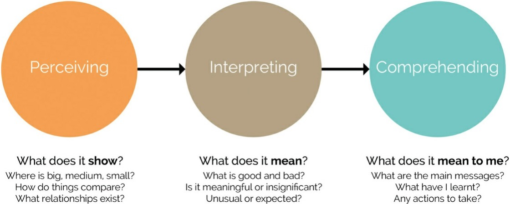
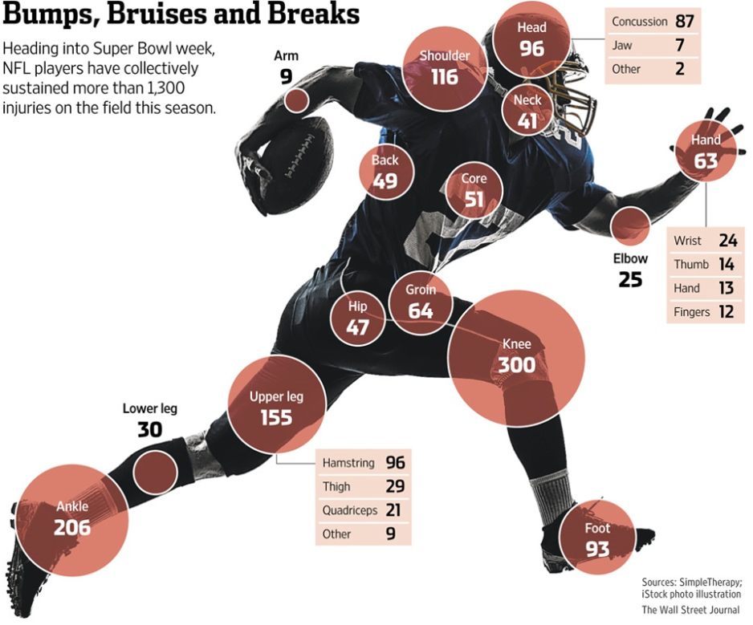
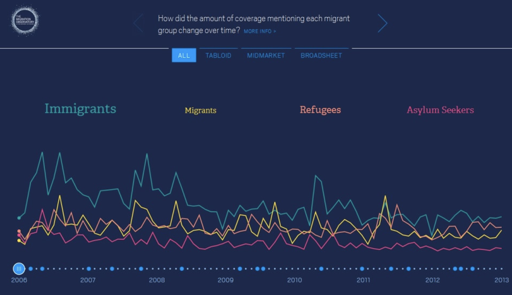
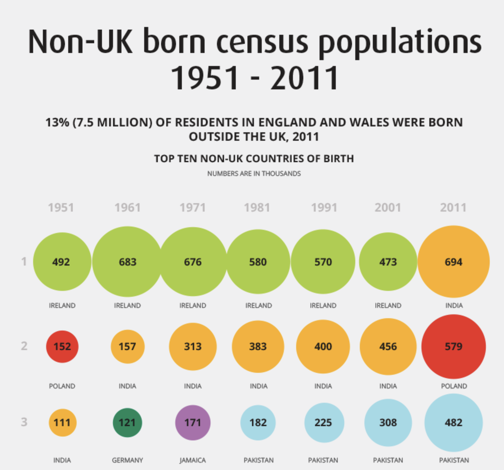
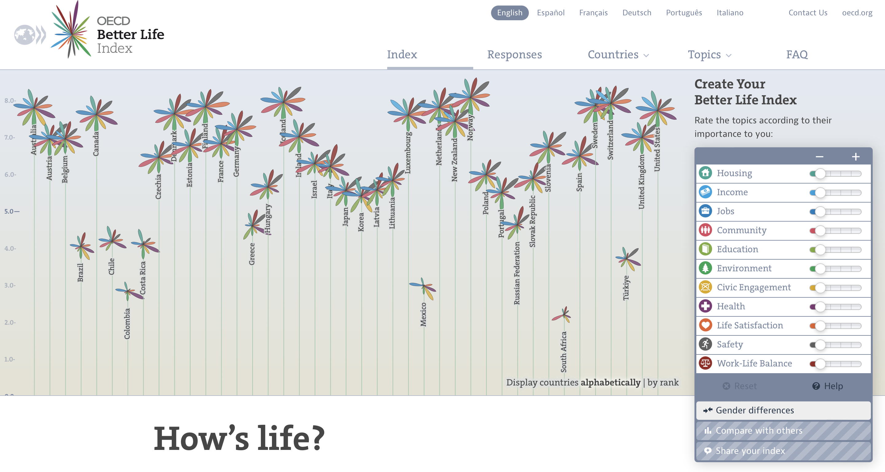
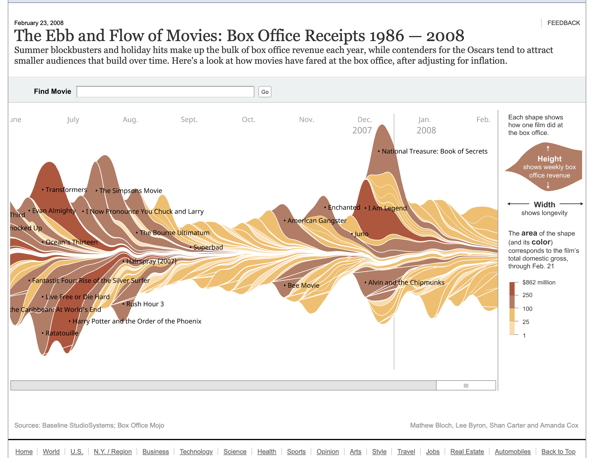
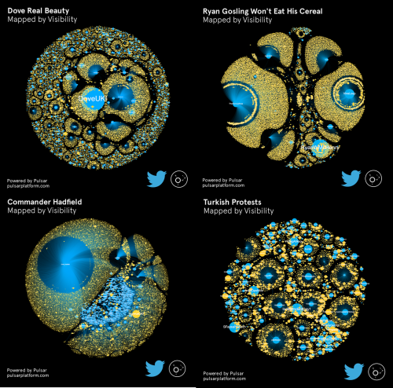

class: middle, title
background-size: contain

<!----- Make a pdf using:

decktape generic --key=ArrowRight --load-pause 1800 --slides '1-39' --size '1216x684'  "week-02/slides/smi105-week-2.html" week-02/slides/smi105-week-2.pdf

----->

<br><br>

# Interpreting a Data Visualisation
#### EDC101: Week 2

<br><br>

**Dr. Calum Webb**<br>
Sheffield Methods Institute, the University of Sheffield<br>
[c.j.webb@sheffield.ac.uk](mailto:c.j.webb@sheffield.ac.uk)

```{r setup, include=FALSE}
options(htmltools.dir.version = FALSE)

# These packages are required for creating the slides
# Many will need to be installed from Github
library(icons)
library(tidyverse)
library(xaringan)
library(xaringanExtra)
library(xaringanthemer)

# Defaults for code
knitr::opts_chunk$set(
  fig.width=9, fig.height=3.5, fig.retina=3,
  out.width = "100%",
  cache = FALSE,
  echo = TRUE,
  message = FALSE, 
  warning = FALSE,
  fig.show = TRUE,
  hiline = TRUE
)

# set global theme for ggplot to make background #F8F8F8F8 (off white),
# but otherwise keep all ggplot themes default (better for teaching)
theme_set(
  theme(plot.background = element_rect(fill = "#F8F8F8", colour = "#F8F8F8"), 
        panel.background = element_rect(fill = "#F8F8F8", colour = "#F8F8F8"),
        legend.background = element_rect(fill = "#F8F8F8", colour = "#F8F8F8")
        )
  )

```

```{r xaringan-tile-view, echo=FALSE}
# Use tile overview by hitting the o key when presenting
xaringanExtra::use_tile_view()
```

```{r xaringan-logo, echo=FALSE}
# Add logo to top right
xaringanExtra::use_logo(
  image_url = "header/smi-logo-white.png",
  exclude_class = c("inverse", "hide_logo"), 
  width = "180px", position = css_position(top = "1em", right = "2em")
)
```

```{r xaringan-themer, include=FALSE, warning=FALSE}

# Set some global objects containing the colours
# of the university's branding
primary_color <- "#131E29"
secondary_color <- "#440099"
tuos_blue <- "#9ADBE8"
white = "#F8F8F8"
tuos_yellow <- "#FCF281"
tuos_purple <- "#440099"
tuos_red <- "#E7004C"
tuos_midnight <- "#131E29"

# The bulk of the styling is handled by xaringanthemer
style_uos <- style_duo_accent(
  primary_color = "#131E29",
  secondary_color = "#440099",
  colors = c(tuos_purple = "#440099", 
             grey = "#131E2960", 
             tuos_blue ="#9ADBE8",
             tuos_mint = "#00CE7C",
             ac_yellow = '#FEC740'),
  header_font_google = xaringanthemer::google_font("Source Serif Pro", "600", "600i"),
  text_font_google   = xaringanthemer::google_font("Source Sans Pro", "300", "300i", "600", "600i"),
  code_font_google   = xaringanthemer::google_font("Lucida Console"),
  header_h1_font_size = "2rem",
  header_h2_font_size = "1.5rem", 
  header_h3_font_size = "1.25rem", 
  text_font_size = "0.9rem",
  code_font_size = "0.65rem", 
  code_inline_font_size = "0.85rem",
  inverse_text_color = "#9ADBE8", 
  background_color = "#F8F8F8", 
  text_color = "#131E29", 
  link_color = "#005A8F", 
  inverse_link_color = "#F8F8F8",
  text_slide_number_color = "#44009970",
  table_row_even_background_color = "transparent", 
  table_border_color = "#44009970",
  text_bold_font_weight = 600
)

style_uos

```


```{r xaringan-panelset, echo=FALSE}
# Allow for adding panelsets (see example on slide 2)
xaringanExtra::use_panelset()
```

```{r xaringanExtra, echo = FALSE}
# Adds white progress bar to top
xaringanExtra::use_progress_bar(color = "#F8F8F8", location = "top")
```

```{r xaringan-extra-styles, echo = FALSE}
# Allow for code to be highlighted on hover
xaringanExtra::use_extra_styles(
  hover_code_line = TRUE,         #<<
  mute_unhighlighted_code = TRUE  #<<
)
```

```{r share-again, echo=FALSE}
# Add sharing links and other embedding tools
xaringanExtra::use_share_again()
```

```{r xaringanExtra-search, echo=FALSE}
# Add magnifying glass search function to bottom left for quick
# searching of slides
xaringanExtra::use_search(show_icon = TRUE, auto_search = FALSE)
```

---

class: middle, inverse

# Sign in

---

class: middle

## Learning outcomes

.panelset[

.panel[.panel-name[What will I learn?]

By the end of this week you will:

* Lecture: How to 'read' a data visualisation, how to identify key structural and aesthetic parameters in their construction, and how they can be manipulated.

* Lecture: What social and societal factors influence engagement.

* Workshop: How to create bar charts to visualise data

]
]


---

class: inverse, middle


#### Part I
# The anatomy of a data visualisation


```{r, echo = FALSE, include=FALSE}

polling_data <- read_csv(here::here("week-02/slides/data/president_polls.csv"))

min(polling_data$start_date)
max(polling_data$start_date)

polling_data <- polling_data %>%
  filter(!is.na(start_date)) %>%
  mutate(
    start_date = mdy(start_date),
    end_date = mdy(end_date)
  ) 

names(polling_data)

polling_data <- polling_data %>%
  filter(
    str_detect(candidate_name, pattern = "Trump|Harris")
  )

polling_data <- polling_data %>%
  filter(
    start_date > date("2024-07-21")
  )

polling_data %>%
  ggplot() +
  geom_smooth(aes(x = end_date, y = pct, colour = candidate_name))


```   


---


.pull-left-big[

<br>

```{r, echo = FALSE, out.width=750, out.height=520, fig.width=7.5, fig.height=5.2}

pollplot <- polling_data %>%
  ggplot() +
  geom_point(aes(x = end_date, y = pct, colour = candidate_name, size = sample_size),
             alpha = 0.1) +
  geom_smooth(aes(x = end_date, y = pct, colour = candidate_name), se = FALSE) +
  scale_colour_manual(values = c("#E81B23", "#00AEF3")) +
  scale_y_continuous(labels = scales::percent_format(scale = 1)) +
  ggtitle("Current polling data for 2024 US Presidential Election",
           subtitle = "Line indicates average of polls, dots indicate individual poll results") +
  ylab("Percent of Votes") +
  xlab("Poll Date") +
  labs(size = "Sample Size", colour = "Candidate", 
       caption = "<br>Data from fivethirtyeight github.com/fivethirtyeight/data (23rd Sept 2024), visualisation by<br>Dr. C Webb, University of Sheffield") +
  theme(plot.title = ggtext::element_markdown(colour = tuos_midnight, hjust = 0,
                                              size = rel(1.5)),
        plot.subtitle = ggtext::element_markdown(colour = tuos_midnight, hjust = 0,
                                              size = rel(1.2)),
        axis.title = ggtext::element_markdown(colour = tuos_midnight, hjust = 0.5,
                                              size = rel(1.2)),
        axis.text = ggtext::element_markdown(colour = tuos_midnight, hjust = 0.5,
                                              size = rel(1)),
        legend.title = ggtext::element_markdown(colour = tuos_midnight, hjust = 0,
                                              size = rel(1)),
        legend.text = ggtext::element_markdown(colour = tuos_midnight, hjust = 0,
                                              size = rel(0.8)),
        plot.caption = ggtext::element_markdown(colour = tuos_midnight, hjust = 1,
                                              size = rel(0.8)),
        axis.ticks = element_line(colour = tuos_midnight)
        ) 

pollplot


```

]


.pull-right-small[

<br>

### The Anatomy of a Chart

]


---


.pull-left-big[

<br>

```{r, echo = FALSE, out.width=750, out.height=520, fig.width=7.5, fig.height=5.2}


polling_data %>%
  ggplot() +
  geom_point(aes(x = end_date, y = pct, colour = candidate_name, size = sample_size),
             alpha = 0.1) +
  geom_smooth(aes(x = end_date, y = pct, colour = candidate_name), se = FALSE) +
  scale_colour_manual(values = c("grey50", "grey50")) +
  scale_y_continuous(labels = scales::percent_format(scale = 1)) +
  ggtitle("Current polling data for 2024 US Presidential Election",
           subtitle = "Line indicates average of polls, dots indicate individual poll results") +
  ylab("Percent of Votes") +
  xlab("Poll Date") +
  labs(size = "Sample Size", colour = "Candidate", 
       caption = "<br>Data from fivethirtyeight github.com/fivethirtyeight/data (23rd Sept 2024), visualisation by<br>Dr. C Webb, University of Sheffield") +
  theme(plot.title = ggtext::element_markdown(colour = tuos_purple, hjust = 0,
                                              size = rel(1.5)),
        plot.subtitle = ggtext::element_markdown(colour = tuos_purple, hjust = 0,
                                              size = rel(1.2)),
        axis.title = ggtext::element_markdown(colour = "grey50", hjust = 0.5,
                                              size = rel(1.2)),
        axis.text = ggtext::element_markdown(colour = "grey50", hjust = 0.5,
                                              size = rel(1)),
        legend.title = ggtext::element_markdown(colour = "grey50", hjust = 0,
                                              size = rel(1)),
        legend.text = ggtext::element_markdown(colour = "grey50", hjust = 0,
                                              size = rel(0.8)),
        plot.caption = ggtext::element_markdown(colour = "grey50", hjust = 1,
                                              size = rel(0.8)),
        axis.ticks = element_line(colour = "grey50")
        ) 

```

]


.pull-right-small[

<br>

### The Anatomy of a Chart

* **The Title**
  * Is there a title?
  * Does the title give you information about what to expect from the chart?
  * Does the chart show or support what the title states?

]


---


.pull-left-big[

<br>

```{r, echo = FALSE, out.width=750, out.height=520, fig.width=7.5, fig.height=5.2}

polling_data %>%
  ggplot() +
  geom_point(aes(x = end_date, y = pct, size = sample_size),
             alpha = 0.1, colour = "grey50") +
  geom_smooth(aes(x = end_date, y = pct, colour = candidate_name), se = FALSE) +
  geom_smooth(aes(x = end_date, y = pct, group = candidate_name), colour = "grey50", se = FALSE) +
  scale_colour_manual(values = c("#E81B23", "#00AEF3")) +
  scale_y_continuous(labels = scales::percent_format(scale = 1)) +
  ggtitle("Current polling data for 2024 US Presidential Election",
           subtitle = "Line indicates average of polls, dots indicate individual poll results") +
  ylab("Percent of Votes") +
  xlab("Poll Date") +
  labs(size = "Sample Size", colour = "Candidate", 
       caption = "<br>Data from fivethirtyeight github.com/fivethirtyeight/data (23rd Sept 2024), visualisation by<br>Dr. C Webb, University of Sheffield") +
  theme(plot.title = ggtext::element_markdown(colour = "grey50", hjust = 0,
                                              size = rel(1.5)),
        plot.subtitle = ggtext::element_markdown(colour = "grey50", hjust = 0,
                                              size = rel(1.2)),
        axis.title = ggtext::element_markdown(colour = "grey50", hjust = 0.5,
                                              size = rel(1.2)),
        axis.text = ggtext::element_markdown(colour = "grey50", hjust = 0.5,
                                              size = rel(1)),
        legend.title = ggtext::element_markdown(colour = tuos_purple, hjust = 0,
                                              size = rel(1)),
        legend.text = ggtext::element_markdown(colour = tuos_purple, hjust = 0,
                                              size = rel(0.8)),
        plot.caption = ggtext::element_markdown(colour = "grey50", hjust = 1,
                                              size = rel(0.8)),
        axis.ticks = element_line(colour = "grey50")
        ) 


```

]


.pull-right-small[

<br>

### The Anatomy of a Chart

* The Title
* **The Key/Legend**
  * Is there a key?
  * What does it tell you about the different colours & shapes in the chart?
  * Does it help you understand how to read it?
  * The key is not always a separate element, sometimes it can be embedded in the title (e.g. certain colours highlighted)


]


---


.pull-left-big[

<br>

```{r, echo = FALSE, out.width=750, out.height=520, fig.width=7.5, fig.height=5.2}

pollplot <- polling_data %>%
  ggplot() +
  geom_point(aes(x = end_date, y = pct, colour = candidate_name, size = sample_size),
             alpha = 0.1) +
  geom_smooth(aes(x = end_date, y = pct, colour = candidate_name), se = FALSE) +
  scale_colour_manual(values = c("grey50", "grey50")) +
  scale_y_continuous(labels = scales::percent_format(scale = 1)) +
  ggtitle("Current polling data for 2024 US Presidential Election",
           subtitle = "Line indicates average of polls, dots indicate individual poll results") +
  ylab("Percent of Votes") +
  xlab("Poll Date") +
  labs(size = "Sample Size", colour = "Candidate", 
       caption = "<br>Data from fivethirtyeight github.com/fivethirtyeight/data (23rd Sept 2024), visualisation by<br>Dr. C Webb, University of Sheffield") +
  theme(plot.title = ggtext::element_markdown(colour = "grey50", hjust = 0,
                                              size = rel(1.5)),
        plot.subtitle = ggtext::element_markdown(colour = "grey50", hjust = 0,
                                              size = rel(1.2)),
        axis.title = ggtext::element_markdown(colour = tuos_purple, hjust = 0.5,
                                              size = rel(1.2)),
        axis.text = ggtext::element_markdown(colour = tuos_purple, hjust = 0.5,
                                              size = rel(1)),
        legend.title = ggtext::element_markdown(colour = "grey50", hjust = 0,
                                              size = rel(1)),
        legend.text = ggtext::element_markdown(colour = "grey50", hjust = 0,
                                              size = rel(0.8)),
        plot.caption = ggtext::element_markdown(colour = "grey50", hjust = 1,
                                              size = rel(0.8)),
        axis.ticks = element_line(colour = tuos_purple),
        axis.line = element_line(colour = tuos_purple)
        ) 

pollplot


```

]


.pull-right-small[

<br>

### The Anatomy of a Chart

* The Title
* The Key/Legend
* **The Axes & Scales**
  * What are the scales? (positions on X & Y axis, size of points, shade of colour)
  * Do the scales start at 0? If not, why not?
  * What is the range of values?
  * Which values are good or bad, high or low?
  * Have the scales been transformed in any way or are they linear? (linear means that, for example, an increase of 5 covers the same distance anywhere on the axis)

]

---


.pull-left-big[

<br>

```{r, echo = FALSE, out.width=750, out.height=520, fig.width=7.5, fig.height=5.2}

pollplot <- polling_data %>%
  ggplot() +
  geom_point(aes(x = end_date, y = pct, colour = candidate_name, size = sample_size),
             alpha = 0.1) +
  geom_smooth(aes(x = end_date, y = pct, colour = candidate_name), se = FALSE) +
  scale_colour_manual(values = c("#E81B23", "#00AEF3")) +
  scale_y_continuous(labels = scales::percent_format(scale = 1)) +
  ggtitle("Current polling data for 2024 US Presidential Election",
           subtitle = "Line indicates average of polls, dots indicate individual poll results") +
  ylab("Percent of Votes") +
  xlab("Poll Date") +
  labs(size = "Sample Size", colour = "Candidate", 
       caption = "<br>Data from fivethirtyeight github.com/fivethirtyeight/data (23rd Sept 2024), visualisation by<br>Dr. C Webb, University of Sheffield") +
  theme(plot.title = ggtext::element_markdown(colour = "grey50", hjust = 0,
                                              size = rel(1.5)),
        plot.subtitle = ggtext::element_markdown(colour = "grey50", hjust = 0,
                                              size = rel(1.2)),
        axis.title = ggtext::element_markdown(colour = "grey50", hjust = 0.5,
                                              size = rel(1.2)),
        axis.text = ggtext::element_markdown(colour = "grey50", hjust = 0.5,
                                              size = rel(1)),
        legend.title = ggtext::element_markdown(colour = "grey50", hjust = 0,
                                              size = rel(1)),
        legend.text = ggtext::element_markdown(colour = "grey50", hjust = 0,
                                              size = rel(0.8)),
        plot.caption = ggtext::element_markdown(colour = "grey50", hjust = 1,
                                              size = rel(0.8)),
        axis.ticks = element_line(colour = "grey50")
        ) 

pollplot


```

]


.pull-right-small[

<br>

### The Anatomy of a Chart

* The Title
* The Key/Legend
* The Axes & Scales
* **The Data**
  * What are the biggest categories? Do they represent proportions, relative differences, or frequencies? (Bar Charts/Histograms/Area Charts)
  * What is the relationship between two variables? (e.g. Scatterplots, Heatmaps, Stacked/Grouped Bar Charts)
  * What is the relationship over time (when one axis is time, line charts)? Is upward movement good or bad? Do lines interact? Are there seasonal trends? 
  * How much *variation* is there, and is variation shown at all? 

]


---


.pull-left-big[

<br>

```{r, echo = FALSE, out.width=750, out.height=520, fig.width=7.5, fig.height=5.2}

pollplot <- polling_data %>%
  ggplot() +
  geom_point(aes(x = end_date, y = pct, colour = candidate_name, size = sample_size),
             alpha = 0.1) +
  geom_smooth(aes(x = end_date, y = pct, colour = candidate_name), se = FALSE) +
  scale_colour_manual(values = c("grey50", "grey50")) +
  scale_y_continuous(labels = scales::percent_format(scale = 1)) +
  ggtitle("Current polling data for 2024 US Presidential Election",
           subtitle = "Line indicates average of polls, dots indicate individual poll results") +
  ylab("Percent of Votes") +
  xlab("Poll Date") +
  labs(size = "Sample Size", colour = "Candidate", 
       caption = "<br>Data from fivethirtyeight github.com/fivethirtyeight/data (23rd Sept 2024), visualisation by<br>Dr. C Webb, University of Sheffield") +
  theme(plot.title = ggtext::element_markdown(colour = "grey50", hjust = 0,
                                              size = rel(1.5)),
        plot.subtitle = ggtext::element_markdown(colour = "grey50", hjust = 0,
                                              size = rel(1.2)),
        axis.title = ggtext::element_markdown(colour = "grey50", hjust = 0.5,
                                              size = rel(1.2)),
        axis.text = ggtext::element_markdown(colour = "grey50", hjust = 0.5,
                                              size = rel(1)),
        legend.title = ggtext::element_markdown(colour = "grey50", hjust = 0,
                                              size = rel(1)),
        legend.text = ggtext::element_markdown(colour = "grey50", hjust = 0,
                                              size = rel(0.8)),
        plot.caption = ggtext::element_markdown(colour = tuos_purple, hjust = 1,
                                              size = rel(0.8)),
        axis.ticks = element_line(colour = "grey50")
        ) 

pollplot


```

]


.pull-right-small[

<br>

### The Anatomy of a Chart

* The Title
* The Key/Legend
* The Axes & Scales
* The Data
* **The Source of the Data**
  * Is there a source provided?
  * Can the source of the data be trusted/verified?
  * If there is no source, can we be sure the data is accurate and truthful? How easy would it be to verify?
  * Has the author been willing to put their name on the visualisation? If not, why not?

]


---


.pull-left-big[

<br>

```{r, echo = FALSE, out.width=750, out.height=520, fig.width=7.5, fig.height=5.2}

pollplot <- polling_data %>%
  ggplot() +
  geom_point(aes(x = end_date, y = pct, colour = candidate_name, size = sample_size),
             alpha = 0.1) +
  geom_smooth(aes(x = end_date, y = pct, colour = candidate_name), se = FALSE) +
  scale_colour_manual(values = c("grey50", "grey50")) +
  scale_y_continuous(labels = scales::percent_format(scale = 1)) +
  ggtitle("Current polling data for 2024 US Presidential Election",
           subtitle = "Line indicates average of polls, dots indicate individual poll results") +
  ylab("Percent of Votes") +
  xlab("Poll Date") +
  labs(size = "Sample Size", colour = "Candidate", 
       caption = "<br>Data from fivethirtyeight github.com/fivethirtyeight/data (23rd Sept 2024), visualisation by<br>Dr. C Webb, University of Sheffield") +
  theme(plot.title = ggtext::element_markdown(colour = "grey50", hjust = 0,
                                              size = rel(1.5)),
        plot.subtitle = ggtext::element_markdown(colour = "grey50", hjust = 0,
                                              size = rel(1.2)),
        axis.title = ggtext::element_markdown(colour = "grey50", hjust = 0.5,
                                              size = rel(1.2)),
        axis.text = ggtext::element_markdown(colour = "grey50", hjust = 0.5,
                                              size = rel(1)),
        legend.title = ggtext::element_markdown(colour = "grey50", hjust = 0,
                                              size = rel(1)),
        legend.text = ggtext::element_markdown(colour = "grey50", hjust = 0,
                                              size = rel(0.8)),
        plot.caption = ggtext::element_markdown(colour = "grey50", hjust = 1,
                                              size = rel(0.8)),
        axis.ticks = element_line(colour = "grey50")
        ) 

pollplot


```

]


.pull-right-small[

<br>

### The Anatomy of a Chart

* The Title
* The Key/Legend
* The Axes & Scales
* The Data
* The Source of the Data
* **Information outside the visualisation**
  * Format and prominence
  * Titles, URL, author, sponsor, funder
  * Introductions & guides (how do I use and interpret this visualisation/interactive tool)
  * Layout
  * Data sources and treatment (how has data been transformed)
  * Interactive features

]

---

class: middle
background-color: #ffffff

.center[

```{r echo = FALSE, out.width="75%"}



```

]

.footnote[Kirk 2016, fig 1.3, The Three Stages of Understanding, p.22]

---

class: middle, inverse


# How can we manipulate these parts of a data visualisation, using <u>bad practice</u> to construct a specific narrative? 


---

.pull-left-big[

<br>

```{r, echo = FALSE, out.width=750, out.height=520, fig.width=7.5, fig.height=5.2}

pollplot <- polling_data %>%
  ggplot() +
  geom_point(aes(x = end_date, y = pct, colour = candidate_name, size = sample_size),
             alpha = 0.1) +
  geom_smooth(aes(x = end_date, y = pct, colour = candidate_name), se = FALSE) +
  scale_colour_manual(values = c("#E81B23", "#00AEF3")) +
  scale_y_continuous(labels = scales::percent_format(scale = 1)) +
  ggtitle("Current polling data for 2024 US Presidential Election",
           subtitle = "Line indicates average of polls, dots indicate individual poll results") +
  ylab("Percent of Votes") +
  xlab("Poll Date") +
  labs(size = "Sample Size", colour = "Candidate", 
       caption = "<br>Data from fivethirtyeight github.com/fivethirtyeight/data (23rd Sept 2024), visualisation by<br>Dr. C Webb, University of Sheffield") +
  theme(plot.title = ggtext::element_markdown(colour = tuos_midnight, hjust = 0,
                                              size = rel(1.5)),
        plot.subtitle = ggtext::element_markdown(colour = tuos_midnight, hjust = 0,
                                              size = rel(1.2)),
        axis.title = ggtext::element_markdown(colour = tuos_midnight, hjust = 0.5,
                                              size = rel(1.2)),
        axis.text = ggtext::element_markdown(colour = tuos_midnight, hjust = 0.5,
                                              size = rel(1)),
        legend.title = ggtext::element_markdown(colour = tuos_midnight, hjust = 0,
                                              size = rel(1)),
        legend.text = ggtext::element_markdown(colour = tuos_midnight, hjust = 0,
                                              size = rel(0.8)),
        plot.caption = ggtext::element_markdown(colour = tuos_midnight, hjust = 1,
                                              size = rel(0.8)),
        axis.ticks = element_line(colour = tuos_midnight)
        ) 

pollplot


```

]


.pull-right-small[

<br>

### Manipulating our datavis

* You are a **Kamala Harris** Campaign Strategist. You will be manipulating this data visualisation so that it conveys a more **Pro-Harris** message.
* I will be taking the role of a Trump strategist, but also acting as your data visualiser.
* But first
  * Go to wooclap.com (or scan the QR code below)
  * Enter the Event Code: **EYEEGJ**

.center[

```{r, echo = FALSE, out.width="65%"}


```

]
  
]


---

.pull-left-big[

<br>

```{r, echo = FALSE, out.width=750, out.height=520, fig.width=7.5, fig.height=5.2}

kamala_plot <- polling_data %>%
  ggplot() +
  geom_point(aes(x = end_date, y = pct, colour = candidate_name, size = sample_size),
             alpha = 0.1) +
  geom_smooth(aes(x = end_date, y = pct, colour = candidate_name), se = FALSE) +
  scale_colour_manual(values = c("#E81B23", "#00AEF3")) +
  scale_y_continuous(labels = scales::percent_format(scale = 1)) +
  ggtitle("Current polling data for 2024 US Presidential Election",
           subtitle = "Line indicates average of polls, dots indicate individual poll results") +
  ylab("Percent of Votes") +
  xlab("Poll Date") +
  labs(size = "Sample Size", colour = "Candidate", 
       caption = "<br>Data from fivethirtyeight github.com/fivethirtyeight/data (23rd Sept 2024), visualisation by<br>Dr. C Webb, University of Sheffield") +
  theme(plot.title = ggtext::element_markdown(colour = tuos_midnight, hjust = 0,
                                              size = rel(1.5)),
        plot.subtitle = ggtext::element_markdown(colour = tuos_midnight, hjust = 0,
                                              size = rel(1.2)),
        axis.title = ggtext::element_markdown(colour = tuos_midnight, hjust = 0.5,
                                              size = rel(1.2)),
        axis.text = ggtext::element_markdown(colour = tuos_midnight, hjust = 0.5,
                                              size = rel(1)),
        legend.title = ggtext::element_markdown(colour = tuos_midnight, hjust = 0,
                                              size = rel(1)),
        legend.text = ggtext::element_markdown(colour = tuos_midnight, hjust = 0,
                                              size = rel(0.8)),
        plot.caption = ggtext::element_markdown(colour = tuos_midnight, hjust = 1,
                                              size = rel(0.8)),
        axis.ticks = element_line(colour = tuos_midnight)
        ) 

kamala_plot


```

]


.pull-right-small[

<br>

### Manipulating our datavis

* You are a **Kamala Harris** Campaign Strategist. You will be manipulating this data visualisation so that it conveys a more **Pro-Harris** message.
* I will be taking the role of a Trump strategist, but also acting as your data visualiser.
* But first
  * Go to wooclap.com (or scan the QR code below)
  * Enter the Event Code: **EYEEGJ**

.center[

```{r, echo = FALSE, out.width="65%"}


```

]
  
]


---

.pull-left-big[

<br>

```{r, echo = FALSE, out.width=750, out.height=520, fig.width=7.5, fig.height=5.2}

pollplot <- polling_data %>%
  ggplot() +
  geom_point(aes(x = end_date, y = pct, colour = candidate_name, size = sample_size),
             alpha = 0.1) +
  geom_smooth(aes(x = end_date, y = pct, colour = candidate_name), se = FALSE) +
  scale_colour_manual(values = c("#E81B23", "#00AEF3")) +
  scale_y_continuous(labels = scales::percent_format(scale = 1)) +
  ggtitle("Donald Trump holds onto poll ratings despite surprise Harris entry",
           subtitle = "Can Harris maintain her newcomer boost?") +
  ylab("Percent of Votes") +
  xlab("Poll Date") +
  labs(size = "Sample Size", colour = "Candidate") +
  theme(plot.title = ggtext::element_markdown(colour = tuos_midnight, hjust = 0,
                                              size = rel(1.5)),
        plot.subtitle = ggtext::element_markdown(colour = tuos_midnight, hjust = 0,
                                              size = rel(1.2)),
        axis.title = ggtext::element_markdown(colour = tuos_midnight, hjust = 0.5,
                                              size = rel(1.2)),
        axis.text = ggtext::element_markdown(colour = tuos_midnight, hjust = 0.5,
                                              size = rel(1)),
        legend.title = ggtext::element_markdown(colour = tuos_midnight, hjust = 0,
                                              size = rel(1)),
        legend.text = ggtext::element_markdown(colour = tuos_midnight, hjust = 0,
                                              size = rel(0.8)),
        plot.caption = ggtext::element_markdown(colour = tuos_midnight, hjust = 1,
                                              size = rel(0.8)),
        axis.ticks = element_line(colour = tuos_midnight)
        ) 

pollplot


```

]


.pull-right-small[

<br>

### Manipulating our datavis

* The Title
  
]

---

.pull-left-big[

<br>

```{r, echo = FALSE, out.width=750, out.height=520, fig.width=7.5, fig.height=5.2}

pollplot <- polling_data %>%
  ggplot() +
  geom_point(aes(x = end_date, y = pct, colour = candidate_name, size = sample_size),
             alpha = 0.1) +
  geom_smooth(aes(x = end_date, y = pct, colour = candidate_name), se = FALSE) +
  scale_colour_manual(values = c("#E81B23", "#256B8A")) +
  scale_y_continuous(labels = scales::percent_format(scale = 1),
                     limits = c(0, 100),
                     breaks = c(0, 20, 40, 60, 80, 100)) +
  ggtitle("Donald Trump holds onto poll ratings despite surprise Harris entry",
           subtitle = "Can Harris maintain her newcomer boost?") +
  ylab("Percent of Votes") +
  xlab("Poll Date") +
  labs(size = "Sample Size", colour = "Candidate") +
  theme(plot.title = ggtext::element_markdown(colour = tuos_midnight, hjust = 0,
                                              size = rel(1.5)),
        plot.subtitle = ggtext::element_markdown(colour = tuos_midnight, hjust = 0,
                                              size = rel(1.2)),
        axis.title = ggtext::element_markdown(colour = tuos_midnight, hjust = 0.5,
                                              size = rel(1.2)),
        axis.text = ggtext::element_markdown(colour = tuos_midnight, hjust = 0.5,
                                              size = rel(1)),
        legend.title = ggtext::element_markdown(colour = tuos_midnight, hjust = 0,
                                              size = rel(1)),
        legend.text = ggtext::element_markdown(colour = tuos_midnight, hjust = 0,
                                              size = rel(0.8)),
        plot.caption = ggtext::element_markdown(colour = tuos_midnight, hjust = 1,
                                              size = rel(0.8)),
        axis.ticks = element_line(colour = tuos_midnight)
        ) 

pollplot 


```

]


.pull-right-small[

<br>

### Manipulating our datavis

* The Title
* The Key/Legend, axes and scales
  
]

---

.pull-left-big[

<br>

```{r, echo = FALSE, out.width=750, out.height=520, fig.width=7.5, fig.height=5.2}

pollplot <- polling_data %>%
  ggplot() +
  geom_point(aes(x = end_date, y = pct, colour = candidate_name, size = sample_size),
             alpha = 0.1) +
  geom_smooth(aes(x = end_date, y = pct, colour = candidate_name), se = FALSE) +
  scale_colour_manual(values = c("#E81B23", "#256B8A")) +
  scale_y_continuous(labels = scales::percent_format(scale = 1),
                     limits = c(0, 100),
                     breaks = c(0, 20, 40, 60, 80, 100)) +
  ggtitle("Donald Trump holds onto poll ratings despite surprise Harris entry",
           subtitle = "Can Harris maintain her newcomer boost?") +
  ylab("Percent of Votes") +
  xlab("Poll Date") +
  labs(size = "Sample Size", colour = "Candidate") +
  facet_wrap(~candidate_name, nrow = 2, ncol = 1) +
  theme(plot.title = ggtext::element_markdown(colour = tuos_midnight, hjust = 0,
                                              size = rel(1.5)),
        plot.subtitle = ggtext::element_markdown(colour = tuos_midnight, hjust = 0,
                                              size = rel(1.2)),
        axis.title = ggtext::element_markdown(colour = tuos_midnight, hjust = 0.5,
                                              size = rel(1.2)),
        axis.text = ggtext::element_markdown(colour = tuos_midnight, hjust = 0.5,
                                              size = rel(1)),
        legend.title = ggtext::element_markdown(colour = tuos_midnight, hjust = 0,
                                              size = rel(1)),
        legend.text = ggtext::element_markdown(colour = tuos_midnight, hjust = 0,
                                              size = rel(0.8)),
        plot.caption = ggtext::element_markdown(colour = tuos_midnight, hjust = 1,
                                              size = rel(0.8)),
        axis.ticks = element_line(colour = tuos_midnight)
        ) 

pollplot


```

]


.pull-right-small[

<br>

### Manipulating our datavis

* The Title
* The Key/Legend, axes and scales
  
]


---

.pull-left-big[

<br>

```{r, echo = FALSE, out.width=750, out.height=520, fig.width=7.5, fig.height=5.2}

trumpplot <- polling_data %>%
  ggplot() +
  geom_point(aes(x = end_date, y = pct, colour = candidate_name, size = sample_size),
             alpha = 0.1) +
  geom_smooth(aes(x = end_date, y = pct, colour = candidate_name), se = FALSE) +
  scale_colour_manual(values = c("#E81B23", "#256B8A")) +
  scale_y_continuous(labels = scales::percent_format(scale = 1),
                     limits = c(0, 100),
                     breaks = c(0, 20, 40, 60, 80, 100)) +
  ggtitle("Donald Trump holds onto poll ratings despite surprise Harris entry",
           subtitle = "Can Harris maintain her newcomer boost?") +
  ylab("Percent of Votes") +
  xlab("Poll Date") +
  labs(size = "Sample Size", colour = "Candidate") +
  facet_wrap(~candidate_name, nrow = 2, ncol = 1) +
  theme(plot.title = ggtext::element_markdown(colour = tuos_midnight, hjust = 0,
                                              size = rel(1.5)),
        plot.subtitle = ggtext::element_markdown(colour = tuos_midnight, hjust = 0,
                                              size = rel(1.2)),
        axis.title = ggtext::element_markdown(colour = tuos_midnight, hjust = 0.5,
                                              size = rel(1.2)),
        axis.text = ggtext::element_markdown(colour = tuos_midnight, hjust = 0.5,
                                              size = rel(1)),
        legend.title = ggtext::element_markdown(colour = tuos_midnight, hjust = 0,
                                              size = rel(1)),
        legend.text = ggtext::element_markdown(colour = tuos_midnight, hjust = 0,
                                              size = rel(0.8)),
        plot.caption = ggtext::element_markdown(colour = tuos_midnight, hjust = 1,
                                              size = rel(0.8)),
        axis.ticks = element_line(colour = tuos_midnight)
        ) 

trumpplot


```

]


.pull-right-small[

<br>

### Manipulating our datavis

* The Title
* The Key/Legend, axes and scales
* The Data 
  
]


---

.pull-left-big[

<br>

```{r, echo = FALSE, out.width=750, out.height=520, fig.width=7.5, fig.height=5.2}

trumpplot <- polling_data %>%
  filter(end_date < date("2024-09-03")) %>%
  ggplot() +
  geom_point(aes(x = end_date, y = pct, colour = candidate_name, size = sample_size),
             alpha = 0.1) +
  geom_smooth(aes(x = end_date, y = pct, colour = candidate_name), se = FALSE) +
  scale_colour_manual(values = c("#E81B23", "#256B8A")) +
  scale_y_continuous(labels = scales::percent_format(scale = 1),
                     limits = c(0, 100),
                     breaks = c(0, 20, 40, 60, 80, 100)) +
  ggtitle("Donald Trump holds onto poll ratings despite surprise Harris entry",
           subtitle = "Can Harris maintain her newcomer boost?") +
  ylab("Percent of Votes") +
  xlab("Poll Date") +
  labs(size = "Sample Size", colour = "Candidate") +
  facet_wrap(~candidate_name, nrow = 2, ncol = 1) +
  theme(plot.title = ggtext::element_markdown(colour = tuos_midnight, hjust = 0,
                                              size = rel(1.5)),
        plot.subtitle = ggtext::element_markdown(colour = tuos_midnight, hjust = 0,
                                              size = rel(1.2)),
        axis.title = ggtext::element_markdown(colour = tuos_midnight, hjust = 0.5,
                                              size = rel(1.2)),
        axis.text = ggtext::element_markdown(colour = tuos_midnight, hjust = 0.5,
                                              size = rel(1)),
        legend.title = ggtext::element_markdown(colour = tuos_midnight, hjust = 0,
                                              size = rel(1)),
        legend.text = ggtext::element_markdown(colour = tuos_midnight, hjust = 0,
                                              size = rel(0.8)),
        plot.caption = ggtext::element_markdown(colour = tuos_midnight, hjust = 1,
                                              size = rel(0.8)),
        axis.ticks = element_line(colour = tuos_midnight)
        ) 

trumpplot


```

]


.pull-right-small[

<br>

### Manipulating our datavis

* The Title
* The Key/Legend, axes and scales
* The Data 
  
]


---

.pull-left[

<br>

```{r, echo = FALSE, out.height=520, out.width=520, fig.height=5.2, fig.width=5.2}

trumpplot +
  theme(
        legend.position = "none"
        )

```

]


.pull-right[

<br>

```{r, echo=FALSE, out.height=520, out.width=520, fig.height=5.2, fig.width=5.2}

polling_data %>%
  ggplot() +
  geom_point(aes(x = end_date, y = pct, colour = candidate_name, size = sample_size),
             alpha = 0.1) +
  geom_smooth(aes(x = end_date, y = pct, colour = candidate_name), se = FALSE) +
  scale_colour_manual(values = c("#E81B23", "#00AEF3")) +
  scale_y_continuous(labels = scales::percent_format(scale = 1)) +
  ggtitle("Current polling data for 2024 US Presidential Election",
           subtitle = "Line indicates average of polls, dots indicate individual poll results") +
  ylab("Percent of Votes") +
  xlab("Poll Date") +
  labs(size = "Sample Size", colour = "Candidate", 
       caption = "<br>Data from fivethirtyeight github.com/fivethirtyeight/data (23rd Sept 2024), visualisation by<br>Dr. C Webb, University of Sheffield") +
  theme(plot.title = ggtext::element_markdown(colour = tuos_midnight, hjust = 0,
                                              size = rel(1.5)),
        plot.subtitle = ggtext::element_markdown(colour = tuos_midnight, hjust = 0,
                                              size = rel(1.2)),
        axis.title = ggtext::element_markdown(colour = tuos_midnight, hjust = 0.5,
                                              size = rel(1.2)),
        axis.text = ggtext::element_markdown(colour = tuos_midnight, hjust = 0.5,
                                              size = rel(1)),
        legend.title = ggtext::element_markdown(colour = tuos_midnight, hjust = 0,
                                              size = rel(1)),
        legend.text = ggtext::element_markdown(colour = tuos_midnight, hjust = 0,
                                              size = rel(0.8)),
        plot.caption = ggtext::element_markdown(colour = tuos_midnight, hjust = 1,
                                              size = rel(0.8)),
        axis.ticks = element_line(colour = tuos_midnight),
        legend.position = "none"
        )

```

  
]


---

.pull-left[

<br>

```{r, echo = FALSE, out.height=520, out.width=520, fig.height=5.2, fig.width=5.2}

trumpplot +
  theme(
        legend.position = "none"
        )

```

]


.pull-right[

<br>

```{r, echo=FALSE, out.height=520, out.width=520, fig.height=5.2, fig.width=5.2}

kamala_plot +
  theme(
        legend.position = "none"
        )

```

  
]


---

class: middle, inverse


# I am showing you this <u>not so you can do it</u>, but so that you can <u>identify when data visualisations have been manipulated to support a specific narrative</u>.


---

background-color: #ffffff

class: middle

.pull-left[

<br>

# Problematising 'Neutral' 

* Most good practice guidance (e.g. Tufte) emphasises the importance of being 'neutral' and 'objective'.

* There is a difference between being 'neutral'/'objective' and being 'misleading'.

* But there is also a difference between being 'neutral'/'objective' and being .tuos_purple[boring]!

* You want people to engage with your data visualisation, so you can pick colours, themes, and designs that you find appealing or that communicate the kind of emotions you want to communicate!

]


.pull-right[

```{r, echo = FALSE, out.width=500, out.height=500, fig.width=5, fig.height=5}

library(ggimage)
library(showtext)

#font_files()
font_add(family = "Stardew Valley", "Stardew_Valley.ttf")
#font_families()

games <- readr::read_csv('https://raw.githubusercontent.com/rfordatascience/tidytuesday/master/data/2021/2021-03-16/games.csv')


stardew_full <- games %>%
  filter(gamename %in% c("Stardew Valley")) 

stardew_full <- stardew_full %>%
  mutate(month = as.factor(month) %>% fct_relevel(., month.name) %>% fct_relabel(~month.abb),
         date = make_date(year = year, month = month)) %>%
  group_by(month) %>%
  mutate(avg_combined = mean(avg, na.rm = TRUE)) %>%
  ungroup()

stardew_full %>%
  ggplot() +
  geom_area(aes(x = date, y = peak)) +
  ylim(c(0, 150000)) +
  xlab("\n") +
  scale_x_date(date_breaks = "1 years", date_labels = "%Y") +
  coord_fixed(1/200) +
  ggtitle("Stardew Valley Player Count") +
  theme_nothing() +
  theme(plot.title = element_text(hjust = 0.5),
        axis.text.x = element_text(colour = tuos_midnight, hjust = 0.5),
        plot.background = element_rect(fill = "#ffffff", colour = "#ffffff"),
        axis.title.x = element_text(colour = tuos_midnight))


```

]


---

background-color: #ffffff

class: middle

.pull-left[

<br>

# Problematising 'Neutral'

* Most good practice guidance (e.g. Tufte) emphasises the importance of being 'neutral' and 'objective'.

* There is a difference between being 'neutral'/'objective' and being 'misleading'.

* But there is also a difference between being 'neutral'/'objective' and being .tuos_purple[boring]!

* You want people to engage with your data visualisation, so you can pick colours, themes, and designs that you find appealing or that communicate the kind of emotions you want to communicate!

]


.pull-right[

```{r, echo = FALSE, out.width=500, out.height=500, fig.width=5, fig.height=5}

stardew_full <- stardew_full %>%
  mutate(month = as.factor(month) %>% fct_relevel(., month.name) %>% fct_relabel(~month.abb),
         date = make_date(year = year, month = month)) %>%
  group_by(month) %>%
  mutate(avg_combined = mean(avg, na.rm = TRUE)) %>%
  ungroup()

stardew_full %>%
  ggplot() +
  geom_area(aes(x = date, y = peak), fill = "#75C745") +
  annotate("curve", x = as_date("2016-07-01"), xend = as_date("2016-03-01"), yend = 70856, y = 110000,
           colour = "#733500") +
  annotate("text", x = as_date("2016-07-20"), y = 110000, 
           label = "February 26th 2016:\nStardew Valley launches.\nPeak players: 64,256",
           hjust = 0, family = "Stardew Valley", lineheight = 0.7,
           colour = "#733500") +
  geom_image(x = as_date("2016-03-01"), y = 70856, image = "img/junimo.png", size = 0.04, asp = 2.5/1) +
  annotate("curve", x = as_date("2017-09-01"), xend = as_date("2018-05-01"), yend = 65000, y = 50000, 
           curvature = 0.3, colour = "#733500") +
  annotate("text", x = as_date("2017-09-01"), y = 50000,
           label = "April 30th 2018:\nMultiplayer beta.\nPeak players: 54,212",
           hjust = 1, family = "Stardew Valley", lineheight = 0.7, colour = "#733500") +
  geom_image(x = as_date("2018-05-01"), y = 65000, image = "img/heart.png", asp = 2.5/1) +
  annotate("curve", x = as_date("2019-08-01"), xend = as_date("2019-12-01"), yend = 50000, y = 90000, 
           curvature = -0.6, colour = "#733500") +
  annotate("text", x = as_date("2019-08-01"), y = 90000, 
           label = "November 26th 2019:\nVersion 1.4 released.\nPeak players: 38,024",
           hjust = 1, family = "Stardew Valley", lineheight = 0.7, colour = "#733500") +
  geom_image(x = as_date("2019-12-01"), y = 50000, image = "img/dog.png", asp = 2.5/1) +
  annotate("curve", x = as_date("2020-06-01"), xend = as_date("2021-01-01"), yend = 110000, y = 125000, 
           curvature = -0.5, colour = "#733500") +
  annotate("text", x = as_date("2020-06-01"), y = 125000, 
           label = "December 21st 2020:\nVersion 1.5 released.\nPeak players: 94,479",
           hjust = 1, family = "Stardew Valley", lineheight = 0.7, colour = "#733500") +
  geom_image(x = as_date("2021-1-01"), y = 110000, image = "img/a-fruit.png", asp = 2.5/1) +
  ylim(c(0, 150000)) +
  xlab("\n") +
  scale_x_date(date_breaks = "1 years", date_labels = "%Y") +
  coord_fixed(1/200) +
  ggtitle("Stardew Valley Player Count") +
  theme_nothing() +
  theme(
    plot.title = element_text(size = 14, family = "Stardew Valley", colour = "#733500", hjust = 0.5),
    axis.text.x = element_text(family = "Stardew Valley", colour = "#733500", hjust = 0.5),
        plot.background = element_rect(fill = "#FFE39C", colour = "#FFE39C"),
        axis.title.x = element_text(family = "Stardew Valley", colour = "#733500"))


```

]


---

### Which data visualisation do you trust more?

.pull-left[

```{r, echo = FALSE, out.width = 500, out.height=450, fig.width=4, fig.height=2}

small_boat_tab_true <- tibble(year = 2018:2023,
                              arrivals = c(299, 1843, 8466, 28526, 45774, 29437))

small_boat_tab_true %>%
  ggplot() +
  geom_col(aes(x = year, y = arrivals/1000), fill = 'green') +
  geom_line(aes(x = year, y = arrivals/1000), colour = 'blue') +
  geom_point(aes(x = year, y = arrivals/1000), colour = 'red') +
  ylab("small boat arrivals (thousands)") +
  theme_grey(base_family = "Comic Sans MS", base_size = 12)


```

]

.pull-right[

```{r, echo = FALSE, out.width = 500, out.height=450, fig.width=5, fig.height=4.5}

small_boat_tab_true %>%
  ggplot() +
  geom_line(aes(x = year, y = cumsum(arrivals/1000)), colour = "#0F5398", linewidth = 1) +
  geom_point(aes(x = year, y = cumsum(arrivals/1000)), colour = "#0F5398", size = 4) +
  ylab("Small boat arrivals (thousands)")  +
  xlab("Year") +
  ggtitle("Small boat arrivals in the UK") +
  labs(caption = "Source: Home Office, Irregular migration detailed datasets and summary tables.") +
  theme(plot.title = ggtext::element_markdown(size = 14, hjust = 0.05, colour = "#0F5398"),
        axis.text = ggtext::element_markdown(colour = "#0F5398"),
        axis.title = ggtext::element_markdown(colour = "#0F5398"),
        axis.ticks = element_line(colour = "#0F5398"),
        plot.background = element_rect(fill = "#FFF1E5", colour = "#FFF1E5"),
        panel.background = element_rect(fill = "#FFF1E5", colour = "#FFF1E5"),
        plot.caption = ggtext::element_markdown(size = 6, colour = "#0F5398", hjust = 1)
        )

```


]


---

background-color: #ffffff

class: middle

.pull-left[

<br>

# Problematising 'Neutral'

'Neutral' or 'objective' presentation can also be used to mask the trustworthiness of the data and/or source by leveraging the **optics of scientific data visualisation**. 

]

--

.pull-right[

The data visualisation equivalent of academic jargon:

> "The systemic realignment of intersubjective modalities generates a paradigm shift in the ontological discourse, fostering emergent epistemic fluidities across multilayered socio-dynamic frameworks."

.right[Prompt: chatGPT: generate some academic sounding jargon that actually means nothing]


]

---

class: middle, inverse


#### Part II

# Factors that influence engagement


---

# Factors that influence engagement

.pull-left[

```{r, echo = FALSE}



```

]

.pull-right[

* **Subject matter & the source**

> “I’m not really interested in American Football, but the dynamic image of the footballer and the big red circles drew me in by getting me thinking about the impacts of sport on the body.”


]


.footnote[Source: Kennedy, et al. [Seeing Data](https://seeingdata.org/developing-visualisation-literacy/rate-these-visualisations/) ]


---

# Factors that influence engagement

.pull-left[

```{r, echo = FALSE}



```

]

.pull-right[

* Subject matter & the source
* **Beliefs and opinions**
  * Confirmation

> “I would say it reinforced ... how I feel. It’s not great the way that refugees and migrants are portrayed. But I wouldn’t say [my view] changed, because I had that view before; it just reinforced it I think”


]


.footnote[Source: Kennedy, et al. [Seeing Data](https://seeingdata.org/developing-visualisation-literacy/rate-these-visualisations/) ]

---

# Factors that influence engagement

.pull-left[

```{r, echo = FALSE}



```

]

.pull-right[

* Subject matter & the source
* **Beliefs and opinions**
  * Confirmation
  * Challenged or changed

> “I was surprised that Irish immigrants were the most common in the U.K. … it was something I hadn’t even thought of and it was like, ‘Wow!’. For all the talk of immigration things, the fact that Irish immigrants are the most common, for a lot of the time until ten years ago, it was something I didn’t expect”


]


---

# Factors that influence engagement

.pull-left[

```{r, echo = FALSE}



```

]

.pull-right[

* Subject matter & the source
* Beliefs and opinions
* **Time/cognitive load**

> “Because I don’t have a lot of time to like read things and what have you, so if it’s kept simple and easy to read, then I’m more likely to be interested in it and reading it all and, and you know, to look at it, have a good look at it really.”

> “I could probably spend an hour on it”


]


.footnote[Source: Kennedy, et al. [Seeing Data](https://seeingdata.org/developing-visualisation-literacy/rate-these-visualisations/) ]

---

# Factors that influence engagement

.pull-left[

```{r, echo = FALSE}



```

]

.pull-right[

* Subject matter & the source
* Beliefs and opinions
* Time/cognitive load
* **Emotions**

> “It was a pleasure to look at this visual presentation because of the co-ordination between the image and the message it carries”

> “Frustrated. It was an ugly representation to start with, difficult to see clearly, no information, just a mess”


]


.footnote[Source: Kennedy, et al. [Seeing Data](https://seeingdata.org/developing-visualisation-literacy/rate-these-visualisations/) ]


---

# Factors that influence engagement

.pull-left[

```{r, echo = FALSE, out.width = "80%"}



```

]

.pull-right[

* Subject matter & the source
* Beliefs and opinions
* Time/cognitive load
* Emotions
* **Confidence** (does it *feel* like it is worth engaging with)

> “It was all these circles and colours and I thought that looks like a bit of hard work; don’t know if I understand.”


]


.footnote[Source: Kennedy, et al. [Seeing Data](https://seeingdata.org/developing-visualisation-literacy/rate-these-visualisations/) ]


---

class: middle

# Factors that influence engagement

.pull-left[

* Subject matter & the source
* Beliefs and opinions
* Time/cognitive load
* Emotions
* Confidence


]


.pull-right[

> Remember what it feels like to be on the receiving end of making sense of other people’s data visualisation — to be the audience — before you become an expert in data visualisation!


]


---

# The rest of this week:

.pull-left[

<br><br>

**This week's workshop**:

Let’s extend bar charts. Last week we drew our first bar chart, but we can do better. What if we want to make the categories easier to interpret? What if we want to put the categories in descending order? What if we want to have bar charts that have the average of different categories, rather than just the number of categories that there are?


]

--


.pull-right[

**Before week 3**:

**Core tasks**:

* **Before lecture**: Give yourself two minutes. See how many different ways you can visualise this dataset: 75, 37 (yes, it is a dataset that only has two numbers in it). Use pen and paper to sketch all the different ways you can think of to visually compare these two numbers. Share (on the Blackboard Discussion thread) the total number of ways you find.

* **Before lecture**: Read the first half of the second chapter, pages 17-42, A Narrative Approach to Data Storytelling, in Feigenbaum, A. and Alamalhodaei, A. (2020) The Data Storytelling Workbook, Routledge

* **Before workshop**: Work through the task at the end of the workshop handout from week 2

]


