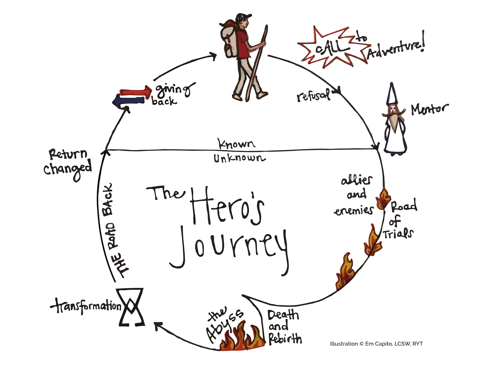
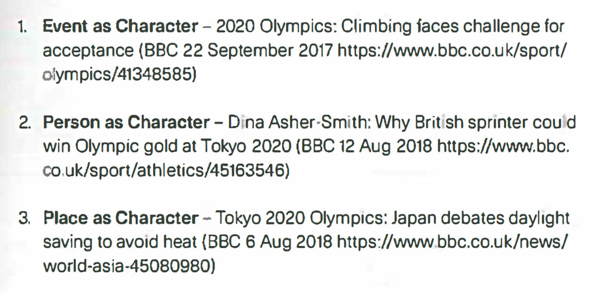

class: middle, title
background-size: contain

<!----- Make a pdf using:

decktape generic --key=ArrowRight --load-pause 1800 --slides '1-29' --size '1216x684' --url-load-timeout 80000 --page-load-timeout 40000 "week-03/slides/smi105-week-3.html" week-03/slides/smi105-week-3.pdf

----->


<br><br>

# Data Storytelling
#### EDC101: Week 3

<br><br>

**Dr. Calum Webb**<br>
Sheffield Methods Institute, the University of Sheffield<br>
[c.j.webb@sheffield.ac.uk](mailto:c.j.webb@sheffield.ac.uk)

```{r setup, include=FALSE}
options(htmltools.dir.version = FALSE)

# These packages are required for creating the slides
# Many will need to be installed from Github
library(icons)
library(tidyverse)
library(xaringan)
library(xaringanExtra)
library(xaringanthemer)

# Defaults for code
knitr::opts_chunk$set(
  fig.width=9, fig.height=3.5, fig.retina=3,
  out.width = "100%",
  cache = FALSE,
  echo = TRUE,
  message = FALSE, 
  warning = FALSE,
  fig.show = TRUE,
  hiline = TRUE
)

# set global theme for ggplot to make background #F8F8F8F8 (off white),
# but otherwise keep all ggplot themes default (better for teaching)
theme_set(
  theme(plot.background = element_rect(fill = "#F8F8F8", colour = "#F8F8F8"), 
        panel.background = element_rect(fill = "#F8F8F8", colour = "#F8F8F8"),
        legend.background = element_rect(fill = "#F8F8F8", colour = "#F8F8F8")
        )
  )

```

```{r xaringan-tile-view, echo=FALSE}
# Use tile overview by hitting the o key when presenting
xaringanExtra::use_tile_view()
```

```{r xaringan-logo, echo=FALSE}
# Add logo to top right
xaringanExtra::use_logo(
  image_url = "header/smi-logo-white.png",
  exclude_class = c("inverse", "hide_logo"), 
  width = "180px", position = css_position(top = "1em", right = "2em")
)
```

```{r xaringan-themer, include=FALSE, warning=FALSE}

# Set some global objects containing the colours
# of the university's branding
primary_color <- "#131E29"
secondary_color <- "#440099"
tuos_blue <- "#9ADBE8"
white = "#F8F8F8"
tuos_yellow <- "#FCF281"
tuos_purple <- "#440099"
tuos_red <- "#E7004C"
tuos_midnight <- "#131E29"

# The bulk of the styling is handled by xaringanthemer
style_uos <- style_duo_accent(
  primary_color = "#131E29",
  secondary_color = "#440099",
  colors = c(tuos_purple = "#440099", 
             grey = "#131E2960", 
             tuos_blue ="#9ADBE8",
             tuos_mint = "#00CE7C",
             ac_yellow = '#FEC740'),
  header_font_google = xaringanthemer::google_font("Source Serif Pro", "600", "600i"),
  text_font_google   = xaringanthemer::google_font("Source Sans Pro", "300", "300i", "600", "600i"),
  code_font_google   = xaringanthemer::google_font("Lucida Console"),
  header_h1_font_size = "2rem",
  header_h2_font_size = "1.5rem", 
  header_h3_font_size = "1.25rem", 
  text_font_size = "0.9rem",
  code_font_size = "0.65rem", 
  code_inline_font_size = "0.85rem",
  inverse_text_color = "#9ADBE8", 
  background_color = "#F8F8F8", 
  text_color = "#131E29", 
  link_color = "#005A8F", 
  inverse_link_color = "#F8F8F8",
  text_slide_number_color = "#44009970",
  table_row_even_background_color = "transparent", 
  table_border_color = "#44009970",
  text_bold_font_weight = 600
)

style_uos

```


```{r xaringan-panelset, echo=FALSE}
# Allow for adding panelsets (see example on slide 2)
xaringanExtra::use_panelset()
```

```{r xaringanExtra, echo = FALSE}
# Adds white progress bar to top
xaringanExtra::use_progress_bar(color = "#F8F8F8", location = "top")
```

```{r xaringan-extra-styles, echo = FALSE}
# Allow for code to be highlighted on hover
xaringanExtra::use_extra_styles(
  hover_code_line = TRUE,         #<<
  mute_unhighlighted_code = TRUE  #<<
)
```

```{r share-again, echo=FALSE}
# Add sharing links and other embedding tools
xaringanExtra::use_share_again()
```

```{r xaringanExtra-search, echo=FALSE}
# Add magnifying glass search function to bottom left for quick
# searching of slides
xaringanExtra::use_search(show_icon = TRUE, auto_search = FALSE)
```

---

class: middle, inverse

# Sign in

---

class: middle

## Learning outcomes

.panelset[

.panel[.panel-name[What will I learn?]

By the end of this week you will know:

* Lecture: How to apply principles of storytelling to data visualisation and presenting data and critically assessing others' presentation of data.

* Workshop: How to extend our use of scatterplots in order to incorporate more information or manage complexity.

]
]


---

class: inverse, middle

```{r, echo=FALSE}

# Data on top games
games_d <- read_csv(here::here("week-03/slides/data/games.csv"))

games_d <- games_d %>%
  filter(year >= 2016) %>%
  group_by(gamename, year) %>%
  summarise(monthlyavg_players = mean(avg)) %>%
  ungroup() %>%
  arrange(desc(monthlyavg_players)) 

top_20 <- games_d %>%
  group_by(gamename) %>%
  summarise(sum_monthavg = sum(monthlyavg_players)) %>%
  mutate(rank_monthavg = rank(desc(sum_monthavg))) %>%
  filter(
    rank_monthavg <=20
  ) %>%
  arrange(rank_monthavg)

top_20_players <- games_d %>%
  filter(gamename %in% top_20$gamename) %>%
  arrange(desc(monthlyavg_players)) %>%
  mutate(
    monthlyavg_players = (monthlyavg_players*30.5)/1000000
  ) %>%
  arrange(desc(monthlyavg_players))

# Add dev country
top_20 <- top_20 %>%
  mutate(
    dev_country = c("USA", "USA", "South Korea", "USA", "Poland", "USA", "Canada",
                    "UK", "USA", "Canada", "USA", "USA", "USA", "Japan",
                    "UK", "USA", "New Zealand", "USA", "USA", "Canada")
  )

top_20_players <- top_20_players %>%
  left_join(
    ., top_20 %>% select(gamename, dev_country), by = c("gamename")
  )


# Data on Genshin Players
# Source: Statista (Genshin Impact), 
genshin_data <- tibble(
  gamename = rep("Genshin Impact", 3),
  dev_country = rep("China", 3),
  year = c(2021:2023),
  monthlyavg_players = c(42.2, 62.1, 64.76),
) 

games_data <- bind_rows(top_20_players, genshin_data)


# Source British Academy SHAPE Observatory: https://www.thebritishacademy.ac.uk/policy-and-research/british-academy-shape-observatory/shape-indicators/ 

language_enrollment <- tibble(
  year = rep(2020:2024, 2),
  language = c(rep("Mandarin Chinese", 5), rep("French", 5)),
  enrollment = c(23076*0.257, 24714*0.257, 36445*0.257, 39896*0.257, 43121*0.257,
                 132036, 131887, 129419, 130901, 134651)
)


# Percentage of other MFL that is Chinese
# Source: JCQ https://www.jcq.org.uk/wp-content/uploads/2023/08/GCE-Other-MFL-Entries-Summer-2023.pdf 

other_mfl_percent <- tibble(
  language = c("Mandarin Chinese", "Other"),
  percent_gcse = c((2272+1349+1449)/(8289+5518+5955), ((8289+5518+5955)-(2272+1349+1449))/(8289+5518+5955) ),
  expected_percent = c(0.0625, 1-0.0625)
)

# Trend plot
game_line_plot_start <- games_data %>%
  filter(monthlyavg_players > 7) %>%
  ggplot() +
  geom_point(aes(x = year, y = monthlyavg_players, colour = gamename)) +
  geom_line(aes(x = year, y = monthlyavg_players, colour = gamename)) +
  ylab("Monthly Average Players (Millions)") +
  xlab("Year") +
  ggeasy::easy_add_legend_title("Name of Game")


# beeswarm of countries for top 21 plus Genshin

# http://hydra.nat.uni-magdeburg.de/packing/cci/cci21.html
circle_dat <- read_table(here::here("week-03/slides/data/circle-positions-21.txt"), col_names = c("id", "x", "y"))

top_21 <- top_20 %>%
  add_row(gamename = "Genshin Impact", 
          sum_monthavg = sum(42.2, 62.1, 64.76)/3, 
          rank_monthavg = NA, 
          dev_country = "China")

top_21_ordered <- bind_rows(slice(top_21, 1:9), slice(top_21, 21), slice(top_21, 10:20))

top_21 <- bind_cols(top_21, circle_dat)
top_21_ordered <- bind_cols(top_21_ordered, circle_dat)

top_21_start <- top_21 %>%
  ggplot() +
  geom_point(aes(x = x, y = y, colour = dev_country), size = 12) +
  coord_equal() +
  scale_x_continuous(limits = c(-1, 1)) +
  scale_y_continuous(limits = c(-1, 1))


# Languages

language_start <- language_enrollment %>%
  filter(language == "Mandarin Chinese") %>%
  ggplot() +
  geom_col(aes(x = fct_rev(factor(year)), y = enrollment)) +
  coord_flip() +
  xlab("Year of Enrollment\n") +
  ylab("Estimated number of students enrolled in\nMandarin Chinese (UK)")


# Map of countries or 

# "In terms of video games, some really popular video games out there like Genshin Impact and Honkai Star Rail are Chinese-developed and can be played entirely in Chinese with subtitles in any language of your choice." 

# "Spent over 20,000 rmb when I played Genshin. I was really immersed in the culture."

# "Other games have Chinese translations and can be loads of fun, but very few (probably none) have such high production values with such a vast amount of high quality relatable dialogue/audio for $0 up front."

# "It's developed in China and is a Mandarin first game. So instead of being translated to Chinese from English, the Mandarin came first, and translated to English second. This means there are no translation errors, or jokes that worked in English but don't work in Mandarin. It also means there are cultural norms hidden in it because it was created by Chinese citizens in China. ... there is a bunch of simple scenarios mixed in with the Dragons, Infinite teapots and dimension travelling."

# Kidding aside, after I started learning Chinese, I switch from JP to CN audio. It's helpful. And at the same time you're learning and enjoying the game.


# you guys see China becoming a videogame developing powerhouse?
# Because it’s an immersive experience that would allow me to learn the language, writing, as well as the culture; and perhaps maybe make a few friends in China.

# I've always been a bit interested in Chinese culture. I'm not gonna lie when I say that Genshin Impact introduced me to it's culture in a new light, but Black Myth did it better. I've always been interested in what Wukong is wearing; specifically in this armor set.

# Genshin got way more people interested in Chinese culture.


flag_lookup <- tibble(country_name = unique(top_21$dev_country),
       country_icon = c("https://hatscripts.github.io/circle-flags/flags/us.svg",
                        "https://hatscripts.github.io/circle-flags/flags/kr.svg",
                        "https://hatscripts.github.io/circle-flags/flags/pl.svg",
                        "https://hatscripts.github.io/circle-flags/flags/ca.svg",
                        "https://hatscripts.github.io/circle-flags/flags/gb.svg",
                        "https://hatscripts.github.io/circle-flags/flags/jp.svg",
                        "https://hatscripts.github.io/circle-flags/flags/nz.svg",
                        "https://hatscripts.github.io/circle-flags/flags/cn.svg"
                        )
         )


games_data <- left_join(games_data, flag_lookup, by = c("dev_country" = "country_name"))
top_21 <- left_join(top_21, flag_lookup, by = c("dev_country" = "country_name"))
top_21_ordered <- left_join(top_21_ordered, flag_lookup, by = c("dev_country" = "country_name"))

# Tidied plots

improved_line <- games_data %>%
  filter(monthlyavg_players > 7) %>%
  ggplot() +
  geom_point(aes(x = year, y = monthlyavg_players, colour = gamename), size = 3) +
  geom_line(aes(x = year, y = monthlyavg_players, colour = gamename), linewidth = 1.5) + 
  scale_colour_manual(values = c("#80C6C3", "#80C6C3", "#80C6C3", "#135EAE", "#80C6C3")) +
  annotate("text", x = 2020.9, hjust = 1, y = 40, label = "Genshin Impact", colour = "#135EAE") +
  annotate("text", x = 2022, hjust = 1, y = 28, label = "Top 4 most played\ngames on Steam", colour = "#80C6C3") +
  ylab("Monthly Average Players (Millions)\n") +
  xlab("\nYear") +
  ggeasy::easy_add_legend_title("Name of Game") +
  ggtitle("The popularity of Genshin Impact has established China as a major player in the <br>video game industry and a cultural sensation among younger gamers.") +
  theme(
    plot.title = ggtext::element_markdown(hjust = 0.5),
    legend.position = "none"
  )


library(ggimage)

improved_flags <- top_21_ordered %>%
  ggplot() +
  annotate("point", x = 0, y = 0, size = 32, colour = "#D81F27") +
  geom_image(aes(x = x, y = y, image = country_icon), size = 0.13) +
  coord_equal() +
  scale_x_continuous(limits = c(-1, 1)) +
  scale_y_continuous(limits = c(-1, 1)) +
  theme_void() +
  ggtitle("The most popular 20 video games have been dominated by<br>United States and Canada-based developers.") +
  theme(
    plot.title = ggtext::element_markdown(hjust = 0.5)
  )


improved_languaged_enrollment <- language_enrollment %>%
  filter(language == "Mandarin Chinese") %>%
  ggplot() +
  geom_col(aes(x = fct_rev(factor(year)), y = enrollment, fill = enrollment)) +
  geom_text(aes(x = fct_rev(factor(year)), y = enrollment-200, hjust = 1, label = scales::comma(enrollment)), size = 8, colour = "#FFDA44") +
  geom_text(aes(x = fct_rev(factor(year)), y = 200, hjust = 0, label = fct_rev(factor(year))), size = 8, colour = "#f0f0f0") +
  annotate("text", x = 4.1, y = 8000, label = "Genshin Impact\nRelease", hjust = 0, 
           colour = "#135EAE", size = 4) +
  annotate("curve", x = 4.3, y = 7800, xend = 4.55, yend = 6100, curvature = 0.3,
           colour = "#135EAE", arrow = arrow(length = unit(0.1, "inches"))) +
  scale_fill_gradient(low = "#D88286", high = "#D81F27") +
  xlab("Year of Enrollment\n") +
  ylab("Estimated number of students enrolled in\nMandarin Chinese (UK)") +
  coord_flip() +
  theme(
    plot.title = ggtext::element_markdown(hjust = 0.5, size = 12),
    legend.position = "none",
    axis.ticks = element_blank(),
    axis.text = element_blank()
  ) +
  ggtitle("There has been significant growth in the number of young people in<br>the UK studying Mandarin Chinese in secondary education<br>since the release of the game.")


```


#### Part 1

# What is a story?

---

### The data underlying any particular data visualisation contains many possible stories

.pull-left-big[

```{r, echo = FALSE, out.width=700, out.height=500, fig.height=5, fig.width=7}

billboard %>%
  pivot_longer(cols = c(wk1:wk76), names_to = 'week', values_to = 'top_100') %>%
  filter(top_100 < 11) %>%
  mutate(
    week = parse_number(week),
    top_100 = fct_rev(factor(top_100))
  ) %>%
  drop_na(top_100) %>%
  ggplot() +
  geom_line(aes(x = week, y = top_100, group = track, colour = track)) +
  theme(legend.position = "none") +
  xlab("Week of Sales") +
  ylab("Position in the top 10")
  

```

]

.pull-right-small[

<br><br>

There were 53 different songs in the top ten during the year 2000, how do we choose what our story is here?

Consider the data backstory:

* Are there any particularly interesting patterns or anomalies?
* Is there something people will care about?

A **story** helps the audience to engage with the data and your data visualisations.


]


---

# What is a story?

.pull-left[

We can think of a story of having a few essential components:

* An audience
* A plot
* A character/characters

.footnote[Feigenbaum and Alamalhodaei (2020), *the Data Storytelling Workbook*]

] 


---

background-color: white

# What is a story?

.pull-left[

We can think of a story of having a few essential components:

* **An audience**
  * Different audiences will be drawn to different presentations of data.
    * Example 1: Establishes a connection at the personal, employee, level — people can *feel* how long 14 days is
* A plot
* A character/characters

.footnote[Feigenbaum and Alamalhodaei (2020), *the Data Storytelling Workbook*]

] 

.pull-right[

#### By the end of the year, the average Brit will spend 14 days — almost half a month — commuting to and from work.

```{r, echo = FALSE, out.width=450, out.height=380, fig.width=4.5, fig.height=3.8}

commuting_dat <- tibble(
  commuting = c(rep("Commuting", 14), rep("Not commuting", 16))
)

commuting_dat <- ggwaffle::waffle_iron(commuting_dat, ggwaffle::aes_d(group = commuting), rows = 5)

commuting_dat %>%
  ggplot() +
  geom_tile(aes(x = x, y = y, fill = group), colour = "#f0f0f0", size = 2) +
  coord_fixed() +
  scale_fill_manual(values = c(tuos_purple, tuos_blue)) +
  theme_void() +
  theme(legend.position = "none") +
  theme(plot.background = element_blank(),
        panel.background = element_blank())


```


]

---

# What is a story?

.pull-left[

We can think of a story of having a few essential components:

* **An audience**
  * Different audiences will be drawn to different presentations of data.
    * Example 1: Establishes a connection at the personal, employee, level — people can *feel* how long 14 days is.
    * Example 2: £5.2billion is not really a scale of money most people can imagine — framing more targeted towards a politically informed audience, policymakers, or large businesses.
    * Data may be "framed" for different audiences, this can inform the kind of data visualisation you choose.
* A plot
* A character/characters

.footnote[Feigenbaum and Alamalhodaei (2020), *the Data Storytelling Workbook*]

] 

.pull-right[

#### Time spent commuting by UK workers is worth £5.3billion in lost productivity annually

```{r, echo = FALSE, out.width=450, out.height=380, fig.width=4.5, fig.height=3.8}

costperday <- (5300000000/14)/1000000

costvis2 <- tibble(
  number_days = 1:14
) %>%
  mutate(
    cost = number_days*costperday
  )

costvis2 %>%
  ggplot() +
  geom_line(
    aes(x = number_days, cost), colour = tuos_purple, size = 1
  ) +
  scale_x_continuous(breaks = 1:14) +
  scale_y_log10(labels = scales::dollar_format(scale = 1*1000000)) +
  xlab("\nNumber of days the average employee\nspends commuting") +
  ylab("Estimated cost in productivity\nnationally\n")


```


]


---

# What is a story?

.pull-left[

We can think of a story of having a few essential components:

* **An audience**
  * Different audiences will be drawn to different presentations of data.
    * Example 1: Establishes a connection at the personal, employee, level — people can *feel* how long 14 days is.
    * Example 2: £5.2billion is not really a scale of money most people can imagine — framing more targeted towards a politically informed audience, policymakers, or large businesses.
    * Data may be "framed" for different audiences, this can inform the kind of data visualisation you choose.
* A plot
* A character/characters

.footnote[Feigenbaum and Alamalhodaei (2020), *the Data Storytelling Workbook*]

] 

.pull-right[

#### "Think, feel, do" Feigenbaum and Alamalhodaei, (2020).

* Who are your audience?
* What do they **know** already? What do you want them to **think** after viewing your data visualisation?
* How do you want them to **feel** after reviewing your data visualisation?
* What do you want them to **do**? What is your **call to action**?


* How much **time do they have to hear your story**?


]


---

background-color: white

# What is a story?

.pull-left[

We can think of a story of having a few essential components:

* An audience
* **A plot**
  * Not a 'data visualisation' type of plot, but an actual story plot. 
  * Not just **what** the story is, but **how you tell it**
* A character/characters

.footnote[Feigenbaum and Alamalhodaei (2020), *the Data Storytelling Workbook*]

] 

.pull-right[


```{r, echo = FALSE, out.width = "100%"}




```


]

---

background-color: white

# What is a story?

.pull-left[

We can think of a story of having a few essential components:

* An audience
* **A plot**
  * Not a 'data visualisation' type of plot, but an actual story plot. 
  * Not just **what** the story is, but **how you tell it**
  * Examples of using 'conventional' narrative story archetypes:
      * **Hero's Journey**: *Something disturbs our comfortable knowledge of a topic, we struggle to make sense of this new information, we transform our existing knowledge and return changed.*
* A character/characters

.footnote[Feigenbaum and Alamalhodaei (2020), *the Data Storytelling Workbook*]

] 

.pull-right[


```{r, echo = FALSE, out.width = "100%"}


```


]

---

# What is a story?

.pull-left[

We can think of a story of having a few essential components:

* An audience
* **A plot**
  * Not a 'data visualisation' type of plot, but an actual story plot. 
  * Not just **what** the story is, but **how you tell it**
  * Examples of using 'conventional' narrative story archetypes:
      * **Voyage and Return**: *We set out to a strange land not knowing what we might find, before returning with new wisdom and life experience. Typical for a lot of very "new" areas of research, e.g. new online movements (Think documentary)*
* A character/characters

.footnote[Feigenbaum and Alamalhodaei (2020), *the Data Storytelling Workbook*]

] 

.pull-right[


<center>
<iframe width="252" height="450"
src="https://www.youtube.com/embed/sdLqIvHxyA0"
title="YouTube video player"
frameborder="0"
allow="accelerometer; autoplay; clipboard-write; encrypted-media; gyroscope; picture-in-picture; web-share"
allowfullscreen></iframe>
</center>


]

---

# What is a story?

.pull-left[

We can think of a story of having a few essential components:

* An audience
* **A plot**
  * Not a 'data visualisation' type of plot, but an actual story plot. 
  * Not just **what** the story is, but **how you tell it**
  * Examples of using 'conventional' narrative story archetypes:
      * **Mystery**: *There is a puzzling event or observation. You follow along with the investigator who uncovers clues and makes discoveries. At the end of the story there is a big revelation where all of the clues fit together.*
* A character/characters

.footnote[Feigenbaum and Alamalhodaei (2020), *the Data Storytelling Workbook*]

] 

.pull-right[

<center>

```{r, echo = FALSE, out.width = "70%"}


```

</center>

]


---

# What is a story?

.pull-left[

We can think of a story of having a few essential components:

* An audience
* A plot
* **A character/characters**
  * A person, an event (including a year), or a place can all be characters.
  * When there are many possible characters in a story, one or two can be used to act as representatives for a wider group in order to make it more relatable to an audience (e.g. Barbie and Oppenheimer)

.footnote[Feigenbaum and Alamalhodaei (2020), *the Data Storytelling Workbook*]

] 

.pull-right[

<br><br>
<center>

```{r, echo = FALSE, out.width = "100%"}




```

</center>

]


---

# What is a story?

.pull-left[

We can think of a story of having a few essential components:

* An audience
* A plot
* A character/characters


* **Dialogue**
  * It is also common to have some "dialogue" between data visualisation and either people affected by the issue or experts on the matter. This can be very effective for engaging audiences and making the subject more personally relatable.


.footnote[Feigenbaum and Alamalhodaei (2020), *the Data Storytelling Workbook*]

] 

.pull-right[

<center>

```{r, echo = FALSE, out.width = "70%"}


```

</center>

]

---

class: middle, inverse


#### Part 2

# Let's hear a story.


---

.pull-left[

```{r, echo = FALSE, out.width=450, out.height=250, fig.height=2.5, fig.width=4.5}

game_line_plot_start

```

```{r, echo = FALSE, out.height=250, fig.height=2.5, fig.width=4.5}

language_start

```

]

.pull-right[

### I'm going to tell a story using these three data visualisations.

```{r, echo = FALSE, out.width=450, out.height=450, fig.height=4.5, fig.width=4.5}

top_21_start


```

]


---

.pull-left-small[

## Let's start with this chart

* What is interesting about it?

* How can I draw attention to what is interesting about it?

* How can I focus the audience on one specific "character"?


]

.pull-right-big[


```{r, echo = FALSE, out.width=700, out.height=550, fig.height=5.5, fig.width=7}

game_line_plot_start


```

]


---

.pull-left-small[

## Turning this visualisation into a story

* Add an active title

* Highlight important characters 


> "Since its launch in 2020, the video game Genshin Impact, from Chinese developer miHoYo, has become a staple app on many young peoples' smartphones across the world. The scale of the game's success outstrips even the most successful PC games on the Steam platform in the years before."


]

.pull-right-big[


```{r, echo = FALSE, out.width=700, out.height=550, fig.height=5.5, fig.width=7}

improved_line


```

]


---

.pull-left[

## Developing our story

* Placing the data within a broader context

* Highlighting variation between two things

* Why is this new and interesting?


]

.pull-right[

<br>

```{r, echo = FALSE, out.width=500, out.height=500, fig.height=5, fig.width=5}

top_21_start


```

]


---

background-color: white

<br>

.pull-left[

## Developing our story

* Improved communication by using instantly recognisable flags, avoiding the need for a key

* Placed the dot representing Genshin Impact (the Chinese studio developed game) in the centre of the visualisation, rather than at the top, to make it the focal point (the main character).

> Taking a wider view, few of the most popular games on the Steam platform have been developed in China, with the United States and Canada dominating the 'top-played' list.

> "*Other games have Chinese translations and can be loads of fun, but very few (probably none) have such high production values with such a vast amount of high quality relatable dialogue/audio for $0 up front.*" - Genshin Impact Player


]

.pull-right[


```{r, echo = FALSE, out.width=500, out.height=500, fig.height=5, fig.width=5}

improved_flags

```

]


---

class: inverse, middle

> ## Few games, however, have also generated so much interest in Chinese culture, as games from Japan did for Japanese culture in the 1980s and 1990s:

> ##"* It also means there are cultural norms hidden in it because it was created by Chinese citizens in China. ... there is a bunch of simple scenarios mixed in with the Dragons, Infinite teapots and dimension travelling.*" - Genshin Impact Player

---

class: inverse
background-image: url("images/genshin-mcdonalds-ad.jpeg")
background-position: center
background-size: contain


---

.pull-left[

## Call to action: changing the way people think about video games

* How to draw a link between two pieces of data in a way that tells an interesting story?

* What message do I want people to take away that will change their thinking or behaviour?

]

.pull-right[


```{r, echo = FALSE, out.width=500, out.height=550, fig.height=5.5, fig.width=5}

language_start


```

]


---

.pull-left[

## Call to action: changing the way people think about video games

* Cross-reference the 'character' from the first two visualisations at a specific point in the data on a different visualisation

* Add frequency counts to the bars to make the change more of the focus

> The success of Genshin Impact has coincided with a large increase in the numbers of young people studying for GCSE and A-level qualifications in Mandarin Chinese in the UK in a way that other strategies to increase uptake in the language have failed to accomplish.

> "*[A]fter I started learning Chinese, I switch from JP to CN audio. It's helpful. And at the same time you're learning and enjoying the game.*" - Genshin Impact Player<br>
> "*I've always been a bit interested in Chinese culture. I'm not gonna lie when I say that Genshin Impact introduced me to it's culture in a new light.*" - Genshin Impact Player<br>
> "*Genshin got way more people interested in Chinese culture.*" - Genshin Impact Player


]

.pull-right[

<br>

```{r, echo = FALSE, out.width=500, out.height=500, fig.height=5, fig.width=5}

improved_languaged_enrollment


```

]


---

.pull-left[

# Activity: Breaking down the storytelling of "The Genshin Impact on young peoples' interest in Chinese language in the UK" 

* Go to [app.wooclap.com/TKOOEY](app.wooclap.com/TKOOEY) and join the first event.

Think about the following:

* Who was the audience? How did I want them to change their views after the story?
* What kind of storytelling plot archetype might this data story have fallen into?
* Who/what could be considered a character in this story?
* How could the audience and plot be changed if I presented the last plot in my story first instead?


]

.pull-right[

.center[

<br><br>

```{r, echo = FALSE, out.width="80%"}

knitr::include_graphics("images/wooclap-qr-week3.png")

```

]

]

---

# The rest of this week:

.pull-left[

<br><br>

**This week's workshop**:

Let’s extend scatterplots. Scatterplots are one of the simplest and most powerful kinds of data visualisation, and we made our first one two weeks ago. How can we include more information than we did before? How can we draw a scatterplot with thousands of observations, without the plot becoming impossible to understand?


]

--

.pull-right[

**Before week 4**:

**Core tasks**:

* **Before lecture**: Bookmark or download a copy of the FT’s Visual Vocabulary: https://github.com/Financial-Times/chart-doctor/blob/main/visual-vocabulary/poster.png

* **Before lecture**: Find a chart in the news that relates to the topic given to you at the end of week 3 lecture. Then, share on Blackboard: (i) the chart you find, (ii) where it was published (if that’s not obvious) and (iii) which category from the 9 listed across the top of FT Visual Vocabulary you think best describes the data relationship in it.

* **Before workshop**: Work through the task at the end of the workshop handout from week 3
Supplementary tasks:

* **Before workshop**: Read chapter 3/Make a plot of the Healy book

]


