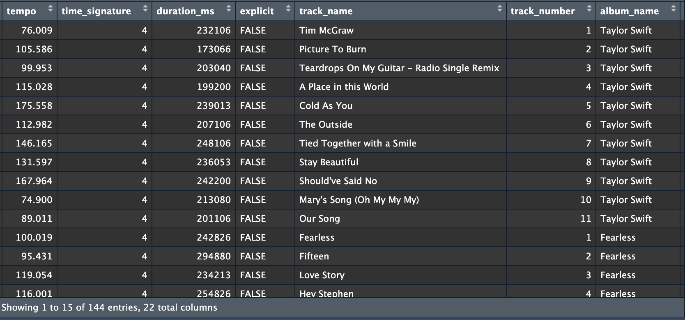
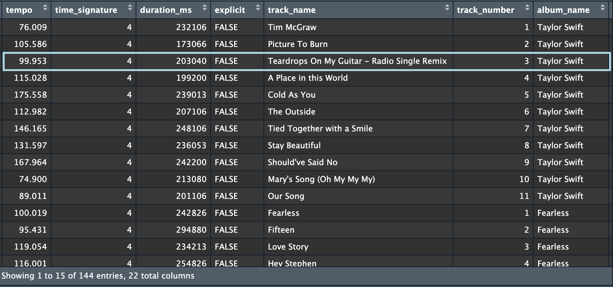
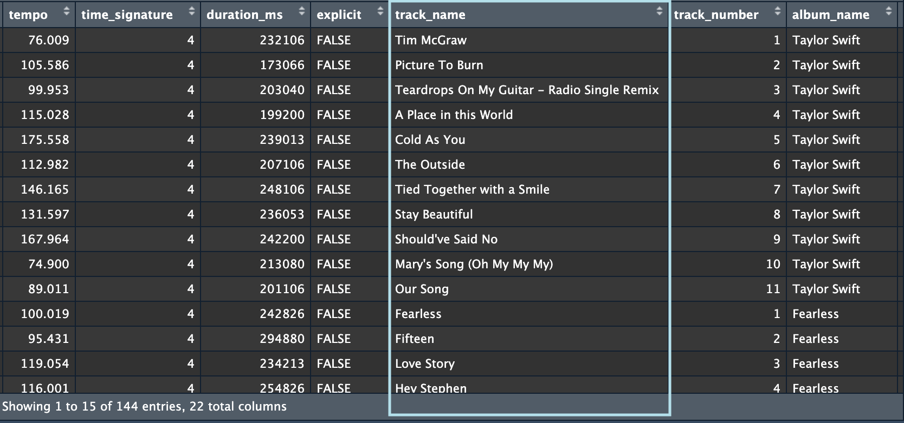
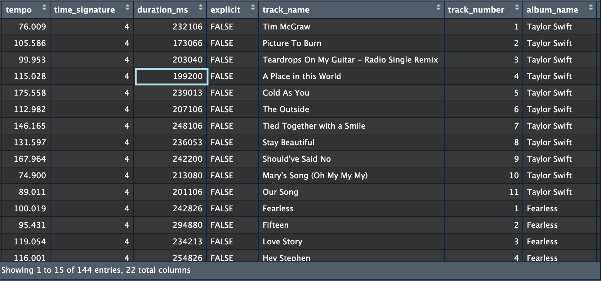
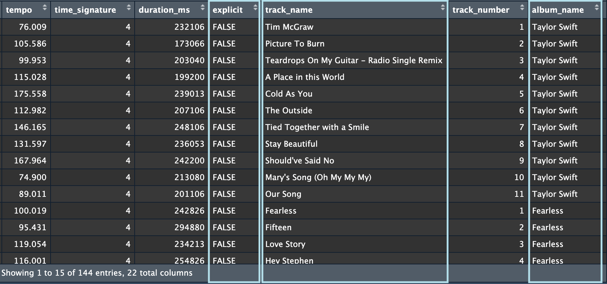
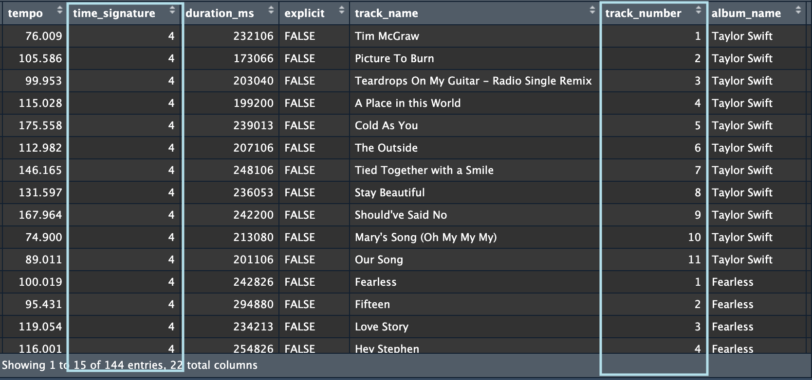
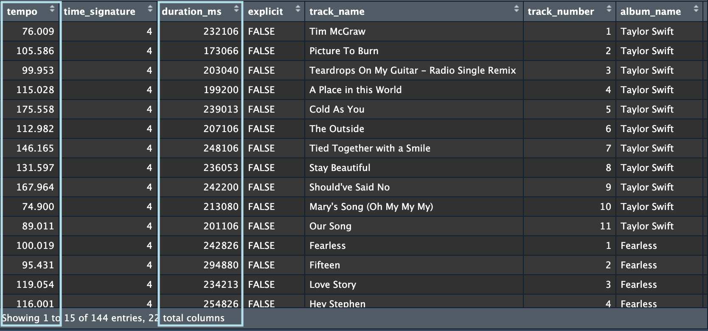
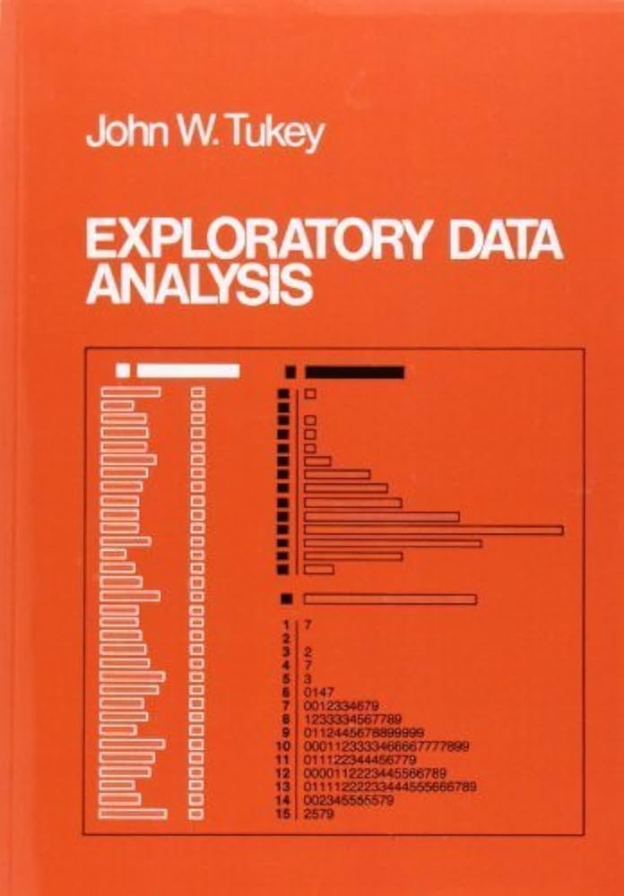
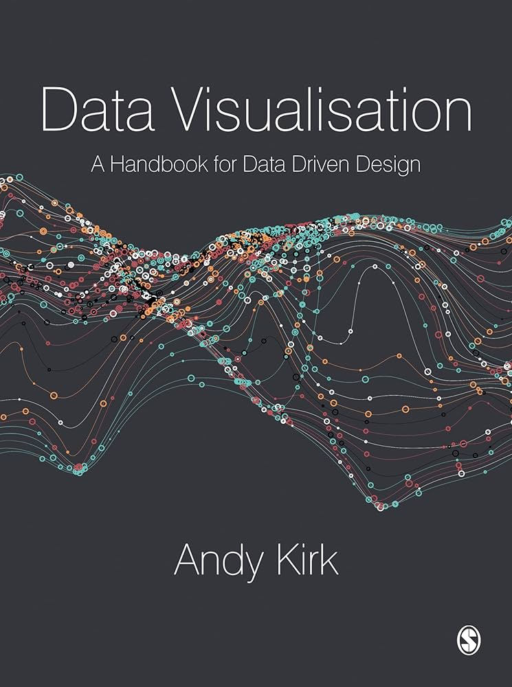

class: middle, title
background-size: contain

<!----- Make a pdf using:

decktape generic --key=ArrowRight --load-pause 1800 --slides '1-47' --size '1216x684' --url-load-timeout 80000 --page-load-timeout 40000 "week-04/slides/smi105-week-4.html" week-04/slides/smi105-week-4.pdf

----->


<br><br>

# Chart Types
#### EDC101: Week 4

<br><br>

**Dr. Calum Webb**<br>
Sheffield Methods Institute, the University of Sheffield<br>
[c.j.webb@sheffield.ac.uk](mailto:c.j.webb@sheffield.ac.uk)

```{r setup, include=FALSE}
options(htmltools.dir.version = FALSE)

# These packages are required for creating the slides
# Many will need to be installed from Github
library(icons)
library(tidyverse)
library(xaringan)
library(xaringanExtra)
library(xaringanthemer)

# Defaults for code
knitr::opts_chunk$set(
  fig.width=9, fig.height=3.5, fig.retina=3,
  out.width = "100%",
  cache = FALSE,
  echo = TRUE,
  message = FALSE, 
  warning = FALSE,
  fig.show = TRUE,
  hiline = TRUE
)

# set global theme for ggplot to make background #F8F8F8F8 (off white),
# but otherwise keep all ggplot themes default (better for teaching)
theme_set(
  theme(plot.background = element_rect(fill = "#F8F8F8", colour = "#F8F8F8"), 
        panel.background = element_rect(fill = "#F8F8F8", colour = "#F8F8F8"),
        legend.background = element_rect(fill = "#F8F8F8", colour = "#F8F8F8")
        )
  )

```

```{r xaringan-tile-view, echo=FALSE}
# Use tile overview by hitting the o key when presenting
xaringanExtra::use_tile_view()
```

```{r xaringan-logo, echo=FALSE}
# Add logo to top right
xaringanExtra::use_logo(
  image_url = "header/smi-logo-white.png",
  exclude_class = c("inverse", "hide_logo"), 
  width = "180px", position = css_position(top = "1em", right = "2em")
)
```

```{r xaringan-themer, include=FALSE, warning=FALSE}

# Set some global objects containing the colours
# of the university's branding
primary_color <- "#131E29"
secondary_color <- "#440099"
tuos_blue <- "#9ADBE8"
white = "#F8F8F8"
tuos_yellow <- "#FCF281"
tuos_purple <- "#440099"
tuos_red <- "#E7004C"
tuos_midnight <- "#131E29"

# The bulk of the styling is handled by xaringanthemer
style_uos <- style_duo_accent(
  primary_color = "#131E29",
  secondary_color = "#440099",
  colors = c(tuos_purple = "#440099", 
             grey = "#131E2960", 
             tuos_blue ="#9ADBE8",
             tuos_mint = "#00CE7C",
             ac_yellow = '#FEC740'),
  header_font_google = xaringanthemer::google_font("Source Serif Pro", "600", "600i"),
  text_font_google   = xaringanthemer::google_font("Source Sans Pro", "300", "300i", "600", "600i"),
  code_font_google   = xaringanthemer::google_font("Lucida Console"),
  header_h1_font_size = "2rem",
  header_h2_font_size = "1.5rem", 
  header_h3_font_size = "1.25rem", 
  text_font_size = "0.9rem",
  code_font_size = "0.65rem", 
  code_inline_font_size = "0.85rem",
  inverse_text_color = "#9ADBE8", 
  background_color = "#F8F8F8", 
  text_color = "#131E29", 
  link_color = "#005A8F", 
  inverse_link_color = "#F8F8F8",
  text_slide_number_color = "#44009970",
  table_row_even_background_color = "transparent", 
  table_border_color = "#44009970",
  text_bold_font_weight = 600
)

style_uos

```


```{r xaringan-panelset, echo=FALSE}
# Allow for adding panelsets (see example on slide 2)
xaringanExtra::use_panelset()
```

```{r xaringanExtra, echo = FALSE}
# Adds white progress bar to top
xaringanExtra::use_progress_bar(color = "#F8F8F8", location = "top")
```

```{r xaringan-extra-styles, echo = FALSE}
# Allow for code to be highlighted on hover
xaringanExtra::use_extra_styles(
  hover_code_line = TRUE,         #<<
  mute_unhighlighted_code = TRUE  #<<
)
```

```{r share-again, echo=FALSE}
# Add sharing links and other embedding tools
xaringanExtra::use_share_again()
```

```{r xaringanExtra-search, echo=FALSE}
# Add magnifying glass search function to bottom left for quick
# searching of slides
xaringanExtra::use_search(show_icon = TRUE, auto_search = FALSE)
```

---

class: middle, inverse

# Sign in

---

class: middle

## Learning outcomes

.panelset[

.panel[.panel-name[What will I learn?]

By the end of this week you will know:

* Key terminology for working with quantitative data

* Two different ways to help us think about which kind of data visualisation we should use:

  * The "classic" approach, where the type of data informs the visualisation
  * Some more modern approaches, where the data story helps inform the choice of the visualisation

]
]

---

class: inverse, middle

# How do I choose what kind of data visualisation is appropriate for my data?

---

class: inverse, middle

#### Part I

# Some key terminology

???

Datasets, variables, types of variables

---

```{r, echo = FALSE, include=FALSE}

brics_dsp <- read_csv(here::here("week-04/slides/data/dsp_dat_small.csv")) %>%
  filter(country_name %in% c("Brazil", "Russia", "China", "India", "South Africa"))

names(brics_dsp)

# Mechkova, Valeriya, Daniel Pemstein, Brigitte Seim, and Steven Wilson. 2024. "DSP Dataset v6" Digital Society Project (DSP).

brics_dsp <- brics_dsp %>%
  rename(polarisation_politics = v2smpolsoc_mean,
         govshutdown_socialmedia = v2smgovsm_mean,
         govmonitor_socialmedia = v2smgovsmmon_mean,
         govshutdown_internet = v2smgovfilprc_mean,
         consumption_domesticmedia = v2smonex_mean
         ) %>%
  select(country_name, year, polarisation_politics, 
         govshutdown_socialmedia, govmonitor_socialmedia, 
         govshutdown_internet, consumption_domesticmedia) %>%
  filter(year > 2006)

# Social media date filter from 2006 (Twitter launch)

# How would you characterize the differences of opinions on major political issues in this society? 0 completely polarised, 4 = 

# Question: How often does the government shut down access to social media platforms?
# Responses: 0 extremely often, 4 not at all

# How comprehensive is the surveillance of political content in social media by the
# government or its agents? 0 = comprehensive, 4 = none at all

#' Question: How frequently does the government censor political information (text, audio, images, or video) on the Internet by filtering (blocking access to certain websites)? 0 extremely often, 4 never
#' 
#' Question: Do people consume domestic online media? 0 = not at all, 4 = extensive

# will need to create some ordinal and categorical variables for first section


```

### This is a **dataset**

.center[
```{r, echo = FALSE, out.width = "90%"}



```
]


---

### Each **row** is an **observation**, e.g. a song, person, measurement at a specific time

.center[
```{r, echo = FALSE, out.width = "90%"}



```
]

---

### Each **column** is a **variable**, e.g. the name of the song, the tempo, etc.

.center[
```{r, echo = FALSE, out.width = "90%"}



```
]

---

### Each **cell** is a **value**, e.g. the duration of the song *for this observation*

.center[
```{r, echo = FALSE, out.width = "90%"}



```
]


---

class: inverse, middle

# Variables (columns) can be put into three different categories: categorical (nominal), ordinal, and continuous

---

class: middle
background-color: white

.center[
```{r, echo = FALSE, out.width = "80%"}

knitr::include_graphics(c("images/continuous-ordinal-categorical.png"))

```
]

.footnote[Art by Allison Horst]


---

### Examples of **categorical** variables might be track name, whether it is explicit, or album name

.center[
```{r, echo = FALSE, out.width = "90%"}



```
]


---

### Examples of **ordinal** variables might be time signature or track number

.center[
```{r, echo = FALSE, out.width = "90%"}



```
]


---

### Examples of **continuous** variables might be duration or tempo

.center[
```{r, echo = FALSE, out.width = "90%"}



```
]

---

### If you're struggling to recognise the difference, here's something that helps:

### <br>

.center[
```{r, echo = FALSE, out.width = "60%"}

knitr::include_graphics("images/three-runners-1.svg")

```
]

---

### One variable we might have for runners is finish time: this is continuous because we know that if Runner 2 was 30 seconds slower than Runner 1, and Runner 3 was 1 minute slower than Runner 2, Runner 3 was behind by twice as much. 1 second means the same thing. 

.center[
```{r, echo = FALSE, out.width = "60%"}

knitr::include_graphics("images/three-runners-2.svg")

```
]

---

### Another variable might be the placement of the runners: 1st, 2nd, 3rd. We know that runner 2 was slower than runner 1, but we don't know *how much by*. 1st, 2nd, and 3rd also means different things depending on the *race*. 3rd in a Park Run ≠ 3rd in Olympics.  This is ordinal.

.center[
```{r, echo = FALSE, out.width = "60%"}

knitr::include_graphics("images/three-runners-3.svg")

```
]


---

### Lastly, another variable we could have is the country the runner is representing. There is no inherent ordering to countries, any ordering would depend on some other external variable (such as alphabetical order). 

.center[
```{r, echo = FALSE, out.width = "60%"}

knitr::include_graphics("images/three-runners-4.svg")

```
]


---

class: inverse, middle

#### Part II

# The 'classic' approach: visualisation determined by the type of variables

.footnote[As found in many, many, introduction to quantitative research textbooks, but largely based on the work of John Tukey (1997) *Exploratory data analysis*]


---

class: middle

.pull-left[

<br><br><br>

## Classic approaches to data visualisation

These are data visualisations that are often driven by:

* The types of the variables being visualised (how many, categorical, continuous, ordinal).
* The computing power available at the time or even the effort to draw the visualisation by hand. 


]

.pull-right[


.center[

```{r, echo = FALSE, out.width = "70%"}



```

]

]


---

class: middle

### In this approach, depending on the type of variable, we can identify an appropriate chart type:


### One variable

```{r, echo = FALSE}

library(formattable)

univisuals <- tibble(
  `Variable Type` = c("Nominal", "Ordinal", "Continuous"),
  `Visualisation` = c("Bar Chart", "Bar Chart", "Histogram"))

univisuals_tab <- formattable::formattable(univisuals,
                         list(
                           `Variable Type` = formatter("span", style = formattable::style(font.weight = "bold"))
                         ))

as.htmlwidget(univisuals_tab, width = "100%")

```


### Two variables

```{r, echo = FALSE}


univisuals <- tibble(
  `Variable Type` = c("Nominal", "Ordinal", "Continuous"),
  `Visualisation` = c("Bar Chart", "Bar Chart", "Histogram"))
  
  

visuals <- tibble(
  `Variable Type` = c("Nominal", "Ordinal", "Continuous"),
  Nominal = c("Bivariate Bar Chart", "Bivariate Bar Chart", "Boxplot"),
  Ordinal = c("", "Bivariate Bar Chart", "Boxplot"),
  Continuous = c("", "", "Scatterplot")
)

visuals_tab <- formattable::formattable(visuals,
                         list(
                           `Variable Type` = formatter("span", style = formattable::style(font.weight = "bold"))
                         ))

as.htmlwidget(visuals_tab, width = "100%")

```


---

.pull-left[

<br><br><br>

## Some examples:

* Favourite messaging platform (categorical)


]

.pull-right[

<br>

```{r, echo=FALSE, fig.height=5, fig.width=5, out.height=500, out.width=500}

set.seed(99)
sm_use <- sample(c("WhatsApp", "WeChat", "Line", "Telegram", "Discord", "Signal"),
       1000,
       prob = c(0.4, 0.35, 0.1, 0.07, 0.06, 0.02),
       replace = TRUE
       )

sm_use <- tibble(sm_use)

sm_use %>%
  mutate(
    sm_use = factor(sm_use, levels = c("WhatsApp", "WeChat", "Line", "Telegram", "Discord", "Signal"))
  ) %>%
  ggplot() +
  aes(x = sm_use) +
  geom_bar(fill = tuos_purple) +
  ylab("Count") +
  xlab("") +
  ggtitle("What are students' favour messaging platforms?") +
  labs(caption = "Simulated data.")

```


]

---

.pull-left[

<br><br><br>

## Some examples:

* Favourite messaging platform (categorical)
* Number of hours spent on social media per day (continuous)


]

.pull-right[

<br>

```{r, echo=FALSE, fig.height=5, fig.width=5, out.height=500, out.width=500}

set.seed(99)

nhours <- numeric()

simparams <- tibble(
  sm_use = c("WhatsApp", "WeChat", "Line", "Telegram", "Discord", "Signal"),
  rnorm_mean = c(2, 2, 3, 4, 5, 0.5),
  rnorm_sd = c(0.7, 0.5, 1.2, 0.5, 1.5, 0.1)
)

#simparams[simparams$sm_use == sm_use$sm_use[1],]$rnorm_mean

for (i in 1:1000) {
  
  nhours[i] <- rnorm(1, 
                     mean = simparams[simparams$sm_use == sm_use$sm_use[i],]$rnorm_mean,
                     sd = simparams[simparams$sm_use == sm_use$sm_use[i],]$rnorm_sd
                     )
  
}


sm_use$nhours <- nhours
sm_use <- sm_use %>%
  mutate(
    nhours = ifelse(nhours < 0, 0, nhours)
  )


sm_use %>%
  mutate(
    sm_use = factor(sm_use, levels = c("WhatsApp", "WeChat", "Line", "Telegram", "Discord", "Signal"))
  ) %>%
  ggplot() +
  aes(x = nhours) +
  geom_histogram(fill = tuos_purple) +
  ylab("Frequency") +
  xlab("Number of Hours") +
  ggtitle("How many hours a day are spent on messaging\nplatforms?") +
  labs(caption = "Simulated data.")

```


]

---

.pull-left[

<br><br><br>

## Some examples:

* Favourite messaging platform (categorical)
* Number of hours spent on social media per day (continuous)
* Do students who use some instant messaging platforms meet up in person less often than others? (categorical ╳ ordinal)


]

.pull-right[

<br>

```{r, echo=FALSE, fig.height=5, fig.width=5, out.height=500, out.width=500}

set.seed(99)

meetup_chance <- numeric()

for (i in 1:1000) {
  meetup_chance[i] <- rnorm(1, mean = 1 + 0.5*(sm_use$nhours[i] - mean(sm_use$nhours)) - 
                              0.21*(sm_use$nhours[i] - mean(sm_use$nhours))^2, sd = 1)
}

sm_use$meetup_chance <- meetup_chance

sm_use <- sm_use %>%
  mutate(
    meetup_freq = case_when(meetup_chance < -1 ~ "Less than once a month",
                            meetup_chance < 0 & meetup_chance >= -1 ~ "Less than once a week",
                            meetup_chance < 1.5 & meetup_chance >= 0 ~ "Once or twice a week",
                            meetup_chance < 2 & meetup_chance >= 1.5 ~ "A few times a week",
                            meetup_chance >= 2 ~ "Almost every day"
                            )
  ) %>%
  mutate(
    meetup_freq = factor(meetup_freq, levels = c("Less than once a month",
                                                 "Less than once a week",
                                                 "Once or twice a week",
                                                 "A few times a week",
                                                 "Almost every day"))
  )


sm_use %>%
  mutate(
    sm_use = factor(sm_use, levels = c("WhatsApp", "WeChat", "Line", "Telegram", "Discord", "Signal"))
  ) %>%
  ggplot() +
  aes(x = sm_use, fill = meetup_freq) +
  geom_bar(position = position_dodge(preserve = "single")) +
  ylab("Frequency") +
  xlab("Messaging Platform") +
  ggtitle("How often do students using different messaging\nplatforms meet up with friends they don't live with?") +
  labs(caption = "Simulated data.") +
  scale_fill_manual(values = c("#005A8F", "#00BBCC", "#64CBE8", "#A1DED2", "#3BD4AE")) +
  theme(legend.position = "bottom") + guides(fill=guide_legend(nrow=3,byrow=TRUE)) +
  ggeasy::easy_remove_legend_title()

```


]


---

.pull-left[

<br><br><br>

## Some examples:

* Favourite messaging platform (categorical)
* Number of hours spent on social media per day (continuous)
* Do students who use some instant messaging platforms meet up in person less often than others? (categorical ╳ ordinal)
* Do students spend different amounts of time on instant messaging platforms depending on the platform they use? (categorical ╳ continuous)


]

.pull-right[

<br>

```{r, echo=FALSE, fig.height=5, fig.width=5, out.height=500, out.width=500}

sm_use %>%
  mutate(
    sm_use = factor(sm_use, levels = c("WhatsApp", "WeChat", "Line", "Telegram", "Discord", "Signal"))
  ) %>%
  ggplot() +
  aes(fill = sm_use, y = nhours, x = sm_use) +
  geom_boxplot() +
  ylab("Number of Hours Used") +
  xlab("") +
  ggtitle("Is the choice of messaging platform linked to\ntime spent using it?") +
  labs(caption = "Simulated data.") +
  scale_fill_manual(values = c("#005A8F", "#00BBCC", "#64CBE8", "#A1DED2", "#3BD4AE", "#00CE7C")) +
  ggeasy::easy_add_legend_title("Platform")

```


]


---

.pull-left[

<br><br><br>

## Some examples:

* Favourite messaging platform (categorical)
* Number of hours spent on social media per day (continuous)
* Do students who use some instant messaging platforms meet up in person less often than others? (categorical ╳ ordinal)
* Do students spend different amounts of time on instant messaging platforms depending on the platform they use? (categorical ╳ continuous)
* Do students who spend more time on instant messaging platforms spend less time in-person with people they don't live with? (continuous ╳ continuous)


]

.pull-right[

<br>

```{r, echo=FALSE, fig.height=5, fig.width=5, out.height=500, out.width=500}

sm_use <- sm_use %>%
  mutate(
    meetup_time = ifelse(meetup_chance + 6 == 0, 0, meetup_chance + 6) + rnorm(1000, mean = 0, sd = 1.2)
  )

sm_use %>%
  mutate(
    sm_use = factor(sm_use, levels = c("WhatsApp", "WeChat", "Line", "Telegram", "Discord", "Signal"))
  ) %>%
  ggplot() +
  aes(y = meetup_time, x = nhours) +
  geom_point(size = 0.5, colour = tuos_purple) +
  ylab("Average time spent with friends in-person\nper week") +
  xlab("Average number of hours spent on messaging\nplatforms per day") +
  ggtitle("Do students who spend more time on messaging platforms\nspend less time with friends in person?") +
  labs(caption = "Simulated data.") 

```


]

---

class: middle

.pull-left[

<br><br><br>

## Classic approaches to data visualisation

* Easy to apply
* Easy to remember
* Quite restrictive, doesn't provide multiple options
* Not always very appealing aesthetically
* Some redundancy in visual presentation
* Sometimes doesn't work so well with very large datasets (e.g. scatterplots)


]

.pull-right[


.center[

```{r, echo = FALSE, out.width = "70%"}


```

]

]


---

class: inverse, middle

#### Part III

# Story-driven choice of chart type

.footnote[Using Andy Kirk's (2019) Data Visualisation A Handbook for Data Driven Design & FT's Visual Vocabulary (Smith, et al. 2019)]

---

.pull-left[

<br>

## Andy Kirk's CHRTS

While the 'data-driven' approach to selecting a visualisation works well, we now have many, many, different types of visualisation we could choose for the same types of data. It can make more sense to start thinking about what kind of story we want to tell.

* **Categorical**: Comparing categories and distributions of quantitative values.

* **Hierarchical**: Revealing part-to-whole relationships and hierarchies.

* **Relational**: Exploring correlations and connections.

* **Temporal**: Plotting trends and intervals over time.

* **Spatial**: Mapping spatial patterns through overlays and distortions.


]

.pull-right[

<br>

.center[

```{r, echo = FALSE, out.width = "70%", fig.cap="Kirk (2019)"}



```

]

]

---

.pull-left[

<br>

## Andy Kirk's CHRTS

While the 'data-driven' approach to selecting a visualisation works well, we now have many, many, different types of visualisation we could choose for the same types of data. It can make more sense to start thinking about what kind of story we want to tell.

* **Categorical**: Comparing categories and distributions of quantitative values.

* .grey[Hierarchical: Revealing part-to-whole relationships and hierarchies.]

* .grey[Relational: Exploring correlations and connections.]

* .grey[Temporal: Plotting trends and intervals over time.]

* .grey[Spatial: Mapping spatial patterns through overlays and distortions.]


]

.pull-right[

<br>

bar chart: `geom_col` / `geom_bar`

.center[

```{r, echo = FALSE, fig.height=5, fig.width=5, out.height=500, out.width=500}
# reverse code so higher = more monitoring/restrictions except domestic 
# media
brics_dsp <- brics_dsp %>%
  mutate_at(
    vars(polarisation_politics:govshutdown_internet), ~4-.
  )

brics_dsp <- brics_dsp %>%
  mutate(
    country_name = factor(country_name, levels = c("Brazil", "Russia",
                                                   "India", "China", 
                                                   "South Africa"))
  )

brics_dsp %>%
  filter(year == 2023) %>%
  ggplot() +
  geom_col(aes(x = country_name, y = govmonitor_socialmedia),
           fill = tuos_purple) +
  xlab("") +
  ylab("Expert rating on how much government\nmonitors social media use (5=Max)") +
  labs(caption = "Source: Mechkova, et al. (2024) Digital Society Project.") +
  ggtitle("Expert assessments of social media monitoring vary\nacross the BRICS")

```

]

]


---


.pull-left[

<br>

## Andy Kirk's CHRTS

While the 'data-driven' approach to selecting a visualisation works well, we now have many, many, different types of visualisation we could choose for the same types of data. It can make more sense to start thinking about what kind of story we want to tell.

* **Categorical**: Comparing categories and distributions of quantitative values.

* .grey[Hierarchical: Revealing part-to-whole relationships and hierarchies.]

* .grey[Relational: Exploring correlations and connections.]

* .grey[Temporal: Plotting trends and intervals over time.]

* .grey[Spatial: Mapping spatial patterns through overlays and distortions.]


]

.pull-right[

<br>

sunburst chart: `geom_col` / `geom_bar` + `coord_polar`

.center[

```{r, echo = FALSE, fig.height=5, fig.width=5, out.height=500, out.width=500}

sunburst_brics <- brics_dsp %>%
  filter(year == 2023) %>%
  ggplot() +
  geom_col(aes(x = country_name, y = govmonitor_socialmedia),
           fill = tuos_purple) +
  xlab("") +
  ylab("Expert rating on how much government\nmonitors social media use (5=Max)") +
  labs(caption = "Source: Mechkova, et al. (2024) Digital Society Project.") +
  ggtitle("Expert assessments of social media monitoring\nvary across the BRICS") +
  coord_polar() 

library(cowplot)

ggdraw(sunburst_brics) + theme(panel.background = element_rect(fill = "#f8f8f8", colour = "#f8f8f8"))


```

]

]

---

.pull-left[

<br>

## Andy Kirk's CHRTS

While the 'data-driven' approach to selecting a visualisation works well, we now have many, many, different types of visualisation we could choose for the same types of data. It can make more sense to start thinking about what kind of story we want to tell.

* **Categorical**: Comparing categories and distributions of quantitative values.

* .grey[Hierarchical: Revealing part-to-whole relationships and hierarchies.]

* .grey[Relational: Exploring correlations and connections.]

* .grey[Temporal: Plotting trends and intervals over time.]

* .grey[Spatial: Mapping spatial patterns through overlays and distortions.]


]

.pull-right[

<br>

dumbbell chart: `geom_point` x2 + `geom_segment`

.center[

```{r, echo = FALSE, fig.height=4.5, fig.width=5, out.height=450, out.width=500}

library(ggradar)

brics_dsp %>%
  filter(year == 2023) %>%
  ggplot() +
  geom_segment(
    aes(x = govmonitor_socialmedia, xend = govshutdown_socialmedia, 
        y = country_name), fill = "grey80", colour = "grey80", linewidth = 5
  ) +
  geom_point(
    aes(y = country_name, x = govmonitor_socialmedia), colour = tuos_purple,
    size = 5
  ) +
  geom_point(
    aes(y = country_name, x = govshutdown_socialmedia), colour = tuos_blue,
    size = 5
  ) +
  xlab("Assessments of Monitoring (Purple) and Shutdown (Blue)") +
  ylab("") +
  xlim(c(0, 5)) 


```

]

]

---

.pull-left[

<br>

## Andy Kirk's CHRTS

While the 'data-driven' approach to selecting a visualisation works well, we now have many, many, different types of visualisation we could choose for the same types of data. It can make more sense to start thinking about what kind of story we want to tell.

* .grey[Categorical: Comparing categories and distributions of quantitative values.]

* **Hierarchical**: Revealing part-to-whole relationships and hierarchies.

* .grey[Relational: Exploring correlations and connections.]

* .grey[Temporal: Plotting trends and intervals over time.]

* .grey[Spatial: Mapping spatial patterns through overlays and distortions.]


]

.pull-right[

<br>

100% Stacked Bar Chart: `geom_col/bar` + `position = "fill"`

.center[

```{r, echo = FALSE, fig.height=4.5, fig.width=5, out.height=450, out.width=500}

brics_dsp %>%
  filter(year == 2023) %>%
  select(country_name, govshutdown_socialmedia:govshutdown_internet) %>%
  pivot_longer(cols = c(govshutdown_socialmedia:govshutdown_internet)) %>%
  mutate(
    name = case_when(name == "govshutdown_socialmedia" ~ "Shut Down S.M.",
                     name == "govmonitor_socialmedia" ~ "Monitor S.M.",
                     name == "govshutdown_internet" ~ "Shut Down Internet",
                     )
  ) %>%
  ggplot() +
  geom_col(aes(x = country_name, y = value, fill = name), position = "fill") +
  scale_fill_manual(values = c("#3BD4AE", "#005A8F", "#00BBCC", "#64CBE8", "#A1DED2")) +
  scale_y_continuous(labels = scales::percent_format()) +
  ylab("Proportion of Overall Digital Control") +
  xlab("") +
  ggeasy::easy_add_legend_title("Govt. Digital Capacity") +
  theme(legend.position = "bottom")

```

]

]

---

.pull-left[

<br>

## Andy Kirk's CHRTS

While the 'data-driven' approach to selecting a visualisation works well, we now have many, many, different types of visualisation we could choose for the same types of data. It can make more sense to start thinking about what kind of story we want to tell.

* .grey[Categorical: Comparing categories and distributions of quantitative values.]

* **Hierarchical**: Revealing part-to-whole relationships and hierarchies.

* .grey[Relational: Exploring correlations and connections.]

* .grey[Temporal: Plotting trends and intervals over time.]

* .grey[Spatial: Mapping spatial patterns through overlays and distortions.]


]

.pull-right[

<br>

Donut Chart: Horizontal 100% Stacked Bar`geom_col/bar` + `coord_polar`

.center[

```{r, echo = FALSE, fig.height=4.5, fig.width=5, out.height=450, out.width=500}

donut <- brics_dsp %>%
  filter(year == 2023) %>%
  select(country_name, govshutdown_socialmedia:govshutdown_internet) %>%
  pivot_longer(cols = c(govshutdown_socialmedia:govshutdown_internet)) %>%
  mutate(
    name = case_when(name == "govshutdown_socialmedia" ~ "Shut Down S.M.",
                     name == "govmonitor_socialmedia" ~ "Monitor S.M.",
                     name == "govshutdown_internet" ~ "Shut Down Internet",
                     )
  ) %>%
  ggplot() +
  geom_col(aes(y = country_name, x = value, fill = name), position = "fill") +
  scale_fill_manual(values = c("#3BD4AE", "#005A8F", "#00BBCC", "#64CBE8", "#A1DED2")) +
  scale_x_continuous(labels = scales::percent_format()) +
  scale_y_discrete(expand = c(0.5, -1)) +
  ylab("") +
  xlab("") +
  ggeasy::easy_add_legend_title("Govt. Digital Capacity") +
  theme(legend.position = "bottom") +
  coord_polar() +
  guides(fill=guide_legend(nrow=3,byrow=TRUE))
  

ggdraw(donut) + theme(panel.background = element_rect(fill = "#f8f8f8", colour = "#f8f8f8"))

```

]

]


---

.pull-left[

<br>

## Andy Kirk's CHRTS

While the 'data-driven' approach to selecting a visualisation works well, we now have many, many, different types of visualisation we could choose for the same types of data. It can make more sense to start thinking about what kind of story we want to tell.

* .grey[Categorical: Comparing categories and distributions of quantitative values.]

* **Hierarchical**: Revealing part-to-whole relationships and hierarchies.

* .grey[Relational: Exploring correlations and connections.]

* .grey[Temporal: Plotting trends and intervals over time.]

* .grey[Spatial: Mapping spatial patterns through overlays and distortions.]


]

.pull-right[

<br>

Dendrogram using `ggdendro`

.center[

```{r, echo = FALSE, fig.height=5, fig.width=5, out.height=500, out.width=500}

bris_23 <- brics_dsp %>%
  filter(year == 2023) 

bris_23 <- bris_23 %>%
  select(-year)

bris_23_mat <- bris_23[,2:6]
bris_23_mat <- as.matrix(bris_23_mat)
rownames(bris_23_mat) <- bris_23$country_name

bris_d <- dist(bris_23_mat)

bric_clustered <- hclust(d = bris_d)

library(ggdendro)

bric_clustered_d <- as.dendrogram(bric_clustered)
# Rectangular lines
ddata <- dendro_data(bric_clustered_d, type = "rectangle")


flag_t <- tibble(label(ddata)) %>%
  mutate(
    flag = c("https://hatscripts.github.io/circle-flags/flags/ru.svg",
             "https://hatscripts.github.io/circle-flags/flags/cn.svg",
             "https://hatscripts.github.io/circle-flags/flags/in.svg",
             "https://hatscripts.github.io/circle-flags/flags/za.svg",
             "https://hatscripts.github.io/circle-flags/flags/br.svg"
             )
  )

library(ggimage)

ggplot() +
  geom_segment(data = segment(ddata), 
               aes(x = x, y = y, xend = xend, yend = yend),
               colour = "grey30"
  ) +
  geom_image(data = flag_t, 
            aes(x = x, y = y, image = flag), 
            size = 0.075
  ) +
  coord_flip() +
  scale_y_reverse(expand = c(0.5, 0.5)) +
  theme_void() +
  theme(
    plot.background = element_rect(fill = "#f8f8f8", colour = "#f8f8f8"),
    panel.background = element_rect(fill = "#f8f8f8", colour = "#f8f8f8")
  )

```

]

]


---

.pull-left[

<br>

## Andy Kirk's CHRTS

While the 'data-driven' approach to selecting a visualisation works well, we now have many, many, different types of visualisation we could choose for the same types of data. It can make more sense to start thinking about what kind of story we want to tell.

* .grey[Categorical: Comparing categories and distributions of quantitative values.]

* .grey[Hierarchical: Revealing part-to-whole relationships and hierarchies.]

* **Relational**: Exploring correlations and connections.

* .grey[Temporal: Plotting trends and intervals over time.]

* .grey[Spatial: Mapping spatial patterns through overlays and distortions.]


]

.pull-right[

<br>

Scatterplot: `geom_point`

.center[

```{r, echo = FALSE, fig.height=5, fig.width=5, out.height=500, out.width=500}

# Flag lookup

flag_lu <- tibble(
    country_name = c("Russia", 
                     "China", 
                     "India", 
                     "South Africa",
                     "Brazil"),
    flag = c("https://hatscripts.github.io/circle-flags/flags/ru.svg",
             "https://hatscripts.github.io/circle-flags/flags/cn.svg",
             "https://hatscripts.github.io/circle-flags/flags/in.svg",
             "https://hatscripts.github.io/circle-flags/flags/za.svg",
             "https://hatscripts.github.io/circle-flags/flags/br.svg"
             )
)


brics_dsp <- left_join(brics_dsp, flag_lu, by = "country_name")

# Scatterplot

brics_dsp %>%
  ggplot() +
  geom_point(aes(x = polarisation_politics, y = govmonitor_socialmedia,
                 colour = country_name)) +
  xlab("How politically polarised are people in the\ncountry? (4=Most polarised)") +
  ylab("How much does government monitor\nsocial media?") +
  ggeasy::easy_add_legend_title("Country") +
  scale_color_manual(values = c("#005A8F", "#00BBCC", "#64CBE8", "#A1DED2", "#3BD4AE")) +
  ylim(c(0,4)) +
  xlim(c(0,4))


```

]

]


---

.pull-left[

<br>

## Andy Kirk's CHRTS

While the 'data-driven' approach to selecting a visualisation works well, we now have many, many, different types of visualisation we could choose for the same types of data. It can make more sense to start thinking about what kind of story we want to tell.

* .grey[Categorical: Comparing categories and distributions of quantitative values.]

* .grey[Hierarchical: Revealing part-to-whole relationships and hierarchies.]

* **Relational**: Exploring correlations and connections.

* .grey[Temporal: Plotting trends and intervals over time.]

* .grey[Spatial: Mapping spatial patterns through overlays and distortions.]


]

.pull-right[

<br><br><br>

Heatmap: `geom_tile`

.center[

```{r, echo = FALSE, fig.height=4.5, fig.width=5, out.height=450, out.width=500}

# Heatmap

heatmapex <- brics_dsp %>%
  filter(year == 2023) %>%
  select(-year, -flag) %>%
  pivot_longer(-1) %>%
  mutate(
    name = case_when(
      name == 'polarisation_politics' ~ 'Political Polarization',
      name == 'govshutdown_socialmedia' ~ 'Govt. Shut Down S.M.',
      name == 'govmonitor_socialmedia' ~ 'Govt. Monitor S.M.',
      name == 'govshutdown_internet' ~ 'Govt. Shut Down Internet',
      name == 'consumption_domesticmedia' ~ 'Consump. Domestic Media',
    )
  ) %>%
  ggplot() +
  geom_tile(aes(x = country_name, y = name,
                 fill = value), colour = "#f8f8f8") +
  ylab("Digital Control") +
  xlab("Country") +
  ggeasy::easy_add_legend_title("Score") +
  scale_fill_gradient(low = "#A1DED2", high = "#005A8F") +
  coord_equal() +
  theme(legend.position = "bottom")


ggdraw(heatmapex) + theme(panel.background = element_rect(fill = "#f8f8f8", colour = "#f8f8f8"))

```

]

]

---

.pull-left[

<br>

## Andy Kirk's CHRTS

While the 'data-driven' approach to selecting a visualisation works well, we now have many, many, different types of visualisation we could choose for the same types of data. It can make more sense to start thinking about what kind of story we want to tell.

* .grey[Categorical: Comparing categories and distributions of quantitative values.]

* .grey[Hierarchical: Revealing part-to-whole relationships and hierarchies.]

* .grey[Relational: Exploring correlations and connections.]

* **Temporal**: Plotting trends and intervals over time.

* .grey[Spatial: Mapping spatial patterns through overlays and distortions.]


]

.pull-right[

<br><br><br>

Line plot: `geom_line` + `group`/`colour` `aes`

.center[

```{r, echo = FALSE, fig.height=4.5, fig.width=5, out.height=450, out.width=500}

# Line plot

brics_dsp %>%
  ggplot() +
  geom_line(aes(x = year, y = govmonitor_socialmedia,
                 colour = country_name)) +
  geom_image(data = brics_dsp %>% filter(year == 2023),
             aes(x = year, y = govmonitor_socialmedia,
                 image = flag), size = 0.05) +
  ylab("Government monitoring of\nsocial media") +
  xlab("Year") +
  scale_color_manual(values = c("#005A8F", "#00BBCC", "#64CBE8", "#A1DED2", "#3BD4AE")) +
  ylim(c(0, 4)) +
  theme(legend.position = "none")


```

]

]

---

.pull-left[

<br>

## Andy Kirk's CHRTS

While the 'data-driven' approach to selecting a visualisation works well, we now have many, many, different types of visualisation we could choose for the same types of data. It can make more sense to start thinking about what kind of story we want to tell.

* .grey[Categorical: Comparing categories and distributions of quantitative values.]

* .grey[Hierarchical: Revealing part-to-whole relationships and hierarchies.]

* .grey[Relational: Exploring correlations and connections.]

* **Temporal**: Plotting trends and intervals over time.

* .grey[Spatial: Mapping spatial patterns through overlays and distortions.]


]

.pull-right[

<br><br><br>

Line plot: `geom_line` + `group`/`colour` `aes`

.center[

```{r, echo = FALSE, fig.height=4.5, fig.width=5, out.height=450, out.width=500}

# Line plot with two points

brics_dsp %>%
  filter(
    year %in% c(2013, 2023)
  ) %>%
  ggplot() +
  geom_line(aes(x = year, y = govmonitor_socialmedia,
                 colour = country_name)) +
  geom_image(data = brics_dsp %>% filter(year%in%c(2013,2023)),
             aes(x = year, y = govmonitor_socialmedia,
                 image = flag), size = 0.05) +
  ylab("Government monitoring of\nsocial media") +
  xlab("Year") +
  scale_color_manual(values = c("#005A8F", "#00BBCC", "#64CBE8", "#A1DED2", "#3BD4AE")) +
  ylim(c(0, 4)) +
  theme(legend.position = "none")


```

]

]


---

.pull-left[

<br>

## Andy Kirk's CHRTS

While the 'data-driven' approach to selecting a visualisation works well, we now have many, many, different types of visualisation we could choose for the same types of data. It can make more sense to start thinking about what kind of story we want to tell.

* .grey[Categorical: Comparing categories and distributions of quantitative values.]

* .grey[Hierarchical: Revealing part-to-whole relationships and hierarchies.]

* .grey[Relational: Exploring correlations and connections.]

* **Temporal**: Plotting trends and intervals over time.

* .grey[Spatial: Mapping spatial patterns through overlays and distortions.]


]

.pull-right[

<br><br><br>

Moving plot: `gganimate`

.center[

```{r, echo = FALSE, fig.height=4.5, fig.width=5, out.height=450, out.width=500}

# Annimate over time

library(gganimate)

frame_count = 160
frames_per_time = 10

brics_dsp %>%
  ggplot() +
  geom_image(aes(x = govshutdown_socialmedia, y = govmonitor_socialmedia,
                 image = flag, size = consumption_domesticmedia)) +
  scale_size_continuous(range = c(0.01,0.15)) +
  ylab("Polarisation of Political Views") +
  xlab("Government monitoring of\nsocial media") +
  scale_color_manual(values = c("#005A8F", "#00BBCC", "#64CBE8", "#A1DED2", "#3BD4AE")) +
  ylim(c(0, 4)) +
  theme(legend.position = "none") +
  labs(title = 'Year: {round(frame_time,0)}') +
  transition_time(year) +
  ease_aes('linear')


```

]

]


---

.pull-left[

<br>

## Andy Kirk's CHRTS

While the 'data-driven' approach to selecting a visualisation works well, we now have many, many, different types of visualisation we could choose for the same types of data. It can make more sense to start thinking about what kind of story we want to tell.

* .grey[Categorical: Comparing categories and distributions of quantitative values.]

* .grey[Hierarchical: Revealing part-to-whole relationships and hierarchies.]

* .grey[Relational: Exploring correlations and connections.]

* .grey[Temporal: Plotting trends and intervals over time.]

* **Spatial**: Mapping spatial patterns through overlays and distortions.


]

.pull-right[

<br><br><br>

Choropleth: `geom_sf`

.center[

```{r, echo = FALSE, fig.height=4.5, fig.width=5, out.height=450, out.width=500}

library(rnaturalearth)
library(sf)
library(cartogram)
library(ggforce)

world <- ne_countries(scale = 110, type = "countries", returnclass = "sf")%>%
  # Convert WGS84 to projected crs (here Robinson)
  sf::st_transform(world_ne, crs="ESRI:54030")

world <- left_join(world, brics_dsp %>% filter(year == "2023"), by = c("name"="country_name"))

standard_map <- ggplot(world, aes(fill=polarisation_politics))+
  geom_sf(colour = "grey30") +
  ggeasy::easy_add_legend_title("Political\nPolarisation") +
  scale_fill_gradient(low = "#A1DED2", high = "#005A8F", na.value = "#f0f0f0") +
  theme(
    legend.position = "bottom"
  )

ggdraw(standard_map) + theme(panel.background = element_rect(fill = "#f8f8f8", colour = "#f8f8f8"), legend.title = element_blank()) 


```

]

]


---

.pull-left[

<br>

## Andy Kirk's CHRTS

While the 'data-driven' approach to selecting a visualisation works well, we now have many, many, different types of visualisation we could choose for the same types of data. It can make more sense to start thinking about what kind of story we want to tell.

* .grey[Categorical: Comparing categories and distributions of quantitative values.]

* .grey[Hierarchical: Revealing part-to-whole relationships and hierarchies.]

* .grey[Relational: Exploring correlations and connections.]

* .grey[Temporal: Plotting trends and intervals over time.]

* **Spatial**: Mapping spatial patterns through overlays and distortions.


]

.pull-right[

<br><br><br>

Dorling Cartogram: `cartogram` package & `geom_sf`

.center[

```{r, echo = FALSE, fig.height=4.5, fig.width=5, out.height=450, out.width=500}

set.seed(99)
dorl<-cartogram::cartogram_dorling(
  world, weight='pop_est', k = 5,
  m_weight = 1, itermax = 1000
)

dorling_map <- ggplot()+
  geom_sf(data = world, colour = "grey30") +
  geom_sf(data = dorl, aes(fill=polarisation_politics)) +
  ggeasy::easy_add_legend_title("Political\nPolarisation") +
  scale_fill_gradient(low = "#A1DED2", high = "#005A8F", na.value = "#f0f0f0") +
  theme(
    legend.position = "bottom"
  )

ggdraw(dorling_map) + theme(panel.background = element_rect(fill = "#f8f8f8", colour = "#f8f8f8"), legend.title = element_blank()) 

```

]

]


---

class: hide-logo
background-image: url("images/poster-1.png")
background-position: center
background-size: contain


???

Easy example: Lollipop

---

class: inverse, middle

## We can use both the types of data that we have and the type of story we are trying to tell to identify appropriate ways to visualise our data.


---

# The rest of this week:

.pull-left[

<br><br>

**This week's workshop**:

Let’s extend graphs where we show the relationship between a continuous and a categorical variable: box plots, density curves, histograms, and so on. What’s the easiest way to understand this information? Why would we use one of these graphs over another?


]

--

.pull-right[

**Before week 5**:

Core tasks:

* **Before lecture, read at least one of these**:
  * On the basics of formatting charts: https://analysisfunction.civilservice.gov.uk/policy-store/data-visualisation-charts/#section-6 (ignore the last section ‘Communicating quality and uncertainty in charts’)
  * On working with text: https://blog.datawrapper.de/text-in-data-visualizations/
  * On working with colour: https://blog.datawrapper.de/emphasize-with-color-in-data-visualizations/

**Before workshop**: Read the assessment brief for assessment 1

**Before workshop**: Work through the task at the end of the workshop handout

**Supplementary tasks**: Before workshop: Read chapter 4/Show the right numbers of the Healy book

]


