class: middle, title
background-size: contain

<!----- Make a pdf using:

decktape generic --key=ArrowRight --load-pause 1800 --slides '1-53' --size '1216x684' --url-load-timeout 80000 --page-load-timeout 40000 "week-05/slides/smi105-week-5.html" week-05/slides/smi105-week-5.pdf

----->


<br><br>

# Visual Design
#### EDC101: Week 5

<br><br>

**Dr. Calum Webb**<br>
Sheffield Methods Institute, the University of Sheffield<br>
[c.j.webb@sheffield.ac.uk](mailto:c.j.webb@sheffield.ac.uk)

```{r setup, include=FALSE}
options(htmltools.dir.version = FALSE)

# These packages are required for creating the slides
# Many will need to be installed from Github
library(icons)
library(tidyverse)
library(xaringan)
library(xaringanExtra)
library(xaringanthemer)

# Defaults for code
knitr::opts_chunk$set(
  fig.width=9, fig.height=3.5, fig.retina=3,
  out.width = "100%",
  cache = FALSE,
  echo = TRUE,
  message = FALSE, 
  warning = FALSE,
  fig.show = TRUE,
  hiline = TRUE
)

# set global theme for ggplot to make background #F8F8F8F8 (off white),
# but otherwise keep all ggplot themes default (better for teaching)
theme_set(
  theme(plot.background = element_rect(fill = "#F8F8F8", colour = "#F8F8F8"), 
        panel.background = element_rect(fill = "#F8F8F8", colour = "#F8F8F8"),
        legend.background = element_rect(fill = "#F8F8F8", colour = "#F8F8F8")
        )
  )

```

```{r xaringan-tile-view, echo=FALSE}
# Use tile overview by hitting the o key when presenting
xaringanExtra::use_tile_view()
```

```{r xaringan-logo, echo=FALSE}
# Add logo to top right
xaringanExtra::use_logo(
  image_url = "header/smi-logo-white.png",
  exclude_class = c("inverse", "hide_logo"), 
  width = "180px", position = css_position(top = "1em", right = "2em")
)
```

```{r xaringan-themer, include=FALSE, warning=FALSE}

# Set some global objects containing the colours
# of the university's branding
primary_color <- "#131E29"
secondary_color <- "#440099"
tuos_blue <- "#9ADBE8"
white = "#F8F8F8"
tuos_yellow <- "#FCF281"
tuos_purple <- "#440099"
tuos_red <- "#E7004C"
tuos_midnight <- "#131E29"

# The bulk of the styling is handled by xaringanthemer
style_uos <- style_duo_accent(
  primary_color = "#131E29",
  secondary_color = "#440099",
  colors = c(tuos_purple = "#440099", 
             grey = "#131E2960", 
             tuos_blue ="#9ADBE8",
             tuos_mint = "#00CE7C",
             ac_yellow = '#FEC740'),
  header_font_google = xaringanthemer::google_font("Source Serif Pro", "600", "600i"),
  text_font_google   = xaringanthemer::google_font("Source Sans Pro", "300", "300i", "600", "600i"),
  code_font_google   = xaringanthemer::google_font("Lucida Console"),
  header_h1_font_size = "2rem",
  header_h2_font_size = "1.5rem", 
  header_h3_font_size = "1.25rem", 
  text_font_size = "0.9rem",
  code_font_size = "0.65rem", 
  code_inline_font_size = "0.85rem",
  inverse_text_color = "#9ADBE8", 
  background_color = "#F8F8F8", 
  text_color = "#131E29", 
  link_color = "#005A8F", 
  inverse_link_color = "#F8F8F8",
  text_slide_number_color = "#44009970",
  table_row_even_background_color = "transparent", 
  table_border_color = "#44009970",
  text_bold_font_weight = 600
)

style_uos

```


```{r xaringan-panelset, echo=FALSE}
# Allow for adding panelsets (see example on slide 2)
xaringanExtra::use_panelset()
```

```{r xaringanExtra, echo = FALSE}
# Adds white progress bar to top
xaringanExtra::use_progress_bar(color = "#F8F8F8", location = "top")
```

```{r xaringan-extra-styles, echo = FALSE}
# Allow for code to be highlighted on hover
xaringanExtra::use_extra_styles(
  hover_code_line = TRUE,         #<<
  mute_unhighlighted_code = TRUE  #<<
)
```

```{r share-again, echo=FALSE}
# Add sharing links and other embedding tools
xaringanExtra::use_share_again()
```

```{r xaringanExtra-search, echo=FALSE}
# Add magnifying glass search function to bottom left for quick
# searching of slides
xaringanExtra::use_search(show_icon = TRUE, auto_search = FALSE)
```

---

class: middle, inverse

# Sign in

---

class: middle

## Learning outcomes

.panelset[

.panel[.panel-name[What will I learn?]

By the end of this week you will know:

* What is considered "best" practice in designing data visualisations.

* How to apply graphic design principles to design effective data visualisations through good use of text and colour.

* How to apply these principles in `ggplot2`

* The answers to any last questions you have about the first assessment.


]
]

---

class: inverse, middle

#### Part I

# The history of good practice in information visual design


---

class: middle

.pull-left[

<br>

## Tufte's (1983/2001) Graphical Excellence & Elegance

Edward Tufte's revolutionised the way that data visualisation was done by introducing principles of excellence and elegance:

> "Graphical excellence consists of complex ideas communicated with clarity, precision and efficiency." (p.51)

> "Graphical excellence is that which gives to the viewer the greatest number of ideas in the shortest time with the least ink in the smallest space." (p.51)

For Tufte (at least in 1983/2001), we should aim to 'maximise the ink to information ratio' and avoid introducing extraneous stylistic elements that, at best, do nothing and, at worst, might influence perception of the data — communicate the most information in the least amount of ink. What does this mean?


]

.pull-right[


.center[

```{r, echo = FALSE, out.width = "70%"}

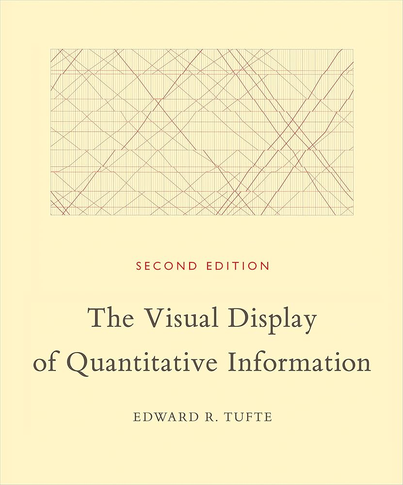

```

]

]


---

class: middle

.pull-left[

<br>

## Tufte's (1983/2001) Graphical Excellence & Elegance

Edward Tufte's revolutionised the way that data visualisation was done by introducing principles of excellence and elegance:

> "Graphical excellence consists of complex ideas communicated with clarity, precision and efficiency." (p.51)

> "Graphical excellence is that which gives to the viewer the greatest number of ideas in the shortest time with the least ink in the smallest space." (p.51)

For Tufte (at least in 1983/2001), we should aim to 'maximise the ink to information ratio' and avoid introducing extraneous stylistic elements that, at best, do nothing and, at worst, might influence perception of the data — communicate the most information in the least amount of ink. What does this mean?


]

.pull-right[


.center[

```{r, echo = FALSE, out.width = "100%", fig.cap="Typical boxplot design (Tufte, 2001)"}

knitr::include_graphics("images/tufte-boxplot-1.png")

```

]

]

---

class: middle

.pull-left[

<br>

## Tufte's (1983/2001) Graphical Excellence & Elegance

Edward Tufte's revolutionised the way that data visualisation was done by introducing principles of excellence and elegance:

> "Graphical excellence consists of complex ideas communicated with clarity, precision and efficiency." (p.51)

> "Graphical excellence is that which gives to the viewer the greatest number of ideas in the shortest time with the least ink in the smallest space." (p.51)

For Tufte (at least in 1983/2001), we should aim to 'maximise the ink to information ratio' and avoid introducing extraneous stylistic elements that, at best, do nothing and, at worst, might influence perception of the data — communicate the most information in the least amount of ink. What does this mean?


]

.pull-right[


.center[

```{r, echo = FALSE, out.width = "100%", fig.cap="Tufte's redesigned boxplot (Tufte, 2001)"}

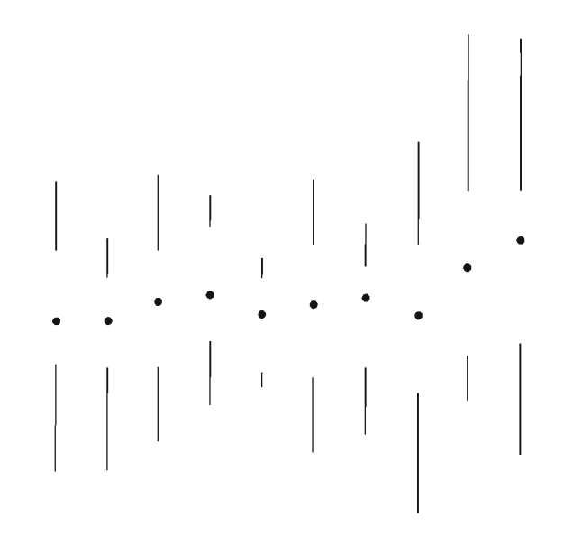

```

] 

]


---

class: middle

.pull-left[

<br>

## Tufte's (1983/2001) Graphical Excellence & Elegance

Edward Tufte's revolutionised the way that data visualisation was done by introducing principles of excellence and elegance:

> "Graphical excellence consists of complex ideas communicated with clarity, precision and efficiency." (p.51)

> "Graphical excellence is that which gives to the viewer the greatest number of ideas in the shortest time with the least ink in the smallest space." (p.51)

For Tufte (at least in 1983/2001), we should aim to 'maximise the ink to information ratio' and avoid introducing extraneous stylistic elements that, at best, do nothing and, at worst, might influence perception of the data — communicate the most information in the least amount of ink. What does this mean?


]

.pull-right[

<br><br>

.center[

```{r, echo = FALSE, out.width = "100%", fig.cap="A standard bar chart (Tufte, 2001)"}

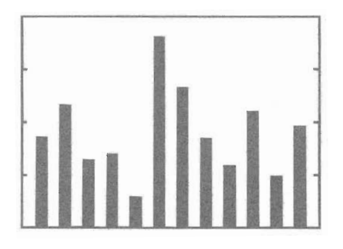

```

] 

]


---

class: middle

.pull-left[

<br>

## Tufte's (1983/2001) Graphical Excellence & Elegance

Edward Tufte's revolutionised the way that data visualisation was done by introducing principles of excellence and elegance:

> "Graphical excellence consists of complex ideas communicated with clarity, precision and efficiency." (p.51)

> "Graphical excellence is that which gives to the viewer the greatest number of ideas in the shortest time with the least ink in the smallest space." (p.51)

For Tufte (at least in 1983/2001), we should aim to 'maximise the ink to information ratio' and avoid introducing extraneous stylistic elements that, at best, do nothing and, at worst, might influence perception of the data — communicate the most information in the least amount of ink. What does this mean?


]

.pull-right[

<br><br>

.center[

```{r, echo = FALSE, out.width = "100%", fig.cap="Tufte's redesigned barchart (Tufte, 2001)"}

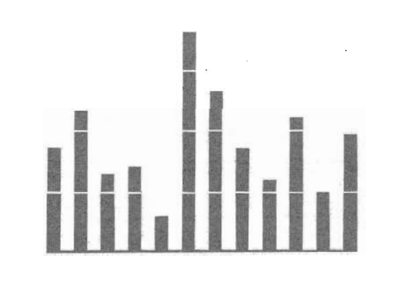

```

] 

]

---

class: inverse, middle


# The life and death(?) of chartjunk


---

class: middle

.pull-left[


## Chartjunk & misrepresentation

Edward Tufte particularly took issue with what he called **"chartjunk"**; the "interior decoration of graphics [that] does not tell the viewer anything new". In addition, he raised the issues of **misrepresentation and integrity** that often accompanied misuse of area/scale

* **Integrity and misrepresentation of scale**: misrepresenting differences between things: a square with twice the area of one that measures 10cm x 10cm would measure ~14cm x 14cm, not 20cm x 20cm

* .grey[Unintentional optical art: eye-straining effects that had "no place in data graphical design" (or arguably, any form of graphical design)]

* .grey[Extraneous gridlines: gridlines that only exist as a relic from drawing visualisations by hand that distract the viewer.]

* .grey[The graphical duck: unneccesary additions to the visualisation (e.g. colour) where it does not add any information, and is done just because "it can be done".]

]

.pull-right[

<br><br>

.center[

```{r, echo = FALSE, out.width = "55%", fig.cap="A lie factor of 2 (Tufte, 2001)"}

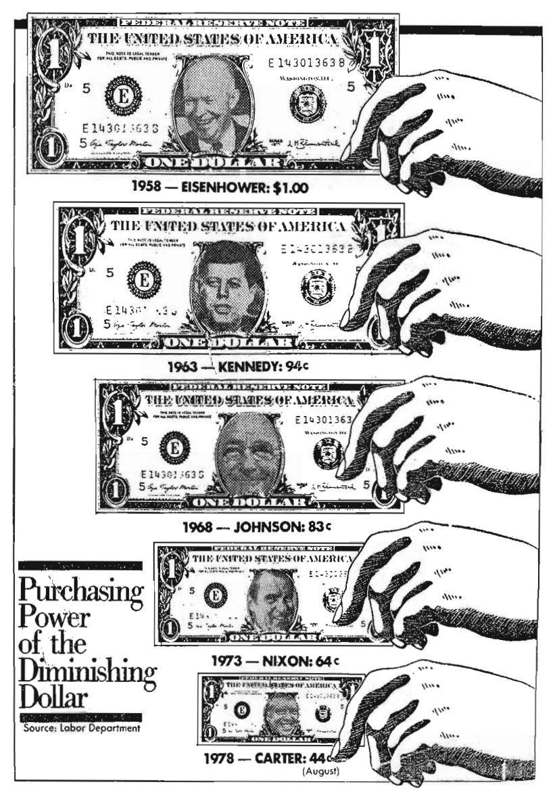

```

] 

]


---

class: middle

.pull-left[


## Chartjunk & misrepresentation

Edward Tufte particularly took issue with what he called **"chartjunk"**; the "interior decoration of graphics [that] does not tell the viewer anything new". In addition, he raised the issues of **misrepresentation and integrity** that often accompanied misuse of area/scale

* .grey[Integrity and misrepresentation of scale: misrepresenting differences between things: a square with twice the area of one that measures 10cm x 10cm would measure ~14cm x 14cm, not 20cm x 20cm]

* **Unintentional optical art**: eye-straining effects that had "no place in data graphical design" (or arguably, any form of graphical design)

* .grey[Extraneous gridlines: gridlines that only exist as a relic from drawing visualisations by hand that distract the viewer.]

* .grey[The graphical duck: unneccesary additions to the visualisation (e.g. colour) where it does not add any information, and is done just because "it can be done".]

]

.pull-right[

<br><br>

.center[

```{r, echo = FALSE, out.width = "100%", fig.cap="(Tufte, 2001: 108)"}

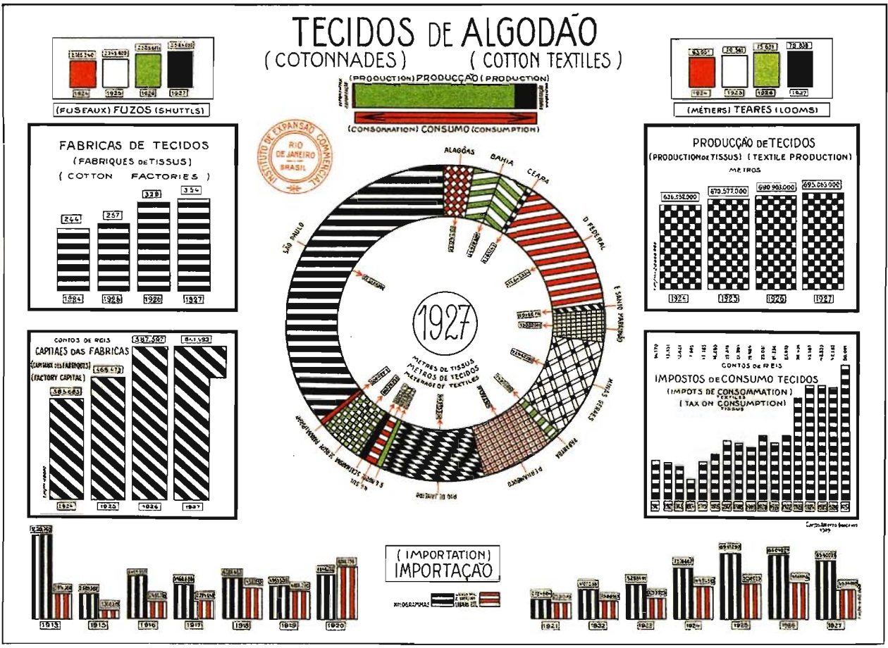

```

] 

]

---

class: middle

.pull-left[


## Chartjunk & misrepresentation

Edward Tufte particularly took issue with what he called **"chartjunk"**; the "interior decoration of graphics [that] does not tell the viewer anything new". In addition, he raised the issues of **misrepresentation and integrity** that often accompanied misuse of area/scale

* .grey[Integrity and misrepresentation of scale: misrepresenting differences between things: a square with twice the area of one that measures 10cm x 10cm would measure ~14cm x 14cm, not 20cm x 20cm]

* .grey[Unintentional optical art: eye-straining effects that had "no place in data graphical design" (or arguably, any form of graphical design)]

* **Extraneous gridlines**: gridlines that only exist as a relic from drawing visualisations by hand that distract the viewer.

* .grey[The graphical duck: unneccesary additions to the visualisation (e.g. colour) where it does not add any information, and is done just because "it can be done".]

]

.pull-right[

<br><br><br><br>

.center[

```{r, echo = FALSE, out.width = "100%", fig.cap="(Tufte, 2001: 115)"}

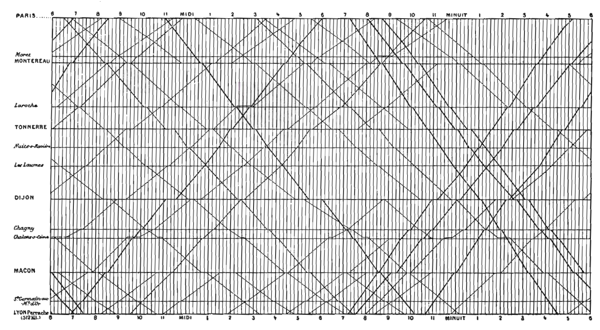

```

] 

]


---

class: middle

.pull-left[


## Chartjunk & misrepresentation

Edward Tufte particularly took issue with what he called **"chartjunk"**; the "interior decoration of graphics [that] does not tell the viewer anything new". In addition, he raised the issues of **misrepresentation and integrity** that often accompanied misuse of area/scale

* .grey[Integrity and misrepresentation of scale: misrepresenting differences between things: a square with twice the area of one that measures 10cm x 10cm would measure ~14cm x 14cm, not 20cm x 20cm]

* .grey[Unintentional optical art: eye-straining effects that had "no place in data graphical design" (or arguably, any form of graphical design)]

* .grey[Extraneous gridlines: gridlines that only exist as a relic from drawing visualisations by hand that distract the viewer.]

* **The graphical duck**: unneccesary additions to the visualisation (e.g. colour) where it does not add any information, and is done just because "it can be done".

]

.pull-right[

<br><br><br><br>

.center[

```{r, echo = FALSE, out.width = "100%", fig.cap="(Tufte, 2001: 120)"}

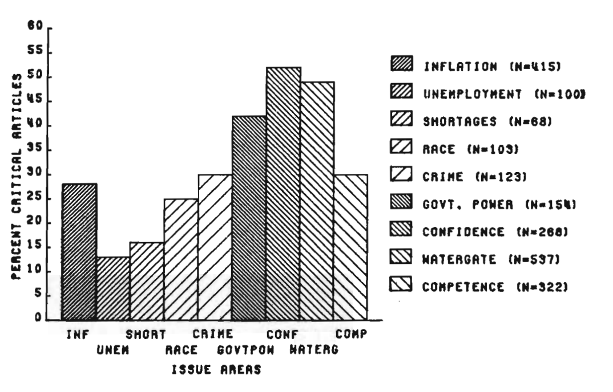

```

] 

]


---

class: middle

.pull-left[

## The influence of, and a critique of, Tufte's approach

Note how, in the workshops, many of the defaults that are used by ggplot (and other packages) tend to use the same kind of best practice that Tufte recommended: **no more thick gridlines, no more unnecessary crosshatching, and you have to try quite hard to misrepresent your data**.

However, of we remove everything that isn't strictly necessary, where does that leave **design, art, and the influence it can have on engagement and communication for different audiences**? What does "default ink" look like in a digital world? What if elegant isn't your aesthetic?

> "Embellishments can at times, when properly chosen and designed, represent information redundantly in useful ways, and even when they aren't information in and of themselves, can meaningfully support the display of information."

.right[Stephen Few, quoted in Feigenbaum & Alamalhodaei, 2020.]


]

.pull-right[

<br><br>

.center[

```{r, echo = FALSE, out.width = "70%", fig.cap="(Tufte, 2001: 120)"}


```

] 

]


---

class: inverse, middle

#### Part II

# Good practice meets good design? Data vis with pretty ducks.


---

class: middle

.pull-left[

## Text

* Font
* Annotation
* Accessibility
* Readability

Some great advice on the DataWrapper blog [here](https://blog.datawrapper.de/text-in-data-visualizations/) and [here](https://blog.datawrapper.de/fonts-for-data-visualization/).

]

.pull-right[

## Colour

* Symbolism/Identity (or lack thereof)
* Colour theory and palettes
* Colour for emphasis
* Accessibility

Some more great advice from DataWrapper on the use of colour in blogs [here](https://blog.datawrapper.de/emphasize-with-color-in-data-visualizations/) and [here](https://blog.datawrapper.de/color-keys-for-data-visualizations/), as well as a very useful tool in the Adobe Color web tool [here](https://color.adobe.com/create/color-wheel)

]


---

.pull-left[

## Text

* Font
* Annotation
* Accessibility
* Readability


]


.pull-right[

<br>

```{r, echo = FALSE, fig.height=5, fig.width=5, out.height=500, out.width=500}

# get some data to act as an example
# Source: YouGov 2024 via OurWorldinData
# https://ourworldindata.org/grapher/americans-worry-work-being-automated?tab=table&showSelectionOnlyInTable=1&country=~18-29+years

ai_worry <- read_csv(here::here("week-05/slides/data/americans-worry-work-being-automated.csv"))

ai_worry <- ai_worry %>%
  filter(
    Entity %in% c("18-29 years", "30-44 years", "45-64 years")
  ) %>%
  mutate(
    worried = `Very worried` + `Fairly worried`
  ) %>%
  select(
    age_group = Entity,
    date = Day,
    worried
  )

set.seed(99)
noise <- round(rnorm(24, 0, 0.2), 3)

ai_worry <- ai_worry %>%
  mutate(
    worried = worried + noise
  )

library(ggtext)

scaleFUN <- function(x) sprintf("%.2f", x)

start_plot <- ai_worry %>%
  ggplot() +
  geom_line(aes(x = date, y = worried, colour = age_group)) +
  xlab("") +
  ylab("Percent who feel worried about their work being automated") +
  ggtitle("Americans increasingly worry that automation will take their jobs",
          subtitle = 'Survey respondents were asked, "How worried, if at all, are you that your type of work could be automated within your lifetime?"') +
  ggeasy::easy_add_legend_title("Age Group") +
  scale_y_continuous(breaks = seq(10, 60, length.out = 7),
                     labels=scaleFUN, 
                     limits = c(0, 60)) +
  theme(
    plot.title = element_textbox_simple(family = "Arial", 
                                        maxwidth = unit(5, "npc"), 
                                        margin = margin(10,0,20,0),
                                        halign = 0
                                        ),
    plot.subtitle = element_textbox_simple(family = "Arial", 
                                           maxwidth = unit(5, "npc"), 
                                           margin = margin(0,0,20,0),
                                           halign = 0
                                           ),
    axis.title.y = element_textbox_simple(family = "Arial", 
                                          maxheight = unit(4, "npc"), 
                                          orientation = "left-rotated",
                                          minwidth = unit(1, "pt"), 
                                          margin = margin(2,0,10,0), 
                                          hjust = 0.5, halign = 0.5),
    axis.text = element_markdown(family = "Arial", size = 8),
    legend.position = "bottom"
  )


start_plot


```

]


---

.pull-left[

## Text

* **Font**

Fonts can generally be characterised into two "flavours": .serif[Serif] (e.g. Times) and .sans-serif[Sans-serif] (e.g. Helvetica).

Fonts can also have different weights, for example: .helv200[Helvetica@200], .helv300[Helvetica@300], .helv600[Helvetica@600], which can indicate emphasis/hierarchy or be a style choice in general.

Further, fonts can be *italicised* or <u>underlined</u> for emphasis.

Sans-serif fonts tend to be **cleaner and easier to read in data visualisation**. 

A good rule of thumb: Maximum 3 different sizes for leading the eye, and bold weights for emphasis if needed.

* .grey[Annotation]
* .grey[Accessibility]
* .grey[Readability]


]


.pull-right[

<br>

```{r, echo = FALSE, fig.height=5, fig.width=5, out.height=500, out.width=500}


start_plot


```

]

---

.pull-left[

## Text

* **Font**

Fonts can generally be characterised into two "flavours": .serif[Serif] (e.g. Times) and .sans-serif[Sans-serif] (e.g. Helvetica).

Fonts can also have different weights, for example: .helv200[Helvetica@200], .helv300[Helvetica@300], .helv600[Helvetica@600], which can indicate emphasis/hierarchy or be a style choice in general.

Further, fonts can be *italicised* or <u>underlined</u> for emphasis.

Sans-serif fonts tend to be **cleaner and easier to read in data visualisation**. 

A good rule of thumb: Maximum 3 different sizes for leading the eye, and bold weights for emphasis if needed.

* .grey[Annotation]
* .grey[Accessibility]
* .grey[Readability]


]


.pull-right[

<br>

```{r, echo = FALSE, fig.height=5, fig.width=5, out.height=500, out.width=500}


ai_worry %>%
  ggplot() +
  geom_line(aes(x = date, y = worried, colour = age_group)) +
  xlab("") +
  ylab("Percent who feel worried about their work being automated") +
  ggtitle("Americans increasingly worry that automation will take their jobs",
          subtitle = 'Survey respondents were asked, "How worried, if at all, are you that your type of work could be automated within your lifetime?"') +
  ggeasy::easy_add_legend_title("Age Group") +
  scale_y_continuous(breaks = seq(10, 60, length.out = 7),
                   labels=scaleFUN, 
                   limits = c(0, 60)) +
  theme(
    plot.title = element_textbox_simple(family = "Helvetica", 
                                        size = 18, face = "bold",
                                        maxwidth = unit(5, "npc"), 
                                        margin = margin(10,0,10,0),
                                        halign = 0
                                        ),
    plot.subtitle = element_textbox_simple(family = "Helvetica", 
                                           size = 10,
                                           maxwidth = unit(5, "npc"), 
                                           margin = margin(0,0,20,0),
                                           halign = 0
                                           ),
    axis.title.y = element_textbox_simple(family = "Helvetica", 
                                          size = 8,
                                          maxheight = unit(4, "npc"), 
                                          orientation = "left-rotated",
                                          minwidth = unit(1, "pt"), 
                                          margin = margin(2,0,10,0), 
                                          hjust = 0.5, halign = 0.5),
    legend.text = element_markdown(family = "Helvetica", 
                                   size = 8), 
    legend.title = element_markdown(family = "Helvetica", 
                                    size = 8),
    axis.text = element_markdown(family = "Helvetica", 
                                 size = 8),
    legend.position = "bottom"
  )


```

]


---

.pull-left[

## Text

* **Font**


```{r, eval = FALSE}
my_plot + theme(
    plot.title = element_text(family = "Helvetica", 
                              size = 18, 
                              face = "bold"
                                        ),
    plot.subtitle = element_text(family = "Helvetica", 
                                 size = 10
                                           ),
    axis.title.y = element_text(family = "Helvetica", 
                                size = 8),
    legend.text = element_text(family = "Helvetica", 
                               size = 8
                               ), 
    legend.title = element_text(family = "Helvetica", 
                                size = 8),
    axis.text = element_text(family = "Helvetica", 
                             size = 8)
  )
```


* .grey[Annotation]
* .grey[Accessibility]
* .grey[Readability]


]


.pull-right[

<br>

```{r, echo = FALSE, fig.height=5, fig.width=5, out.height=500, out.width=500}


ai_worry %>%
  ggplot() +
  geom_line(aes(x = date, y = worried, colour = age_group)) +
  xlab("") +
  ylab("Percent who feel worried about their work being automated") +
  ggtitle("Americans increasingly worry that automation will take their jobs",
          subtitle = 'Survey respondents were asked, "How worried, if at all, are you that your type of work could be automated within your lifetime?"') +
  ggeasy::easy_add_legend_title("Age Group") +
  scale_y_continuous(breaks = seq(10, 60, length.out = 7),
                   labels=scaleFUN, 
                   limits = c(0, 60)) +
  theme(
    plot.title = element_textbox_simple(family = "Helvetica", 
                                        size = 18, face = "bold",
                                        maxwidth = unit(5, "npc"), 
                                        margin = margin(10,0,10,0),
                                        halign = 0
                                        ),
    plot.subtitle = element_textbox_simple(family = "Helvetica", 
                                           size = 10,
                                           maxwidth = unit(5, "npc"), 
                                           margin = margin(0,0,20,0),
                                           halign = 0
                                           ),
    axis.title.y = element_textbox_simple(family = "Helvetica", 
                                          size = 8,
                                          maxheight = unit(4, "npc"), 
                                          orientation = "left-rotated",
                                          minwidth = unit(1, "pt"), 
                                          margin = margin(2,0,10,0), 
                                          hjust = 0.5, halign = 0.5),
    legend.text = element_markdown(family = "Helvetica", 
                                   size = 8), 
    legend.title = element_markdown(family = "Helvetica", 
                                    size = 8),
    axis.text = element_markdown(family = "Helvetica", 
                                 size = 8),
    legend.position = "bottom"
  )


```

]


---

.pull-left[

## Text

* .grey[Font]
* **Annotation**

Annotation refers to placing text (or sometimes images/icons) on the 'data' layer of the data visualisation. 

This helps keep the reader's eye centred on the most important part of the visualisation — the data — and **prevents them having to go 'hunting' for the relevant information** (i.e. the legend). 

Annotations are usually combined with colour in order to remove the need for a separate key outside the data at all.

Annotations are usually best placed at the 'end' of a time-series or near the thing we want to draw attention to (which could also be a 'peak').


* .grey[Accessibility]
* .grey[Readability]


]


.pull-right[

<br>

```{r, echo = FALSE, fig.height=5, fig.width=5, out.height=500, out.width=500}


ai_worry %>%
  ggplot() +
  geom_line(aes(x = date, y = worried, colour = age_group)) +
  xlab("") +
  ylab("Percent who feel worried about their work being automated") +
  ggtitle("Americans increasingly worry that automation will take their jobs",
          subtitle = 'Survey respondents were asked, "How worried, if at all, are you that your type of work could be automated within your lifetime?"') +
  ggeasy::easy_add_legend_title("Age Group") +
  scale_y_continuous(breaks = seq(10, 60, length.out = 7),
                   labels=scaleFUN, 
                   limits = c(0, 60)) +
  theme(
    plot.title = element_textbox_simple(family = "Helvetica", 
                                        size = 18, face = "bold",
                                        maxwidth = unit(5, "npc"), 
                                        margin = margin(10,0,10,0),
                                        halign = 0
                                        ),
    plot.subtitle = element_textbox_simple(family = "Helvetica", 
                                           size = 10,
                                           maxwidth = unit(5, "npc"), 
                                           margin = margin(0,0,20,0),
                                           halign = 0
                                           ),
    axis.title.y = element_textbox_simple(family = "Helvetica", 
                                          size = 8,
                                          maxheight = unit(4, "npc"), 
                                          orientation = "left-rotated",
                                          minwidth = unit(1, "pt"), 
                                          margin = margin(2,0,10,0), 
                                          hjust = 0.5, halign = 0.5),
    legend.text = element_markdown(family = "Helvetica", 
                                   size = 8), 
    legend.title = element_markdown(family = "Helvetica", 
                                    size = 8),
    axis.text = element_markdown(family = "Helvetica", 
                                 size = 8),
    legend.position = "bottom"
  )


```

]


---

.pull-left[

## Text

* .grey[Font]
* **Annotation**

Annotation refers to placing text (or sometimes images/icons) on the 'data' layer of the data visualisation. 

This helps keep the reader's eye centred on the most important part of the visualisation — the data — and **prevents them having to go 'hunting' for the relevant information** (i.e. the legend). 

Annotations are usually combined with colour in order to remove the need for a separate key outside the data at all.

Annotations are usually best placed at the 'end' of a time-series or near the thing we want to draw attention to (which could also be a 'peak').


* .grey[Accessibility]
* .grey[Readability]


]


.pull-right[

<br>

```{r, echo = FALSE, fig.height=5, fig.width=5, out.height=500, out.width=500}


ai_worry %>%
  ggplot() +
  geom_line(aes(x = date, y = worried, colour = age_group)) +
  xlab("") +
  ylab("Percent who feel worried about their work being automated") +
  ggtitle("Americans increasingly worry that automation will take their jobs",
          subtitle = 'Survey respondents were asked, "How worried, if at all, are you that your type of work could be automated within your lifetime?"') +
  annotate("text", x = as.Date("2024-08-01"), y = 44.5, label = "Age 30-44",
           hjust = 0,
           family = "Helvetica", face = "bold",
           size = 10/.pt,
           colour = "#00BA38"
           ) +
  annotate("text", x = as.Date("2024-08-01"), y = 36, label = "Age 18-29",
         hjust = 0,
         family = "Helvetica", face = "bold",
         size = 10/.pt,
         colour = "#F8786F"
         ) +
  annotate("text", x = as.Date("2024-08-01"), y = 25.5, label = "Age 45-65",
       hjust = 0,
       family = "Helvetica", face = "bold",
       size = 10/.pt,
       colour = "#619CFF"
       ) +
  ggeasy::easy_add_legend_title("Age Group") +
  scale_y_continuous(breaks = seq(10, 60, length.out = 7),
                   labels=scaleFUN, 
                   limits = c(0, 60)) +
  scale_x_date(breaks = as.Date(c("2021-01-01", "2022-01-01", "2023-01-01", "2024-01-01")), 
               labels = scales::date_format("%Y")) + 
  expand_limits(x = as.Date(c("2021-01-01", "2025-06-01"))) +
  theme(
    plot.title = element_textbox_simple(family = "Helvetica", 
                                        size = 18, face = "bold",
                                        maxwidth = unit(5, "npc"), 
                                        margin = margin(10,0,10,0),
                                        halign = 0
                                        ),
    plot.subtitle = element_textbox_simple(family = "Helvetica", 
                                           size = 10,
                                           maxwidth = unit(5, "npc"), 
                                           margin = margin(0,0,20,0),
                                           halign = 0
                                           ),
    axis.title.y = element_textbox_simple(family = "Helvetica", 
                                          size = 8,
                                          maxheight = unit(4, "npc"), 
                                          orientation = "left-rotated",
                                          minwidth = unit(1, "pt"), 
                                          margin = margin(2,0,10,0), 
                                          hjust = 0.5, halign = 0.5),
    legend.text = element_markdown(family = "Helvetica", 
                                   size = 8), 
    legend.title = element_markdown(family = "Helvetica", 
                                    size = 8),
    axis.text = element_markdown(family = "Helvetica", 
                                 size = 8),
    legend.position = "none"
  )


```

]


---

.pull-left[

## Text

* .grey[Font]
* **Annotation**

```{r, eval = FALSE}

my_plot +
    annotate("text", 
             x = as.Date("2024-08-01"), 
             y = 44.5, 
             label = "Age 30-44",
             hjust = 0,
             family = "Helvetica", face = "bold",
             size = 10/.pt,
             colour = "#00BA38"
           ) +
  ... +
  scale_x_date(breaks = as.Date(c("2021-01-01", "2022-01-01", "2023-01-01", "2024-01-01")), 
               labels = scales::date_format("%Y")) + 
  expand_limits(x = as.Date(c("2021-01-01", "2025-06-01"))) +
  theme(
    legend.position = "none"
  )


```


* .grey[Accessibility]
* .grey[Readability]


]


.pull-right[

<br>

```{r, echo = FALSE, fig.height=5, fig.width=5, out.height=500, out.width=500}


ai_worry %>%
  ggplot() +
  geom_line(aes(x = date, y = worried, colour = age_group)) +
  xlab("") +
  ylab("Percent who feel worried about their work being automated") +
  ggtitle("Americans increasingly worry that automation will take their jobs",
          subtitle = 'Survey respondents were asked, "How worried, if at all, are you that your type of work could be automated within your lifetime?"') +
  annotate("text", x = as.Date("2024-08-01"), y = 44.5, label = "Age 30-44",
           hjust = 0,
           family = "Helvetica", face = "bold",
           size = 10/.pt,
           colour = "#00BA38"
           ) +
  annotate("text", x = as.Date("2024-08-01"), y = 36, label = "Age 18-29",
         hjust = 0,
         family = "Helvetica", face = "bold",
         size = 10/.pt,
         colour = "#F8786F"
         ) +
  annotate("text", x = as.Date("2024-08-01"), y = 25.5, label = "Age 45-65",
       hjust = 0,
       family = "Helvetica", face = "bold",
       size = 10/.pt,
       colour = "#619CFF"
       ) +
  ggeasy::easy_add_legend_title("Age Group") +
  scale_x_date(breaks = as.Date(c("2021-01-01", "2022-01-01", "2023-01-01", "2024-01-01")), 
               labels = scales::date_format("%Y")) + 
  expand_limits(x = as.Date(c("2021-01-01", "2025-06-01"))) +
    scale_y_continuous(breaks = seq(10, 60, length.out = 7),
                     labels=scaleFUN, 
                     limits = c(0, 60)) +
  theme(
    plot.title = element_textbox_simple(family = "Helvetica", 
                                        size = 18, face = "bold",
                                        maxwidth = unit(5, "npc"), 
                                        margin = margin(10,0,10,0),
                                        halign = 0
                                        ),
    plot.subtitle = element_textbox_simple(family = "Helvetica", 
                                           size = 10,
                                           maxwidth = unit(5, "npc"), 
                                           margin = margin(0,0,20,0),
                                           halign = 0
                                           ),
    axis.title.y = element_textbox_simple(family = "Helvetica", 
                                          size = 8,
                                          maxheight = unit(4, "npc"), 
                                          orientation = "left-rotated",
                                          minwidth = unit(1, "pt"), 
                                          margin = margin(2,0,10,0), 
                                          hjust = 0.5, halign = 0.5),
    legend.text = element_markdown(family = "Helvetica", 
                                   size = 8), 
    legend.title = element_markdown(family = "Helvetica", 
                                    size = 8),
    axis.text = element_markdown(family = "Helvetica", 
                                 size = 8),
    legend.position = "none"
  )


```

]


---

.pull-left[

## Text

* .grey[Font]
* **Annotation**

An alternative, usually easier, way to add annotation without having to expand the axis is to add a "label" that is the same colour as your background. This makes your annotation feel "embedded".

```{r, eval = FALSE}

my_plot + 
  annotate("label", x = as.Date("2022-01-15"), 
           y = 34, label = "Age 30-44",
          hjust = 0,
          family = "Helvetica", face = "bold",
          size = 10/.pt,
          colour = "#f8f8f8", 
          fill = "#00BA38") 


```

I prefer the first version and feel like it's more appropriate for us wanting to draw the reader's eye to the most recent time point on the right hand side though.


* .grey[Accessibility]
* .grey[Readability]


]


.pull-right[

<br>

```{r, echo = FALSE, fig.height=5, fig.width=5, out.height=500, out.width=500}


ai_worry %>%
  ggplot() +
  geom_line(aes(x = date, y = worried, colour = age_group)) +
  xlab("") +
  ylab("Percent who feel worried about their work being automated") +
  ggtitle("Americans increasingly worry that automation will take their jobs",
          subtitle = 'Survey respondents were asked, "How worried, if at all, are you that your type of work could be automated within your lifetime?"') +
  annotate("label", x = as.Date("2022-01-15"), y = 34, label = "Age 30-44",
           hjust = 0,
           family = "Helvetica", face = "bold",
           size = 10/.pt,
           colour = "#f8f8f8", 
           fill = "#00BA38"
           ) +
  annotate("label", x = as.Date("2022-03-01"), y = 26.5, label = "Age 18-29",
         hjust = 0,
         family = "Helvetica", face = "bold",
         size = 10/.pt,
         colour = "#f8f8f8",
         fill = "#F8786F"
         ) +
  annotate("label", x = as.Date("2023-06-01"), y = 20, label = "Age 45-65",
       hjust = 0,
       family = "Helvetica", face = "bold",
       size = 10/.pt,
       colour = "#f8f8f8",
       fill = "#619CFF"
       ) +
  scale_y_continuous(breaks = seq(10, 60, length.out = 7),
                   labels=scaleFUN, 
                   limits = c(0, 60)) +
  theme(
    plot.title = element_textbox_simple(family = "Helvetica", 
                                        size = 18, face = "bold",
                                        maxwidth = unit(5, "npc"), 
                                        margin = margin(10,0,10,0),
                                        halign = 0
                                        ),
    plot.subtitle = element_textbox_simple(family = "Helvetica", 
                                           size = 10,
                                           maxwidth = unit(5, "npc"), 
                                           margin = margin(0,0,20,0),
                                           halign = 0
                                           ),
    axis.title.y = element_textbox_simple(family = "Helvetica", 
                                          size = 8,
                                          maxheight = unit(4, "npc"), 
                                          orientation = "left-rotated",
                                          minwidth = unit(1, "pt"), 
                                          margin = margin(2,0,10,0), 
                                          hjust = 0.5, halign = 0.5),
    legend.text = element_markdown(family = "Helvetica", 
                                   size = 8), 
    legend.title = element_markdown(family = "Helvetica", 
                                    size = 8),
    axis.text = element_markdown(family = "Helvetica", 
                                 size = 8),
    legend.position = "none"
  )


```

]


---

.pull-left[

## Text

* .grey[Font]
* .grey[Annotation]
* **Accessibility**

**Font/text**

Is the text size sufficiently large?

.sans-serif-dyslexia[Sans serif with increased letter spacing can be better for people with dyslexia.]

Left aligned text is easier to read than

<center>center aligned text.</center>

UPPERCASE is harder to read than lowercase.

Best practice for text contrast is not Black text on a pure white background, but actually slightly less contrast (it reduces eye strain) by either using a "grey" text or a "grey" background. 


* .grey[Readability]


]


.pull-right[

<br>

```{r, echo = FALSE, fig.height=5, fig.width=5, out.height=500, out.width=500}


ai_worry %>%
  ggplot() +
  geom_line(aes(x = date, y = worried, colour = age_group)) +
  xlab("") +
  ylab("Percent who feel worried about their work being automated") +
  ggtitle("Americans increasingly worry that automation will take their jobs",
          subtitle = 'Survey respondents were asked, "How worried, if at all, are you that your type of work could be automated within your lifetime?"') +
  annotate("text", x = as.Date("2024-08-01"), y = 44.5, label = "Age 30-44",
           hjust = 0,
           family = "Helvetica", face = "bold",
           size = 10/.pt,
           colour = "#00BA38"
           ) +
  annotate("text", x = as.Date("2024-08-01"), y = 36, label = "Age 18-29",
         hjust = 0,
         family = "Helvetica", face = "bold",
         size = 10/.pt,
         colour = "#F8786F"
         ) +
  annotate("text", x = as.Date("2024-08-01"), y = 25.5, label = "Age 45-65",
       hjust = 0,
       family = "Helvetica", face = "bold",
       size = 10/.pt,
       colour = "#619CFF"
       ) +
  ggeasy::easy_add_legend_title("Age Group") +
  scale_x_date(breaks = as.Date(c("2021-01-01", "2022-01-01", "2023-01-01", "2024-01-01")), 
               labels = scales::date_format("%Y")) + 
  expand_limits(x = as.Date(c("2021-01-01", "2025-06-01"))) +
  scale_y_continuous(breaks = seq(10, 60, length.out = 7),
                   labels=scaleFUN, 
                   limits = c(0, 60)) +
  theme(
    plot.title = element_textbox_simple(family = "Helvetica", 
                                        size = 18, face = "bold",
                                        maxwidth = unit(5, "npc"), 
                                        margin = margin(10,0,10,0),
                                        halign = 0
                                        ),
    plot.subtitle = element_textbox_simple(family = "Helvetica", 
                                           size = 10,
                                           maxwidth = unit(5, "npc"), 
                                           margin = margin(0,0,20,0),
                                           halign = 0
                                           ),
    axis.title.y = element_textbox_simple(family = "Helvetica", 
                                          size = 8,
                                          maxheight = unit(4, "npc"), 
                                          orientation = "left-rotated",
                                          minwidth = unit(1, "pt"), 
                                          margin = margin(2,0,10,0), 
                                          hjust = 0.5, halign = 0.5),
    legend.text = element_markdown(family = "Helvetica", 
                                   size = 8), 
    legend.title = element_markdown(family = "Helvetica", 
                                    size = 8),
    axis.text = element_markdown(family = "Helvetica", 
                                 size = 8),
    legend.position = "none"
  )


```

]


---

.pull-left[

## Text

* .grey[Font]
* .grey[Annotation]
* **Accessibility**

(Technically this is about colour, but it applies specifically to reading text, so it's here):

Here is an example using black (#00000) text and a white (#ffffff) background (Contrast ratio of 21:1).


* .grey[Readability]


]


.pull-right[

<br>

```{r, echo = FALSE, fig.height=5, fig.width=5, out.height=500, out.width=500}


ai_worry %>%
  ggplot() +
  geom_line(aes(x = date, y = worried, colour = age_group)) +
  xlab("") +
  ylab("Percent who feel worried about their work being automated") +
  ggtitle("Americans increasingly worry that automation will take their jobs",
          subtitle = 'Survey respondents were asked, "How worried, if at all, are you that your type of work could be automated within your lifetime?"') +
  annotate("text", x = as.Date("2024-08-01"), y = 44.5, label = "Age 30-44",
           hjust = 0,
           family = "Helvetica", face = "bold",
           size = 10/.pt,
           colour = "#00BA38"
           ) +
  annotate("text", x = as.Date("2024-08-01"), y = 36, label = "Age 18-29",
         hjust = 0,
         family = "Helvetica", face = "bold",
         size = 10/.pt,
         colour = "#F8786F"
         ) +
  annotate("text", x = as.Date("2024-08-01"), y = 25.5, label = "Age 45-65",
       hjust = 0,
       family = "Helvetica", face = "bold",
       size = 10/.pt,
       colour = "#619CFF"
       ) +
  ggeasy::easy_add_legend_title("Age Group") +
  scale_x_date(breaks = as.Date(c("2021-01-01", "2022-01-01", "2023-01-01", "2024-01-01")), 
               labels = scales::date_format("%Y")) + 
  expand_limits(x = as.Date(c("2021-01-01", "2025-06-01"))) +
  scale_y_continuous(breaks = seq(10, 60, length.out = 7),
                   labels=scaleFUN, 
                   limits = c(0, 60)) +
  theme(
    plot.title = element_textbox_simple(family = "Helvetica", 
                                        size = 18, face = "bold",
                                        maxwidth = unit(5, "npc"), 
                                        margin = margin(10,0,10,0),
                                        halign = 0,
                                        colour = "#000000"
                                        ),
    plot.subtitle = element_textbox_simple(family = "Helvetica", 
                                           size = 10,
                                           maxwidth = unit(5, "npc"), 
                                           margin = margin(0,0,20,0),
                                           halign = 0,
                                        colour = "#000000"
                                           ),
    axis.title.y = element_textbox_simple(family = "Helvetica", 
                                          size = 8,
                                          maxheight = unit(4, "npc"), 
                                          orientation = "left-rotated",
                                          minwidth = unit(1, "pt"), 
                                          margin = margin(2,0,10,0), 
                                          hjust = 0.5, halign = 0.5,
                                        colour = "#000000"),
    legend.text = element_markdown(family = "Helvetica", 
                                   size = 8,
                                        colour = "#000000"), 
    legend.title = element_markdown(family = "Helvetica", 
                                    size = 8,
                                        colour = "#000000"),
    axis.text = element_markdown(family = "Helvetica", 
                                 size = 8,
                                        colour = "#000000"),
    legend.position = "none",
    plot.background = element_rect(fill = "#ffffff", colour = "white"),
    panel.background = element_rect(fill = "white", colour = "white")
  )


```

]


---

.pull-left[

## Text

* .grey[Font]
* .grey[Annotation]
* **Accessibility**

(Technically this is about colour, but it applies specifically to reading text, so it's here):

.grey[Here is an example using black (#00000) text and a white (#ffffff) background (Contrast ratio of 21:1)]

Here is an example using "grey" (#323232) text and a "grey" (#f8f8f8) background (Contrast ratio of around 12:1).


A free tool for checking contrast ratio can be found [here](https://webaim.org/resources/contrastchecker/). Contrast ratios for all text intended to be read should be no lower than 4.5:1. Most people tend to find a contrast ratio between 10-15:1 comfortable for reading.

* .grey[Readability]


]


.pull-right[

<br>

```{r, echo = FALSE, fig.height=5, fig.width=5, out.height=500, out.width=500}


ai_worry %>%
  ggplot() +
  geom_line(aes(x = date, y = worried, colour = age_group)) +
  xlab("") +
  ylab("Percent who feel worried about their work being automated") +
  ggtitle("Americans increasingly worry that automation will take their jobs",
          subtitle = 'Survey respondents were asked, "How worried, if at all, are you that your type of work could be automated within your lifetime?"') +
  annotate("text", x = as.Date("2024-08-01"), y = 44.5, label = "Age 30-44",
           hjust = 0,
           family = "Helvetica", face = "bold",
           size = 10/.pt,
           colour = "#00BA38"
           ) +
  annotate("text", x = as.Date("2024-08-01"), y = 36, label = "Age 18-29",
         hjust = 0,
         family = "Helvetica", face = "bold",
         size = 10/.pt,
         colour = "#F8786F"
         ) +
  annotate("text", x = as.Date("2024-08-01"), y = 25.5, label = "Age 45-65",
       hjust = 0,
       family = "Helvetica", face = "bold",
       size = 10/.pt,
       colour = "#619CFF"
       ) +
  ggeasy::easy_add_legend_title("Age Group") +
  scale_x_date(breaks = as.Date(c("2021-01-01", "2022-01-01", "2023-01-01", "2024-01-01")), 
               labels = scales::date_format("%Y")) + 
  expand_limits(x = as.Date(c("2021-01-01", "2025-06-01"))) +
  scale_y_continuous(breaks = seq(10, 60, length.out = 7),
                   labels=scaleFUN, 
                   limits = c(0, 60)) +
  theme(
    plot.title = element_textbox_simple(family = "Helvetica", 
                                        size = 18, face = "bold",
                                        maxwidth = unit(5, "npc"), 
                                        margin = margin(10,0,10,0),
                                        halign = 0,
                                        colour = "#323232"
                                        ),
    plot.subtitle = element_textbox_simple(family = "Helvetica", 
                                           size = 10,
                                           maxwidth = unit(5, "npc"), 
                                           margin = margin(0,0,20,0),
                                           halign = 0,
                                        colour = "#323232"
                                           ),
    axis.title.y = element_textbox_simple(family = "Helvetica", 
                                          size = 8,
                                          maxheight = unit(4, "npc"), 
                                          orientation = "left-rotated",
                                          minwidth = unit(1, "pt"), 
                                          margin = margin(2,0,10,0), 
                                          hjust = 0.5, halign = 0.5,
                                        colour = "#323232"),
    legend.text = element_markdown(family = "Helvetica", 
                                   size = 8,
                                        colour = "#323232"), 
    legend.title = element_markdown(family = "Helvetica", 
                                    size = 8,
                                        colour = "#323232"),
    axis.text = element_markdown(family = "Helvetica", 
                                 size = 8,
                                        colour = "#323232"),
    legend.position = "none",
    plot.background = element_rect(fill = "#f8f8f8", colour = "#f8f8f8"),
    panel.background = element_rect(fill = "#f8f8f8", colour = "#f8f8f8")
  )


```

]


---

.pull-left[

## Text

* .grey[Font]
* .grey[Annotation]
* .grey[Accessibility]
* **Readability**

Right aligned numbers are easier to read than left-aligned numbers, especially when they have a different number of digits. Decimal point-aligned numbers can be even better.

**Round numbers** where you can. Group large numbers, for example, use 1,000,000 instead of 1000000 or 1e+06 (the `scales` package functions such as `scales::comma_format()` are very useful for this). Be conscious of regional differences in whether , or . means decimal. 

Keep your formats represented (somewhere) on your axes, where possible. For example, using `scales::percent_format()` to add % signs for axes showing percentage.


]


.pull-right[

<br>

```{r, echo = FALSE, fig.height=5, fig.width=5, out.height=500, out.width=500}


ai_worry %>%
  ggplot() +
  geom_line(aes(x = date, y = worried, colour = age_group)) +
  xlab("") +
  ylab("Percent who feel worried about their work being automated") +
  ggtitle("Americans increasingly worry that automation will take their jobs",
          subtitle = 'Survey respondents were asked, "How worried, if at all, are you that your type of work could be automated within your lifetime?"') +
  annotate("text", x = as.Date("2024-08-01"), y = 44.5, label = "Age 30-44",
           hjust = 0,
           family = "Helvetica", face = "bold",
           size = 10/.pt,
           colour = "#00BA38"
           ) +
  annotate("text", x = as.Date("2024-08-01"), y = 36, label = "Age 18-29",
         hjust = 0,
         family = "Helvetica", face = "bold",
         size = 10/.pt,
         colour = "#F8786F"
         ) +
  annotate("text", x = as.Date("2024-08-01"), y = 25.5, label = "Age 45-65",
       hjust = 0,
       family = "Helvetica", face = "bold",
       size = 10/.pt,
       colour = "#619CFF"
       ) +
  ggeasy::easy_add_legend_title("Age Group") +
  scale_x_date(breaks = as.Date(c("2021-01-01", "2022-01-01", "2023-01-01", "2024-01-01")), 
               labels = scales::date_format("%Y")) + 
  expand_limits(x = as.Date(c("2021-01-01", "2025-06-01"))) +
  scale_y_continuous(breaks = seq(10, 60, length.out = 7),
                   labels=scaleFUN, 
                   limits = c(0, 60)) +
  theme(
    plot.title = element_textbox_simple(family = "Helvetica", 
                                        size = 18, face = "bold",
                                        maxwidth = unit(5, "npc"), 
                                        margin = margin(10,0,10,0),
                                        halign = 0,
                                        colour = "#323232"
                                        ),
    plot.subtitle = element_textbox_simple(family = "Helvetica", 
                                           size = 10,
                                           maxwidth = unit(5, "npc"), 
                                           margin = margin(0,0,20,0),
                                           halign = 0,
                                        colour = "#323232"
                                           ),
    axis.title.y = element_textbox_simple(family = "Helvetica", 
                                          size = 8,
                                          maxheight = unit(4, "npc"), 
                                          orientation = "left-rotated",
                                          minwidth = unit(1, "pt"), 
                                          margin = margin(2,0,10,0), 
                                          hjust = 0.5, halign = 0.5,
                                        colour = "#323232"),
    legend.text = element_markdown(family = "Helvetica", 
                                   size = 8,
                                        colour = "#323232"), 
    legend.title = element_markdown(family = "Helvetica", 
                                    size = 8,
                                        colour = "#323232"),
    axis.text = element_markdown(family = "Helvetica", 
                                 size = 8,
                                        colour = "#323232"),
    legend.position = "none",
    plot.background = element_rect(fill = "#f8f8f8", colour = "#f8f8f8"),
    panel.background = element_rect(fill = "#f8f8f8", colour = "#f8f8f8")
  )


```

]


---

.pull-left[

## Text

* .grey[Font]
* .grey[Annotation]
* .grey[Accessibility]
* **Readability**


```{r, eval = FALSE}

ai_data %>%
  mutate(worried = round(worried, 0)) %>%
  ggplot() + ...
  scale_y_continuous(limits = c(0, 60), 
                     labels = scales::percent_format()) +
  ...

```


]


.pull-right[

<br>

```{r, echo = FALSE, fig.height=5, fig.width=5, out.height=500, out.width=500}


ai_worry %>%
  mutate(
    worried = round(worried, 0)
  ) %>%
  ggplot() +
  geom_line(aes(x = date, y = worried, colour = age_group)) +
  xlab("") +
  ylab("Percent who feel worried about their work being automated") +
  ggtitle("Americans increasingly worry that automation will take their jobs",
          subtitle = 'Survey respondents were asked, "How worried, if at all, are you that your type of work could be automated within your lifetime?"') +
  annotate("text", x = as.Date("2024-08-01"), y = 44.5, label = "Age 30-44",
           hjust = 0,
           family = "Helvetica", face = "bold",
           size = 10/.pt,
           colour = "#00BA38"
           ) +
  annotate("text", x = as.Date("2024-08-01"), y = 36, label = "Age 18-29",
         hjust = 0,
         family = "Helvetica", face = "bold",
         size = 10/.pt,
         colour = "#F8786F"
         ) +
  annotate("text", x = as.Date("2024-08-01"), y = 25.5, label = "Age 45-65",
       hjust = 0,
       family = "Helvetica", face = "bold",
       size = 10/.pt,
       colour = "#619CFF"
       ) +
  ggeasy::easy_add_legend_title("Age Group") +
  scale_x_date(breaks = as.Date(c("2021-01-01", "2022-01-01", "2023-01-01", "2024-01-01")), 
               labels = scales::date_format("%Y")) + 
  expand_limits(x = as.Date(c("2021-01-01", "2025-06-01"))) +
  scale_y_continuous(limits = c(0, 60), labels = scales::percent_format(scale = 1)) +
  theme(
    plot.title = element_textbox_simple(family = "Helvetica", 
                                        size = 18, face = "bold",
                                        maxwidth = unit(5, "npc"), 
                                        margin = margin(10,0,10,0),
                                        halign = 0,
                                        colour = "#323232"
                                        ),
    plot.subtitle = element_textbox_simple(family = "Helvetica", 
                                           size = 10,
                                           maxwidth = unit(5, "npc"), 
                                           margin = margin(0,0,20,0),
                                           halign = 0,
                                        colour = "#323232"
                                           ),
    axis.title.y = element_textbox_simple(family = "Helvetica", 
                                          size = 8,
                                          maxheight = unit(4, "npc"), 
                                          orientation = "left-rotated",
                                          minwidth = unit(1, "pt"), 
                                          margin = margin(2,0,10,0), 
                                          hjust = 0.5, halign = 0.5,
                                        colour = "#323232"),
    legend.text = element_markdown(family = "Helvetica", 
                                   size = 8,
                                        colour = "#323232"), 
    legend.title = element_markdown(family = "Helvetica", 
                                    size = 8,
                                        colour = "#323232"),
    axis.text = element_markdown(family = "Helvetica", 
                                 size = 8,
                                        colour = "#323232"),
    legend.position = "none",
    plot.background = element_rect(fill = "#f8f8f8", colour = "#f8f8f8"),
    panel.background = element_rect(fill = "#f8f8f8", colour = "#f8f8f8")
  )


```

]

---

.pull-left[

## Text

* .grey[Font]
* .grey[Annotation]
* .grey[Accessibility]
* **Readability**


Make the most conversational language the most prominent, and keep the specifics/technical details in places like the subtitle, captions, and axis titles.

Where possible, think of ways to avoid making people have to tilt their heads or their screens/printouts to read the axis labels. 

This can be done by making the value of the Y axis obvious through other means (for example, in the subtitle as we have done here) and then using a much shorter or no label at all.


]


.pull-right[

<br>

```{r, echo = FALSE, fig.height=5, fig.width=5, out.height=500, out.width=500}


ai_worry %>%
  mutate(
    worried = round(worried, 0)
  ) %>%
  ggplot() +
  geom_line(aes(x = date, y = worried, colour = age_group)) +
  xlab("") +
  ylab("Percent who feel worried about their work being automated") +
  ggtitle("Americans increasingly worry that automation will take their jobs",
          subtitle = 'Survey respondents were asked, "How worried, if at all, are you that your type of work could be automated within your lifetime?"') +
  annotate("text", x = as.Date("2024-08-01"), y = 44.5, label = "Age 30-44",
           hjust = 0,
           family = "Helvetica", face = "bold",
           size = 10/.pt,
           colour = "#00BA38"
           ) +
  annotate("text", x = as.Date("2024-08-01"), y = 36, label = "Age 18-29",
         hjust = 0,
         family = "Helvetica", face = "bold",
         size = 10/.pt,
         colour = "#F8786F"
         ) +
  annotate("text", x = as.Date("2024-08-01"), y = 25.5, label = "Age 45-65",
       hjust = 0,
       family = "Helvetica", face = "bold",
       size = 10/.pt,
       colour = "#619CFF"
       ) +
  ggeasy::easy_add_legend_title("Age Group") +
  scale_x_date(breaks = as.Date(c("2021-01-01", "2022-01-01", "2023-01-01", "2024-01-01")), 
               labels = scales::date_format("%Y")) + 
  expand_limits(x = as.Date(c("2021-01-01", "2025-06-01"))) +
  scale_y_continuous(limits = c(0, 60), labels = scales::percent_format(scale = 1)) +
  theme(
    plot.title = element_textbox_simple(family = "Helvetica", 
                                        size = 18, face = "bold",
                                        maxwidth = unit(5, "npc"), 
                                        margin = margin(10,0,10,0),
                                        halign = 0,
                                        colour = "#323232"
                                        ),
    plot.subtitle = element_textbox_simple(family = "Helvetica", 
                                           size = 10,
                                           maxwidth = unit(5, "npc"), 
                                           margin = margin(0,0,20,0),
                                           halign = 0,
                                        colour = "#323232"
                                           ),
    axis.title.y = element_textbox_simple(family = "Helvetica", 
                                          size = 8,
                                          maxheight = unit(4, "npc"), 
                                          orientation = "left-rotated",
                                          minwidth = unit(1, "pt"), 
                                          margin = margin(2,0,10,0), 
                                          hjust = 0.5, halign = 0.5,
                                        colour = "#323232"),
    legend.text = element_markdown(family = "Helvetica", 
                                   size = 8,
                                        colour = "#323232"), 
    legend.title = element_markdown(family = "Helvetica", 
                                    size = 8,
                                        colour = "#323232"),
    axis.text = element_markdown(family = "Helvetica", 
                                 size = 8,
                                        colour = "#323232"),
    legend.position = "none",
    plot.background = element_rect(fill = "#f8f8f8", colour = "#f8f8f8"),
    panel.background = element_rect(fill = "#f8f8f8", colour = "#f8f8f8")
  )


```

]


---

.pull-left[

## Text

* .grey[Font]
* .grey[Annotation]
* .grey[Accessibility]
* **Readability**


Make the most conversational language the most prominent, and keep the specifics/technical details in places like the subtitle, captions, and axis titles.

Where possible, think of ways to avoid making people have to tilt their heads or their screens/printouts to read the axis labels. 

This can be done by making the value of the Y axis obvious through other means (for example, in the subtitle as we have done here) and then using a much shorter or no label at all.


```{r, eval = FALSE}

my_plot +
  theme(
    axis.title.y = element_text(family = "Helvetica", 
                                size = 8,
                                vjust = 0.8,
                                angle = 0,
                                colour = "#323232")
  )

```


]


.pull-right[

<br>

```{r, echo = FALSE, fig.height=5, fig.width=5, out.height=500, out.width=500}


ai_worry %>%
  mutate(
    worried = round(worried, 0)
  ) %>%
  ggplot() +
  geom_line(aes(x = date, y = worried, colour = age_group)) +
  xlab("") +
  ylab("Worried\n(%)") +
  ggtitle("Americans increasingly worry that automation will take their jobs",
          subtitle = 'Survey respondents were asked, "How worried, if at all, are you that your type of work could be automated within your lifetime?"') +
  annotate("text", x = as.Date("2024-08-01"), y = 44.5, label = "Age 30-44",
           hjust = 0,
           family = "Helvetica", face = "bold",
           size = 10/.pt,
           colour = "#00BA38"
           ) +
  annotate("text", x = as.Date("2024-08-01"), y = 36, label = "Age 18-29",
         hjust = 0,
         family = "Helvetica", face = "bold",
         size = 10/.pt,
         colour = "#F8786F"
         ) +
  annotate("text", x = as.Date("2024-08-01"), y = 25.5, label = "Age 45-65",
       hjust = 0,
       family = "Helvetica", face = "bold",
       size = 10/.pt,
       colour = "#619CFF"
       ) +
  ggeasy::easy_add_legend_title("Age Group") +
  scale_x_date(breaks = as.Date(c("2021-01-01", "2022-01-01", "2023-01-01", "2024-01-01")), 
               labels = scales::date_format("%Y")) + 
  expand_limits(x = as.Date(c("2021-01-01", "2025-06-01"))) +
  scale_y_continuous(limits = c(0, 60), labels = scales::percent_format(scale = 1)) +
  theme(
    plot.title = element_textbox_simple(family = "Helvetica", 
                                        size = 18, face = "bold",
                                        maxwidth = unit(5, "npc"), 
                                        margin = margin(10,0,10,0),
                                        halign = 0,
                                        colour = "#323232"
                                        ),
    plot.subtitle = element_textbox_simple(family = "Helvetica", 
                                           size = 10,
                                           maxwidth = unit(5, "npc"), 
                                           margin = margin(0,0,20,0),
                                           halign = 0,
                                        colour = "#323232"
                                           ),
    axis.title.y = element_text(family = "Helvetica", 
                                          size = 8,
                                          margin = margin(0,2,0,2), 
                                          vjust = 0.8,
                                          angle = 0,
                                          colour = "#323232"),
    legend.text = element_markdown(family = "Helvetica", 
                                   size = 8,
                                        colour = "#323232"), 
    legend.title = element_markdown(family = "Helvetica", 
                                    size = 8,
                                        colour = "#323232"),
    axis.text = element_markdown(family = "Helvetica", 
                                 size = 8,
                                        colour = "#323232"),
    legend.position = "none",
    plot.background = element_rect(fill = "#f8f8f8", colour = "#f8f8f8"),
    panel.background = element_rect(fill = "#f8f8f8", colour = "#f8f8f8")
  )


```

]


---

.pull-left[

## Colour

* Symbolism/Identity (or lack thereof)
* Colour theory and palettes
* Colour for emphasis
* Accessibility


]


.pull-right[

<br>

```{r, echo = FALSE, fig.height=5, fig.width=5, out.height=500, out.width=500}


ai_worry %>%
  mutate(
    worried = round(worried, 0)
  ) %>%
  ggplot() +
  geom_line(aes(x = date, y = worried, colour = age_group)) +
  xlab("") +
  ylab("Worried\n(%)") +
  ggtitle("Americans increasingly worry that automation will take their jobs",
          subtitle = 'Survey respondents were asked, "How worried, if at all, are you that your type of work could be automated within your lifetime?"') +
  annotate("text", x = as.Date("2024-08-01"), y = 44.5, label = "Age 30-44",
           hjust = 0,
           family = "Helvetica", face = "bold",
           size = 10/.pt,
           colour = "#00BA38"
           ) +
  annotate("text", x = as.Date("2024-08-01"), y = 36, label = "Age 18-29",
         hjust = 0,
         family = "Helvetica", face = "bold",
         size = 10/.pt,
         colour = "#F8786F"
         ) +
  annotate("text", x = as.Date("2024-08-01"), y = 25.5, label = "Age 45-65",
       hjust = 0,
       family = "Helvetica", face = "bold",
       size = 10/.pt,
       colour = "#619CFF"
       ) +
  ggeasy::easy_add_legend_title("Age Group") +
  scale_x_date(breaks = as.Date(c("2021-01-01", "2022-01-01", "2023-01-01", "2024-01-01")), 
               labels = scales::date_format("%Y")) + 
  expand_limits(x = as.Date(c("2021-01-01", "2025-06-01"))) +
  scale_y_continuous(limits = c(0, 60), labels = scales::percent_format(scale = 1)) +
  theme(
    plot.title = element_textbox_simple(family = "Helvetica", 
                                        size = 18, face = "bold",
                                        maxwidth = unit(5, "npc"), 
                                        margin = margin(10,0,10,0),
                                        halign = 0,
                                        colour = "#323232"
                                        ),
    plot.subtitle = element_textbox_simple(family = "Helvetica", 
                                           size = 10,
                                           maxwidth = unit(5, "npc"), 
                                           margin = margin(0,0,20,0),
                                           halign = 0,
                                        colour = "#323232"
                                           ),
    axis.title.y = element_text(family = "Helvetica", 
                                          size = 8,
                                          margin = margin(0,2,0,2), 
                                          vjust = 0.8,
                                          angle = 0,
                                          colour = "#323232"),
    legend.text = element_markdown(family = "Helvetica", 
                                   size = 8,
                                        colour = "#323232"), 
    legend.title = element_markdown(family = "Helvetica", 
                                    size = 8,
                                        colour = "#323232"),
    axis.text = element_markdown(family = "Helvetica", 
                                 size = 8,
                                        colour = "#323232"),
    legend.position = "none",
    plot.background = element_rect(fill = "#f8f8f8", colour = "#f8f8f8"),
    panel.background = element_rect(fill = "#f8f8f8", colour = "#f8f8f8")
  )


```

]


---

.pull-left[

## Colour

* **Symbolism/Identity (or lack thereof)**

Is there an existing colour identity or symbolism that you could/should use? 

For example:

Colour choices related to countries (flags)?

Colour choices that represent certain symbols or identities (e.g. red = hot, blue = cold; green for flora/nature), though we do not have to reproduce these in all cases (e.g. should we reproduce colour choices like "pink for girls, blue for boys"?)

Is the data visualisation for or about a specific brand that has a recognisable colour identity?

* Colour theory and palettes
* Colour for emphasis
* Accessibility


]


.pull-right[

<br>

```{r, echo = FALSE, out.width = "90%"}

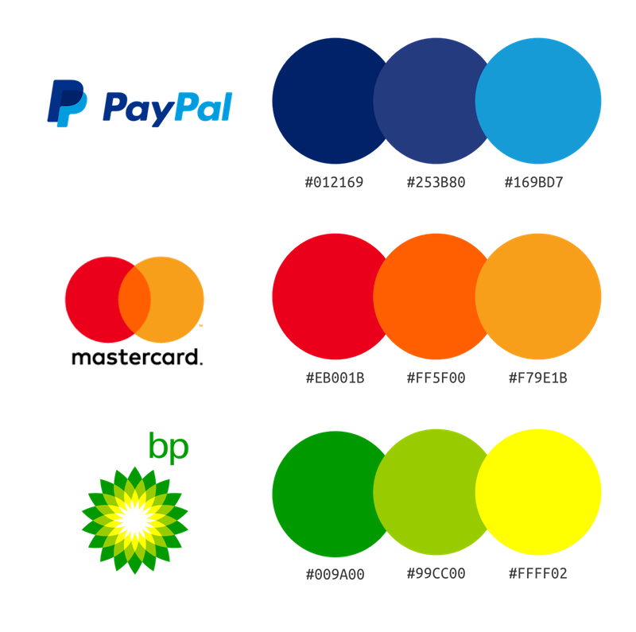

```

]


---

.pull-left[

## Colour

* Symbolism/Identity (or lack thereof)
* **Colour theory and palettes**

If we do not have a specific symbolic or brand-identity colour in mind, there are **colour theory** tools we can use to help us identify colour palettes that are pleasing to the eye and help us commuinicate our story:

**Tone**: Colours can be thought of as "warm" or "cool". Tone can be used to create contrasts (as in complementary colours) or mood.

**Saturation**: Saturated colours can be placed against de-saturated colours in order to create emphasis.

**Colour harmony**: Certain strategies can be used to create combinations of colours that harmonise well, either to contrast against each other while still being aesthetically pleasing or to create a scale.

* Colour for emphasis
* Accessibility


]


.pull-right[

<br>

```{r, echo = FALSE, out.width = "90%"}

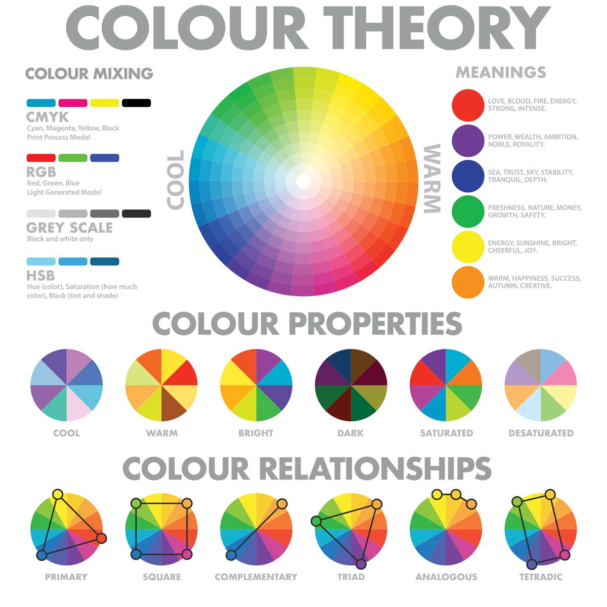

```

Source: Pixel and Ink (https://pixelandink.com.au/the-colour-theory/)

]


---

.pull-left[

## Colour

* Symbolism/Identity (or lack thereof)
* **Colour theory and palettes**

Tools like [Adobe Color](https://color.adobe.com/create/color-wheel) can be used to help design colour palettes that correspond with ideas in colour theory. You can then take those colour palettes and apply them to your data visualisations using `scale_colour_manual(values = c("#FF7A27", "#52A8AA"))` etc.

<center>

```{r, echo = FALSE, out.width = "45%"}

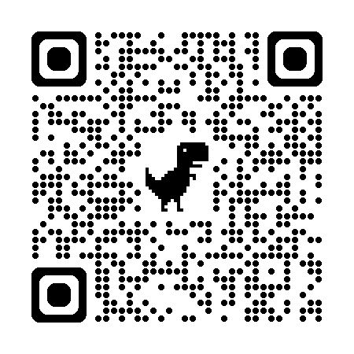

```

</center>


* Colour for emphasis
* Accessibility


]


.pull-right[

<br><br><br><br>

```{r, echo = FALSE, out.width = "100%"}

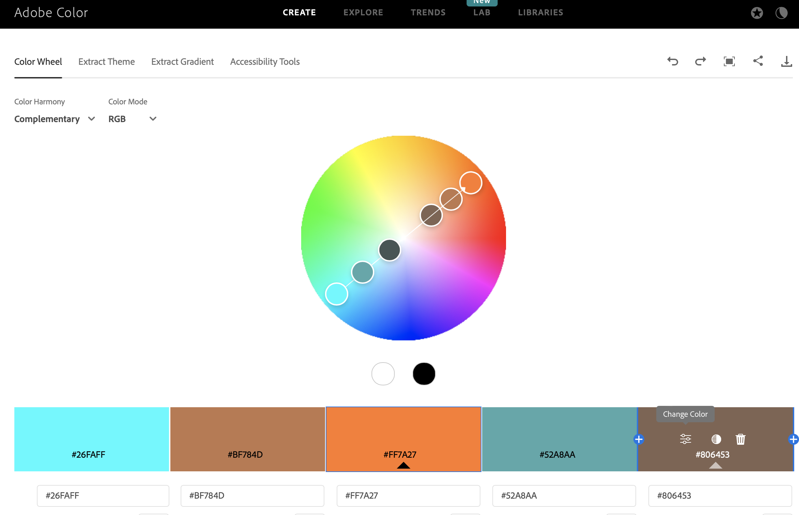

```

Source: https://color.adobe.com/create/color-wheel

]


---

.pull-left[

## Colour

* Symbolism/Identity (or lack thereof)
* **Colour theory and palettes**

**Shades/Analogous/Monochromatic**: Used for generating a scale from 'lowest' to 'highest', e.g. usage: `scale_colour_gradient(low = "#2477E3", high = "#70C6E3")`, good for encoding an additional continuous/ordinal variable.


* Colour for emphasis
* Accessibility


]


.pull-right[

<br>

```{r, echo = FALSE, fig.height=5, fig.width=5, out.height=500, out.width=500}


ai_worry %>%
  mutate(
    worried = round(worried, 0)
  ) %>%
  ggplot() +
  geom_line(aes(x = date, y = worried, colour = age_group)) +
  xlab("") +
  ylab("Worried\n(%)") +
  ggtitle("Americans increasingly worry that automation will take their jobs",
          subtitle = 'Survey respondents were asked, "How worried, if at all, are you that your type of work could be automated within your lifetime?"') +
  annotate("text", x = as.Date("2024-08-01"), y = 44.5, label = "Age 30-44",
           hjust = 0,
           family = "Helvetica", face = "bold",
           size = 10/.pt,
           colour = "#24B3E3"
           ) +
  annotate("text", x = as.Date("2024-08-01"), y = 36, label = "Age 18-29",
         hjust = 0,
         family = "Helvetica", face = "bold",
         size = 10/.pt,
         colour = "#2477E3"
         ) +
  annotate("text", x = as.Date("2024-08-01"), y = 25.5, label = "Age 45-65",
       hjust = 0,
       family = "Helvetica", face = "bold",
       size = 10/.pt,
       colour = "#70C6E3"
       ) +
  scale_colour_manual(values = c("#2477E3", "#24B3E3", "#70C6E3")) + 
  ggeasy::easy_add_legend_title("Age Group") +
  scale_x_date(breaks = as.Date(c("2021-01-01", "2022-01-01", "2023-01-01", "2024-01-01")), 
               labels = scales::date_format("%Y")) + 
  expand_limits(x = as.Date(c("2021-01-01", "2025-06-01"))) +
  scale_y_continuous(limits = c(0, 60), labels = scales::percent_format(scale = 1)) +
  theme(
    plot.title = element_textbox_simple(family = "Helvetica", 
                                        size = 18, face = "bold",
                                        maxwidth = unit(5, "npc"), 
                                        margin = margin(10,0,10,0),
                                        halign = 0,
                                        colour = "#323232"
                                        ),
    plot.subtitle = element_textbox_simple(family = "Helvetica", 
                                           size = 10,
                                           maxwidth = unit(5, "npc"), 
                                           margin = margin(0,0,20,0),
                                           halign = 0,
                                        colour = "#323232"
                                           ),
    axis.title.y = element_text(family = "Helvetica", 
                                          size = 8,
                                          margin = margin(0,2,0,2), 
                                          vjust = 0.8,
                                          angle = 0,
                                          colour = "#323232"),
    legend.text = element_markdown(family = "Helvetica", 
                                   size = 8,
                                        colour = "#323232"), 
    legend.title = element_markdown(family = "Helvetica", 
                                    size = 8,
                                        colour = "#323232"),
    axis.text = element_markdown(family = "Helvetica", 
                                 size = 8,
                                        colour = "#323232"),
    legend.position = "none",
    plot.background = element_rect(fill = "#f8f8f8", colour = "#f8f8f8"),
    panel.background = element_rect(fill = "#f8f8f8", colour = "#f8f8f8")
  )


```


]


---

.pull-left[

## Colour

* Symbolism/Identity (or lack thereof)
* **Colour theory and palettes**

**Shades/Analogous/Monochromatic**: Used for generating a scale from 'lowest' to 'highest', e.g. usage: `scale_colour_gradient(low = "#2477E3", high = "#70C6E3")`, good for encoding an additional continuous/ordinal variable.

**Square/Triad/Compound**: Used for generating diverse colour palettes that work well together. e.g. usage: `scale_colour_manual(values = c("#F5E116", "#F5166C", "#17CEF5"))`, good when every group is equally important to the story.

* Colour for emphasis
* Accessibility


]


.pull-right[

<br>

```{r, echo = FALSE, fig.height=5, fig.width=5, out.height=500, out.width=500}


ai_worry %>%
  mutate(
    worried = round(worried, 0)
  ) %>%
  ggplot() +
  geom_line(aes(x = date, y = worried, colour = age_group)) +
  xlab("") +
  ylab("Worried\n(%)") +
  ggtitle("Americans increasingly worry that automation will take their jobs",
          subtitle = 'Survey respondents were asked, "How worried, if at all, are you that your type of work could be automated within your lifetime?"') +
  annotate("text", x = as.Date("2024-08-01"), y = 44.5, label = "Age 30-44",
           hjust = 0,
           family = "Helvetica", face = "bold",
           size = 10/.pt,
           colour = "#F5166C"
           ) +
  annotate("text", x = as.Date("2024-08-01"), y = 36, label = "Age 18-29",
         hjust = 0,
         family = "Helvetica", face = "bold",
         size = 10/.pt,
         colour = "#F5E116"
         ) +
  annotate("text", x = as.Date("2024-08-01"), y = 25.5, label = "Age 45-65",
       hjust = 0,
       family = "Helvetica", face = "bold",
       size = 10/.pt,
       colour = "#17CEF5"
       ) +
  scale_colour_manual(values = c("#F5E116", "#F5166C", "#17CEF5")) + 
  ggeasy::easy_add_legend_title("Age Group") +
  scale_x_date(breaks = as.Date(c("2021-01-01", "2022-01-01", "2023-01-01", "2024-01-01")), 
               labels = scales::date_format("%Y")) + 
  expand_limits(x = as.Date(c("2021-01-01", "2025-06-01"))) +
  scale_y_continuous(limits = c(0, 60), labels = scales::percent_format(scale = 1)) +
  theme(
    plot.title = element_textbox_simple(family = "Helvetica", 
                                        size = 18, face = "bold",
                                        maxwidth = unit(5, "npc"), 
                                        margin = margin(10,0,10,0),
                                        halign = 0,
                                        colour = "#323232"
                                        ),
    plot.subtitle = element_textbox_simple(family = "Helvetica", 
                                           size = 10,
                                           maxwidth = unit(5, "npc"), 
                                           margin = margin(0,0,20,0),
                                           halign = 0,
                                        colour = "#323232"
                                           ),
    axis.title.y = element_text(family = "Helvetica", 
                                          size = 8,
                                          margin = margin(0,2,0,2), 
                                          vjust = 0.8,
                                          angle = 0,
                                          colour = "#323232"),
    legend.text = element_markdown(family = "Helvetica", 
                                   size = 8,
                                        colour = "#323232"), 
    legend.title = element_markdown(family = "Helvetica", 
                                    size = 8,
                                        colour = "#323232"),
    axis.text = element_markdown(family = "Helvetica", 
                                 size = 8,
                                        colour = "#323232"),
    legend.position = "none",
    plot.background = element_rect(fill = "#f8f8f8", colour = "#f8f8f8"),
    panel.background = element_rect(fill = "#f8f8f8", colour = "#f8f8f8")
  )


```


]


---

.pull-left[

## Colour

* Symbolism/Identity (or lack thereof)
* **Colour theory and palettes**

**Shades/Analogous/Monochromatic**: Used for generating a scale from 'lowest' to 'highest', e.g. usage: `scale_colour_gradient(low = "#2477E3", high = "#70C6E3")`, good for encoding an additional continuous/ordinal variable.

**Square/Triad/Compound**: Used for generating diverse colour palettes that work well together. e.g. usage: `scale_colour_manual(values = c("#F5E116", "#F5166C", "#17CEF5"))`, good when every group is equally important to the story.

**Complementary/Split Complementary**: Used for generating two colours that work well together according to colour theory. e.g. usage: `scale_colour_manual(values = c("#1085F5", "#1085F5", "#F59F14"))`, good when emphasising a specific group.

* Colour for emphasis
* Accessibility


]


.pull-right[

<br>

```{r, echo = FALSE, fig.height=5, fig.width=5, out.height=500, out.width=500}


ai_worry %>%
  mutate(
    worried = round(worried, 0)
  ) %>%
  ggplot() +
  geom_line(aes(x = date, y = worried, colour = age_group)) +
  xlab("") +
  ylab("Worried\n(%)") +
  ggtitle("Americans increasingly worry that automation will take their jobs",
          subtitle = 'Survey respondents were asked, "How worried, if at all, are you that your type of work could be automated within your lifetime?"') +
  annotate("text", x = as.Date("2024-08-01"), y = 44.5, label = "Age 30-44",
           hjust = 0,
           family = "Helvetica", face = "bold",
           size = 10/.pt,
           colour = "#1085F5"
           ) +
  annotate("text", x = as.Date("2024-08-01"), y = 36, label = "Age 18-29",
         hjust = 0,
         family = "Helvetica", face = "bold",
         size = 10/.pt,
         colour = "#1085F5"
         ) +
  annotate("text", x = as.Date("2024-08-01"), y = 25.5, label = "Age 45-65",
       hjust = 0,
       family = "Helvetica", face = "bold",
       size = 10/.pt,
       colour = "#F59F14"
       ) +
  scale_colour_manual(values = c("#1085F5", "#1085F5", "#F59F14")) + 
  ggeasy::easy_add_legend_title("Age Group") +
  scale_x_date(breaks = as.Date(c("2021-01-01", "2022-01-01", "2023-01-01", "2024-01-01")), 
               labels = scales::date_format("%Y")) + 
  expand_limits(x = as.Date(c("2021-01-01", "2025-06-01"))) +
  scale_y_continuous(limits = c(0, 60), labels = scales::percent_format(scale = 1)) +
  theme(
    plot.title = element_textbox_simple(family = "Helvetica", 
                                        size = 18, face = "bold",
                                        maxwidth = unit(5, "npc"), 
                                        margin = margin(10,0,10,0),
                                        halign = 0,
                                        colour = "#323232"
                                        ),
    plot.subtitle = element_textbox_simple(family = "Helvetica", 
                                           size = 10,
                                           maxwidth = unit(5, "npc"), 
                                           margin = margin(0,0,20,0),
                                           halign = 0,
                                        colour = "#323232"
                                           ),
    axis.title.y = element_text(family = "Helvetica", 
                                          size = 8,
                                          margin = margin(0,2,0,2), 
                                          vjust = 0.8,
                                          angle = 0,
                                          colour = "#323232"),
    legend.text = element_markdown(family = "Helvetica", 
                                   size = 8,
                                        colour = "#323232"), 
    legend.title = element_markdown(family = "Helvetica", 
                                    size = 8,
                                        colour = "#323232"),
    axis.text = element_markdown(family = "Helvetica", 
                                 size = 8,
                                        colour = "#323232"),
    legend.position = "none",
    plot.background = element_rect(fill = "#f8f8f8", colour = "#f8f8f8"),
    panel.background = element_rect(fill = "#f8f8f8", colour = "#f8f8f8")
  )


```


]


---

.pull-left[

## Colour

* Symbolism/Identity (or lack thereof)
* Colour theory and palettes
* Colour for emphasis

**Saturation** to further emphasise the part of the data that is important to your story, you can colour 'unimportant' groups using a lower saturation. #1085F5 -> #82BFF5

* Accessibility


]


.pull-right[

<br>

```{r, echo = FALSE, fig.height=5, fig.width=5, out.height=500, out.width=500}


ai_worry %>%
  mutate(
    worried = round(worried, 0)
  ) %>%
  ggplot() +
  geom_line(aes(x = date, y = worried, colour = age_group)) +
  xlab("") +
  ylab("Worried\n(%)") +
  ggtitle("Americans increasingly worry that automation will take their jobs",
          subtitle = 'Survey respondents were asked, "How worried, if at all, are you that your type of work could be automated within your lifetime?"') +
  annotate("text", x = as.Date("2024-08-01"), y = 44.5, label = "Age 30-44",
           hjust = 0,
           family = "Helvetica", face = "bold",
           size = 10/.pt,
           colour = "#82BFF5"
           ) +
  annotate("text", x = as.Date("2024-08-01"), y = 36, label = "Age 18-29",
         hjust = 0,
         family = "Helvetica", face = "bold",
         size = 10/.pt,
         colour = "#82BFF5"
         ) +
  annotate("text", x = as.Date("2024-08-01"), y = 25.5, label = "Age 45-65",
       hjust = 0,
       family = "Helvetica", face = "bold",
       size = 10/.pt,
       colour = "#F59F14"
       ) +
  scale_colour_manual(values = c("#82BFF5", "#82BFF5", "#F59F14")) + 
  ggeasy::easy_add_legend_title("Age Group") +
  scale_x_date(breaks = as.Date(c("2021-01-01", "2022-01-01", "2023-01-01", "2024-01-01")), 
               labels = scales::date_format("%Y")) + 
  expand_limits(x = as.Date(c("2021-01-01", "2025-06-01"))) +
  scale_y_continuous(limits = c(0, 60), labels = scales::percent_format(scale = 1)) +
  theme(
    plot.title = element_textbox_simple(family = "Helvetica", 
                                        size = 18, face = "bold",
                                        maxwidth = unit(5, "npc"), 
                                        margin = margin(10,0,10,0),
                                        halign = 0,
                                        colour = "#323232"
                                        ),
    plot.subtitle = element_textbox_simple(family = "Helvetica", 
                                           size = 10,
                                           maxwidth = unit(5, "npc"), 
                                           margin = margin(0,0,20,0),
                                           halign = 0,
                                        colour = "#323232"
                                           ),
    axis.title.y = element_text(family = "Helvetica", 
                                          size = 8,
                                          margin = margin(0,2,0,2), 
                                          vjust = 0.8,
                                          angle = 0,
                                          colour = "#323232"),
    legend.text = element_markdown(family = "Helvetica", 
                                   size = 8,
                                        colour = "#323232"), 
    legend.title = element_markdown(family = "Helvetica", 
                                    size = 8,
                                        colour = "#323232"),
    axis.text = element_markdown(family = "Helvetica", 
                                 size = 8,
                                        colour = "#323232"),
    legend.position = "none",
    plot.background = element_rect(fill = "#f8f8f8", colour = "#f8f8f8"),
    panel.background = element_rect(fill = "#f8f8f8", colour = "#f8f8f8")
  )


```


]


---

.pull-left[

## Colour

* Symbolism/Identity (or lack thereof)
* Colour theory and palettes
* Colour for emphasis

**Saturation** to further emphasise the part of the data that is important to your story, you can colour 'unimportant' groups using a lower saturation. #1085F5 -> #82BFF5

**Use of grey** usually implies that the information is unimportant: avoid using grey or low saturation for information that is important, and use it liberally if you want that information to fall more into the background. #1085F5 -> grey50

* Accessibility


]


.pull-right[

<br>

```{r, echo = FALSE, fig.height=5, fig.width=5, out.height=500, out.width=500}


ai_worry %>%
  mutate(
    worried = round(worried, 0)
  ) %>%
  ggplot() +
  geom_line(aes(x = date, y = worried, colour = age_group)) +
  xlab("") +
  ylab("Worried\n(%)") +
  ggtitle("Americans increasingly worry that automation will take their jobs",
          subtitle = 'Survey respondents were asked, "How worried, if at all, are you that your type of work could be automated within your lifetime?"') +
  annotate("text", x = as.Date("2024-08-01"), y = 44.5, label = "Age 30-44",
           hjust = 0,
           family = "Helvetica", face = "bold",
           size = 10/.pt,
           colour = "grey70"
           ) +
  annotate("text", x = as.Date("2024-08-01"), y = 36, label = "Age 18-29",
         hjust = 0,
         family = "Helvetica", face = "bold",
         size = 10/.pt,
         colour = "grey70"
         ) +
  annotate("text", x = as.Date("2024-08-01"), y = 25.5, label = "Age 45-65",
       hjust = 0,
       family = "Helvetica", face = "bold",
       size = 10/.pt,
       colour = "#F59F14"
       ) +
  scale_colour_manual(values = c("grey70", "grey70", "#F59F14")) + 
  ggeasy::easy_add_legend_title("Age Group") +
  scale_x_date(breaks = as.Date(c("2021-01-01", "2022-01-01", "2023-01-01", "2024-01-01")), 
               labels = scales::date_format("%Y")) + 
  expand_limits(x = as.Date(c("2021-01-01", "2025-06-01"))) +
  scale_y_continuous(limits = c(0, 60), labels = scales::percent_format(scale = 1)) +
  theme(
    plot.title = element_textbox_simple(family = "Helvetica", 
                                        size = 18, face = "bold",
                                        maxwidth = unit(5, "npc"), 
                                        margin = margin(10,0,10,0),
                                        halign = 0,
                                        colour = "#323232"
                                        ),
    plot.subtitle = element_textbox_simple(family = "Helvetica", 
                                           size = 10,
                                           maxwidth = unit(5, "npc"), 
                                           margin = margin(0,0,20,0),
                                           halign = 0,
                                        colour = "#323232"
                                           ),
    axis.title.y = element_text(family = "Helvetica", 
                                          size = 8,
                                          margin = margin(0,2,0,2), 
                                          vjust = 0.8,
                                          angle = 0,
                                          colour = "#323232"),
    legend.text = element_markdown(family = "Helvetica", 
                                   size = 8,
                                        colour = "#323232"), 
    legend.title = element_markdown(family = "Helvetica", 
                                    size = 8,
                                        colour = "#323232"),
    axis.text = element_markdown(family = "Helvetica", 
                                 size = 8,
                                        colour = "#323232"),
    legend.position = "none",
    plot.background = element_rect(fill = "#f8f8f8", colour = "#f8f8f8"),
    panel.background = element_rect(fill = "#f8f8f8", colour = "#f8f8f8")
  )


```


]

---

.pull-left[

## Colour

* Symbolism/Identity (or lack thereof)
* Colour theory and palettes
* Colour for emphasis
* **Accessibility**


]


.pull-right[

<br>

```{r, echo = FALSE, fig.height=5, fig.width=5, out.height=500, out.width=500}


ai_worry %>%
  mutate(
    worried = round(worried, 0)
  ) %>%
  ggplot() +
  geom_line(aes(x = date, y = worried, colour = age_group)) +
  xlab("") +
  ylab("Worried\n(%)") +
  ggtitle("Americans increasingly worry that automation will take their jobs",
          subtitle = 'Survey respondents were asked, "How worried, if at all, are you that your type of work could be automated within your lifetime?"') +
  annotate("text", x = as.Date("2024-08-01"), y = 44.5, label = "Age 30-44",
           hjust = 0,
           family = "Helvetica", face = "bold",
           size = 10/.pt,
           colour = "grey70"
           ) +
  annotate("text", x = as.Date("2024-08-01"), y = 36, label = "Age 18-29",
         hjust = 0,
         family = "Helvetica", face = "bold",
         size = 10/.pt,
         colour = "grey70"
         ) +
  annotate("text", x = as.Date("2024-08-01"), y = 25.5, label = "Age 45-65",
       hjust = 0,
       family = "Helvetica", face = "bold",
       size = 10/.pt,
       colour = "#F59F14"
       ) +
  scale_colour_manual(values = c("grey70", "grey70", "#F59F14")) + 
  ggeasy::easy_add_legend_title("Age Group") +
  scale_x_date(breaks = as.Date(c("2021-01-01", "2022-01-01", "2023-01-01", "2024-01-01")), 
               labels = scales::date_format("%Y")) + 
  expand_limits(x = as.Date(c("2021-01-01", "2025-06-01"))) +
  scale_y_continuous(limits = c(0, 60), labels = scales::percent_format(scale = 1)) +
  theme(
    plot.title = element_textbox_simple(family = "Helvetica", 
                                        size = 18, face = "bold",
                                        maxwidth = unit(5, "npc"), 
                                        margin = margin(10,0,10,0),
                                        halign = 0,
                                        colour = "#323232"
                                        ),
    plot.subtitle = element_textbox_simple(family = "Helvetica", 
                                           size = 10,
                                           maxwidth = unit(5, "npc"), 
                                           margin = margin(0,0,20,0),
                                           halign = 0,
                                        colour = "#323232"
                                           ),
    axis.title.y = element_text(family = "Helvetica", 
                                          size = 8,
                                          margin = margin(0,2,0,2), 
                                          vjust = 0.8,
                                          angle = 0,
                                          colour = "#323232"),
    legend.text = element_markdown(family = "Helvetica", 
                                   size = 8,
                                        colour = "#323232"), 
    legend.title = element_markdown(family = "Helvetica", 
                                    size = 8,
                                        colour = "#323232"),
    axis.text = element_markdown(family = "Helvetica", 
                                 size = 8,
                                        colour = "#323232"),
    legend.position = "none",
    plot.background = element_rect(fill = "#f8f8f8", colour = "#f8f8f8"),
    panel.background = element_rect(fill = "#f8f8f8", colour = "#f8f8f8")
  )


```


]

---

.pull-left[

## Colour

* Symbolism/Identity (or lack thereof)
* Colour theory and palettes
* Colour for emphasis
* **Accessibility**

Check that text is legible against background, e.g. using the Adobe Color **contrast checker** (https://color.adobe.com/create/color-contrast-analyzer). Aim for > 4.5:1


]


.pull-right[

<br>

```{r, echo = FALSE, fig.height=5, fig.width=5, out.height=500, out.width=500}


ai_worry %>%
  mutate(
    worried = round(worried, 0)
  ) %>%
  ggplot() +
  geom_line(aes(x = date, y = worried, colour = age_group)) +
  xlab("") +
  ylab("Worried\n(%)") +
  ggtitle("Americans increasingly worry that automation will take their jobs",
          subtitle = 'Survey respondents were asked, "How worried, if at all, are you that your type of work could be automated within your lifetime?"') +
  annotate("text", x = as.Date("2024-08-01"), y = 44.5, label = "Age 30-44",
           hjust = 0,
           family = "Helvetica", face = "bold",
           size = 10/.pt,
           colour = "grey85"
           ) +
  annotate("text", x = as.Date("2024-08-01"), y = 36, label = "Age 18-29",
         hjust = 0,
         family = "Helvetica", face = "bold",
         size = 10/.pt,
         colour = "grey85"
         ) +
  annotate("text", x = as.Date("2024-08-01"), y = 25.5, label = "Age 45-65",
       hjust = 0,
       family = "Helvetica", face = "bold",
       size = 10/.pt,
       colour = "#FFC48E"
       ) +
  scale_colour_manual(values = c("grey85", "grey85", "#FFC48E")) + 
  ggeasy::easy_add_legend_title("Age Group") +
  scale_x_date(breaks = as.Date(c("2021-01-01", "2022-01-01", "2023-01-01", "2024-01-01")), 
               labels = scales::date_format("%Y")) + 
  expand_limits(x = as.Date(c("2021-01-01", "2025-06-01"))) +
  scale_y_continuous(limits = c(0, 60), labels = scales::percent_format(scale = 1)) +
  theme(
    plot.title = element_textbox_simple(family = "Helvetica", 
                                        size = 18, face = "bold",
                                        maxwidth = unit(5, "npc"), 
                                        margin = margin(10,0,10,0),
                                        halign = 0,
                                        colour = "grey70"
                                        ),
    plot.subtitle = element_textbox_simple(family = "Helvetica", 
                                           size = 10,
                                           maxwidth = unit(5, "npc"), 
                                           margin = margin(0,0,20,0),
                                           halign = 0,
                                        colour = "grey70"
                                           ),
    axis.title.y = element_text(family = "Helvetica", 
                                          size = 8,
                                          margin = margin(0,2,0,2), 
                                          vjust = 0.8,
                                          angle = 0,
                                          colour = "grey70"),
    legend.text = element_markdown(family = "Helvetica", 
                                   size = 8,
                                        colour = "grey70"), 
    legend.title = element_markdown(family = "Helvetica", 
                                    size = 8,
                                        colour = "grey70"),
    axis.text = element_markdown(family = "Helvetica", 
                                 size = 8,
                                        colour = "grey70"),
    legend.position = "none",
    plot.background = element_rect(fill = "#f8f8f8", colour = "#f8f8f8"),
    panel.background = element_rect(fill = "#f8f8f8", colour = "#f8f8f8")
  )


```


]

---

.pull-left[

## Colour

* Symbolism/Identity (or lack thereof)
* Colour theory and palettes
* Colour for emphasis
* **Accessibility**

Check that text is legible against background, e.g. using the Adobe Color **contrast checker** (https://color.adobe.com/create/color-contrast-analyzer). Aim for > 4.5:1

Check that colours are **colour-blind safe** or **colour-blind friendly**, e.g. using the Adobe Color Colour Blind Safe checker (https://color.adobe.com/create/color-accessibility) or apps like Sim Daltonism. The most common form of colour blindness is red-green colour-blindness.


]


.pull-right[

<br>

```{r, echo = FALSE, fig.height=5, fig.width=5, out.height=500, out.width=500}


ai_worry %>%
  mutate(
    worried = round(worried, 0)
  ) %>%
  ggplot() +
  geom_line(aes(x = date, y = worried, colour = age_group)) +
  xlab("") +
  ylab("Worried\n(%)") +
  ggtitle("Americans increasingly worry that automation will take their jobs",
          subtitle = 'Survey respondents were asked, "How worried, if at all, are you that your type of work could be automated within your lifetime?"') +
  annotate("text", x = as.Date("2024-08-01"), y = 44.5, label = "Age 30-44",
           hjust = 0,
           family = "Helvetica", face = "bold",
           size = 10/.pt,
           colour = "#318F42"
           ) +
  annotate("text", x = as.Date("2024-08-01"), y = 36, label = "Age 18-29",
         hjust = 0,
         family = "Helvetica", face = "bold",
         size = 10/.pt,
         colour = "#318F42"
         ) +
  annotate("text", x = as.Date("2024-08-01"), y = 25.5, label = "Age 45-65",
       hjust = 0,
       family = "Helvetica", face = "bold",
       size = 10/.pt,
       colour = "#F54640"
       ) +
  scale_colour_manual(values = c("#318F42", "#318F42", "#F54640")) + 
  ggeasy::easy_add_legend_title("Age Group") +
  scale_x_date(breaks = as.Date(c("2021-01-01", "2022-01-01", "2023-01-01", "2024-01-01")), 
               labels = scales::date_format("%Y")) + 
  expand_limits(x = as.Date(c("2021-01-01", "2025-06-01"))) +
  scale_y_continuous(limits = c(0, 60), labels = scales::percent_format(scale = 1)) +
  theme(
    plot.title = element_textbox_simple(family = "Helvetica", 
                                        size = 18, face = "bold",
                                        maxwidth = unit(5, "npc"), 
                                        margin = margin(10,0,10,0),
                                        halign = 0,
                                        colour = "#323232"
                                        ),
    plot.subtitle = element_textbox_simple(family = "Helvetica", 
                                           size = 10,
                                           maxwidth = unit(5, "npc"), 
                                           margin = margin(0,0,20,0),
                                           halign = 0,
                                        colour = "#323232"
                                           ),
    axis.title.y = element_text(family = "Helvetica", 
                                          size = 8,
                                          margin = margin(0,2,0,2), 
                                          vjust = 0.8,
                                          angle = 0,
                                          colour = "#323232"),
    legend.text = element_markdown(family = "Helvetica", 
                                   size = 8,
                                        colour = "#323232"), 
    legend.title = element_markdown(family = "Helvetica", 
                                    size = 8,
                                        colour = "#323232"),
    axis.text = element_markdown(family = "Helvetica", 
                                 size = 8,
                                        colour = "#323232"),
    legend.position = "none",
    plot.background = element_rect(fill = "#f8f8f8", colour = "#f8f8f8"),
    panel.background = element_rect(fill = "#f8f8f8", colour = "#f8f8f8")
  )


```


]


---

.pull-left[

## Colour

* Symbolism/Identity (or lack thereof)
* Colour theory and palettes
* Colour for emphasis
* **Accessibility**

Check that text is legible against background, e.g. using the Adobe Color **contrast checker** (https://color.adobe.com/create/color-contrast-analyzer). Aim for > 4.5:1

Check that colours are **colour-blind safe** or **colour-blind friendly**, e.g. using the Adobe Color Colour Blind Safe checker (https://color.adobe.com/create/color-accessibility) or apps like Sim Daltonism. The most common form of colour blindness is red-green colour-blindness.

Avoid using colour palettes that exaggerate variations (such as rainbow). The [`scico` library](https://github.com/thomasp85/scico?tab=readme-ov-file) has been developed for `R` has been developed to provide colour gradients that avoid exaggeration. 


]


.pull-right[

<br><br><br><br>

```{r, echo = FALSE, out.width = "100%"}

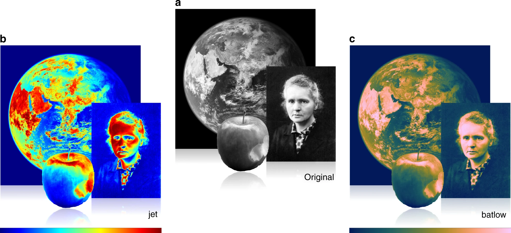

```

.center[Crameri, et al. (2020) [The misuse of colour in science communication](https://www.nature.com/articles/s41467-020-19160-7) ]


]


---

.pull-left[

<br>

```{r, echo = FALSE, fig.height=5, fig.width=5, out.height=500, out.width=500}


start_plot


```


]


.pull-right[

<br>

```{r, echo = FALSE, fig.height=5, fig.width=5, out.height=500, out.width=500}


ai_worry %>%
  mutate(
    worried = round(worried, 0)
  ) %>%
  ggplot() +
  geom_line(aes(x = date, y = worried, colour = age_group)) +
  xlab("") +
  ylab("Worried\n(%)") +
  ggtitle("Americans increasingly worry that automation will take their jobs",
          subtitle = 'Survey respondents were asked, "How worried, if at all, are you that your type of work could be automated within your lifetime?"') +
  annotate("text", x = as.Date("2024-08-01"), y = 44.5, label = "Age 30-44",
           hjust = 0,
           family = "Helvetica", face = "bold",
           size = 10/.pt,
           colour = "grey70"
           ) +
  annotate("text", x = as.Date("2024-08-01"), y = 36, label = "Age 18-29",
         hjust = 0,
         family = "Helvetica", face = "bold",
         size = 10/.pt,
         colour = "grey70"
         ) +
  annotate("text", x = as.Date("2024-08-01"), y = 25.5, label = "Age 45-65",
       hjust = 0,
       family = "Helvetica", face = "bold",
       size = 10/.pt,
       colour = "#F59F14"
       ) +
  scale_colour_manual(values = c("grey70", "grey70", "#F59F14")) + 
  ggeasy::easy_add_legend_title("Age Group") +
  scale_x_date(breaks = as.Date(c("2021-01-01", "2022-01-01", "2023-01-01", "2024-01-01")), 
               labels = scales::date_format("%Y")) + 
  expand_limits(x = as.Date(c("2021-01-01", "2025-06-01"))) +
  scale_y_continuous(limits = c(0, 60), labels = scales::percent_format(scale = 1)) +
  theme(
    plot.title = element_textbox_simple(family = "Helvetica", 
                                        size = 18, face = "bold",
                                        maxwidth = unit(5, "npc"), 
                                        margin = margin(10,0,10,0),
                                        halign = 0,
                                        colour = "#323232"
                                        ),
    plot.subtitle = element_textbox_simple(family = "Helvetica", 
                                           size = 10,
                                           maxwidth = unit(5, "npc"), 
                                           margin = margin(0,0,20,0),
                                           halign = 0,
                                        colour = "#323232"
                                           ),
    axis.title.y = element_text(family = "Helvetica", 
                                          size = 8,
                                          margin = margin(0,2,0,2), 
                                          vjust = 0.8,
                                          angle = 0,
                                          colour = "#323232"),
    legend.text = element_markdown(family = "Helvetica", 
                                   size = 8,
                                        colour = "#323232"), 
    legend.title = element_markdown(family = "Helvetica", 
                                    size = 8,
                                        colour = "#323232"),
    axis.text = element_markdown(family = "Helvetica", 
                                 size = 8,
                                        colour = "#323232"),
    legend.position = "none",
    plot.background = element_rect(fill = "#f8f8f8", colour = "#f8f8f8"),
    panel.background = element_rect(fill = "#f8f8f8", colour = "#f8f8f8")
  )


```


]

---

class: middle, inverse

#### Part III

# Is this "best" practice?

---

class: middle


.pull-left[

## Best practice?

Charts that look clear, plain, minimal can suggest the data they contain is neutral, objective and certain, but we know it is none of these things (D’Ignazio and Klein, 2020). Data is collected *by humans*, and no method for collecting, interpreting, and presenting data is free of bias.

The 'best practice' design aesthetic we are learning may be great for many purposes, but many people may choose not to reproduce this aesthetic.

This might be in order to:

* Attract a different type of audience
* Create more of an emotional connection with the audience
* Make things feel more visceral/real


]

.pull-right[

.center[

```{r, echo = FALSE, out.width = "90%"}

knitr::include_graphics("images/mona-chalabi-1.jpg")

```

]

.center[
Source: Mona Chalabi, [DataJournalism.com](https://datajournalism.com/read/handbook/two/working-with-data/experiencing-data/the-web-as-a-medium-for-data-visualisation) 
]

]

---

class: middle


.pull-left[

## Best practice?

Charts that look clear, plain, minimal can suggest the data they contain is neutral, objective and certain, but we know it is none of these things (D’Ignazio and Klein, 2020). Data is collected *by humans*, and no method for collecting, interpreting, and presenting data is free of bias.

The 'best practice' design aesthetic we are learning may be great for many purposes, but many people may choose not to reproduce this aesthetic.

This might be in order to:

* Attract a different type of audience
* Create more of an emotional connection with the audience
* Make things feel more visceral/real


]

.pull-right[

.center[

```{r, echo = FALSE, out.width = "65%"}

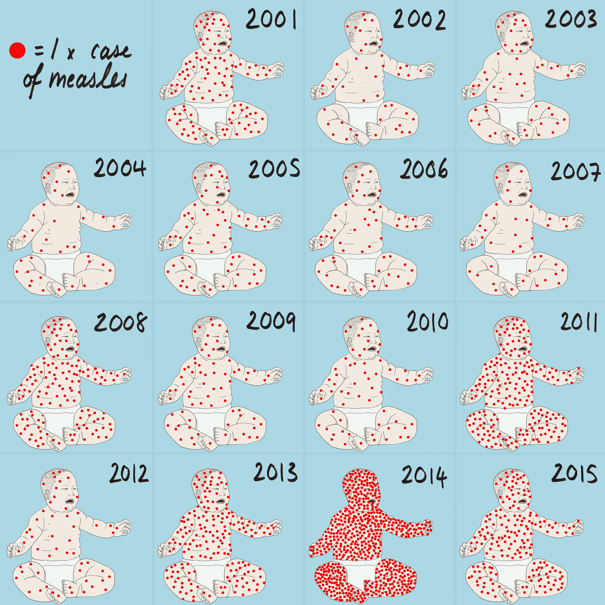

```

]

.center[
Source: Mona Chalabi, [ItsNiceThat.com](https://www.itsnicethat.com/articles/wix-playground-presents-data-narrative-design-round-up-digital-event-040320) 
]

]


---

class: middle, inverse

## Summary

* Visual design in data visualisation has been continually evolving, from the 'wild west' of data ducks to a more clear, plain, and minimal style that has been informed by best practice in graphic design.

* 'Best practice' can be an effective tool to ensure that we are telling our data story (week 3) effectively, emphasising the points we want to emphasize, and ensuring our work is accessible.

* However, we should keep in mind that 'best practice' and good visual design can be used to make bad or biased data look more objective and neutral than it is. We may also have artistic reasons for choosing different design aesthetics. 


---

# The rest of this week:

.pull-left[

<br><br>

**This week's workshop**:

We’ll begin by talking through your first assessment and address any questions you have about it. Then, let’s customise our graphs. The work we’ve been putting together so far looks OK, but it’s often very functional: default colour schemes, grey backgrounds, messy titles, and so on. In this session, we’ll go through some of the ways that we can tidy our graphs up so that we’re happy presenting them to a different set of audiences.


]

--

.pull-right[

Week 6 (next week) is a reading week. There is no lecture or workshop in week 6.


**Before week 7**:

**Core tasks**:

* Before workshop: Work through the task at the end of the workshop handout

**Supplementary tasks**:

Before week 7 lecture: Read Chalabi, M. and Gray, J. Sketching With Data The Data Journalism Handbook 2 pages 108-114, available online here: https://s3.eu-central-1.amazonaws.com/datajournalismcom/handbooks/The-Data-Journalism-Handbook-2.pdf

]