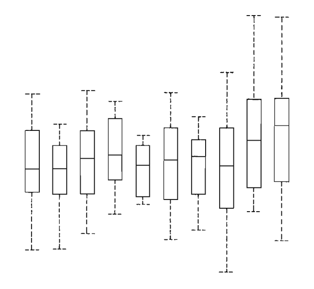

class: middle, title
background-size: contain


<br><br>

# Visual Design
#### SMI105: Week 5

<br><br>

**Dr. Calum Webb**<br>
Sheffield Methods Institute, the University of Sheffield<br>
[c.j.webb@sheffield.ac.uk](mailto:c.j.webb@sheffield.ac.uk)

```{r setup, include=FALSE}
options(htmltools.dir.version = FALSE)

# These packages are required for creating the slides
# Many will need to be installed from Github
library(icons)
library(tidyverse)
library(xaringan)
library(xaringanExtra)
library(xaringanthemer)

# Defaults for code
knitr::opts_chunk$set(
  fig.width=9, fig.height=3.5, fig.retina=3,
  out.width = "100%",
  cache = FALSE,
  echo = TRUE,
  message = FALSE, 
  warning = FALSE,
  fig.show = TRUE,
  hiline = TRUE
)

# set global theme for ggplot to make background #F8F8F8F8 (off white),
# but otherwise keep all ggplot themes default (better for teaching)
theme_set(
  theme(plot.background = element_rect(fill = "#F8F8F8", colour = "#F8F8F8"), 
        panel.background = element_rect(fill = "#F8F8F8", colour = "#F8F8F8"),
        legend.background = element_rect(fill = "#F8F8F8", colour = "#F8F8F8")
        )
  )

```

```{r xaringan-tile-view, echo=FALSE}
# Use tile overview by hitting the o key when presenting
xaringanExtra::use_tile_view()
```

```{r xaringan-logo, echo=FALSE}
# Add logo to top right
xaringanExtra::use_logo(
  image_url = "header/smi-logo-white.png",
  exclude_class = c("inverse", "hide_logo"), 
  width = "180px", position = css_position(top = "1em", right = "2em")
)
```

```{r xaringan-themer, include=FALSE, warning=FALSE}

# Set some global objects containing the colours
# of the university's branding
primary_color <- "#131E29"
secondary_color <- "#440099"
tuos_blue <- "#9ADBE8"
white = "#F8F8F8"
tuos_yellow <- "#FCF281"
tuos_purple <- "#440099"
tuos_red <- "#E7004C"
tuos_midnight <- "#131E29"

# The bulk of the styling is handled by xaringanthemer
style_uos <- style_duo_accent(
  primary_color = "#131E29",
  secondary_color = "#440099",
  colors = c(tuos_purple = "#440099", 
             grey = "#131E2960", 
             tuos_blue ="#9ADBE8",
             tuos_mint = "#00CE7C",
             ac_yellow = '#FEC740'),
  header_font_google = xaringanthemer::google_font("Source Serif Pro", "600", "600i"),
  text_font_google   = xaringanthemer::google_font("Source Sans Pro", "300", "300i", "600", "600i"),
  code_font_google   = xaringanthemer::google_font("Lucida Console"),
  header_h1_font_size = "2rem",
  header_h2_font_size = "1.5rem", 
  header_h3_font_size = "1.25rem", 
  text_font_size = "0.9rem",
  code_font_size = "0.65rem", 
  code_inline_font_size = "0.85rem",
  inverse_text_color = "#9ADBE8", 
  background_color = "#F8F8F8", 
  text_color = "#131E29", 
  link_color = "#005A8F", 
  inverse_link_color = "#F8F8F8",
  text_slide_number_color = "#44009970",
  table_row_even_background_color = "transparent", 
  table_border_color = "#44009970",
  text_bold_font_weight = 600
)

style_uos

```


```{r xaringan-panelset, echo=FALSE}
# Allow for adding panelsets (see example on slide 2)
xaringanExtra::use_panelset()
```

```{r xaringanExtra, echo = FALSE}
# Adds white progress bar to top
xaringanExtra::use_progress_bar(color = "#F8F8F8", location = "top")
```

```{r xaringan-extra-styles, echo = FALSE}
# Allow for code to be highlighted on hover
xaringanExtra::use_extra_styles(
  hover_code_line = TRUE,         #<<
  mute_unhighlighted_code = TRUE  #<<
)
```

```{r share-again, echo=FALSE}
# Add sharing links and other embedding tools
xaringanExtra::use_share_again()
```

```{r xaringanExtra-search, echo=FALSE}
# Add magnifying glass search function to bottom left for quick
# searching of slides
xaringanExtra::use_search(show_icon = TRUE, auto_search = FALSE)
```

---

class: middle, inverse

# Sign in

---

class: middle

## Learning outcomes

.panelset[

.panel[.panel-name[What will I learn?]

By the end of this week you will know:

Tufte, then modern visual design principles

* 


]
]

---

class: inverse, middle

#### Part I

# The history of good practice in information visual design


---

class: middle

.pull-left[

<br>

## Tufte's (1983/2001) Graphical Excellence & Elegance

Edward Tufte's revolutionised the way that data visualisation was done by introducing principles of excellence and elegance:

> "Graphical excellence consists of complex ideas communicated with clarity, precision and efficiency." (p.51)

> "Graphical excellence is that which gives to the viewer the greatest number of ideas in the shortest time with the least ink in the smallest space." (p.51)

For Tufte (at least in 1983/2001), we should aim to 'maximise the ink to information ratio' and avoid introducing extraneous stylistic elements that, at best, do nothing and, at worst, might influence perception of the data — communicate the most information in the least amount of ink. What does this mean?


]

.pull-right[


.center[

```{r, echo = FALSE, out.width = "70%"}

knitr::include_graphics("images/tufte.jpg")

```

]

]


---

class: middle

.pull-left[

<br>

## Tufte's (1983/2001) Graphical Excellence & Elegance

Edward Tufte's revolutionised the way that data visualisation was done by introducing principles of excellence and elegance:

> "Graphical excellence consists of complex ideas communicated with clarity, precision and efficiency." (p.51)

> "Graphical excellence is that which gives to the viewer the greatest number of ideas in the shortest time with the least ink in the smallest space." (p.51)

For Tufte (at least in 1983/2001), we should aim to 'maximise the ink to information ratio' and avoid introducing extraneous stylistic elements that, at best, do nothing and, at worst, might influence perception of the data — communicate the most information in the least amount of ink. What does this mean?


]

.pull-right[


.center[

```{r, echo = FALSE, out.width = "100%", fig.cap="Typical boxplot design (Tufte, 2001)"}



```

]

]

---

class: middle

.pull-left[

<br>

## Tufte's (1983/2001) Graphical Excellence & Elegance

Edward Tufte's revolutionised the way that data visualisation was done by introducing principles of excellence and elegance:

> "Graphical excellence consists of complex ideas communicated with clarity, precision and efficiency." (p.51)

> "Graphical excellence is that which gives to the viewer the greatest number of ideas in the shortest time with the least ink in the smallest space." (p.51)

For Tufte (at least in 1983/2001), we should aim to 'maximise the ink to information ratio' and avoid introducing extraneous stylistic elements that, at best, do nothing and, at worst, might influence perception of the data — communicate the most information in the least amount of ink. What does this mean?


]

.pull-right[


.center[

```{r, echo = FALSE, out.width = "100%", fig.cap="Tufte's redesigned boxplot (Tufte, 2001)"}

knitr::include_graphics("images/tufte-boxplot-2.png")

```

] 

]


---

class: middle

.pull-left[

<br>

## Tufte's (1983/2001) Graphical Excellence & Elegance

Edward Tufte's revolutionised the way that data visualisation was done by introducing principles of excellence and elegance:

> "Graphical excellence consists of complex ideas communicated with clarity, precision and efficiency." (p.51)

> "Graphical excellence is that which gives to the viewer the greatest number of ideas in the shortest time with the least ink in the smallest space." (p.51)

For Tufte (at least in 1983/2001), we should aim to 'maximise the ink to information ratio' and avoid introducing extraneous stylistic elements that, at best, do nothing and, at worst, might influence perception of the data — communicate the most information in the least amount of ink. What does this mean?


]

.pull-right[

<br><br>

.center[

```{r, echo = FALSE, out.width = "100%", fig.cap="A standard bar chart (Tufte, 2001)"}

knitr::include_graphics("images/tufte-bar-1.png")

```

] 

]


---

class: middle

.pull-left[

<br>

## Tufte's (1983/2001) Graphical Excellence & Elegance

Edward Tufte's revolutionised the way that data visualisation was done by introducing principles of excellence and elegance:

> "Graphical excellence consists of complex ideas communicated with clarity, precision and efficiency." (p.51)

> "Graphical excellence is that which gives to the viewer the greatest number of ideas in the shortest time with the least ink in the smallest space." (p.51)

For Tufte (at least in 1983/2001), we should aim to 'maximise the ink to information ratio' and avoid introducing extraneous stylistic elements that, at best, do nothing and, at worst, might influence perception of the data — communicate the most information in the least amount of ink. What does this mean?


]

.pull-right[

<br><br>

.center[

```{r, echo = FALSE, out.width = "100%", fig.cap="Tufte's redesigned barchart (Tufte, 2001)"}

knitr::include_graphics("images/tufte-bar-2.png")

```

] 

]

---

class: inverse, middle


# The life and death(?) of chartjunk


---

class: middle

.pull-left[


## Chartjunk & misrepresentation

Edward Tufte particularly took issue with what he called **"chartjunk"**; the "interior decoration of graphics [that] does not tell the viewer anything new". In addition, he raised the issues of **misrepresentation and integrity** that often accompanied misuse of area/scale

* **Integrity and misrepresentation of scale**: misrepresenting differences between things: a square with twice the area of one that measures 10cm x 10cm would measure ~14cm x 14cm, not 20cm x 20cm

* .grey[Unintentional optical art: eye-straining effects that had "no place in data graphical design" (or arguably, any form of graphical design)]

* .grey[Extraneous gridlines: gridlines that only exist as a relic from drawing visualisations by hand that distract the viewer.]

* .grey[The graphical duck: unneccesary additions to the visualisation (e.g. colour) where it does not add any information, and is done just because "it can be done".]

]

.pull-right[

<br><br>

.center[

```{r, echo = FALSE, out.width = "55%", fig.cap="A lie factor of 2 (Tufte, 2001)"}

knitr::include_graphics("images/tufte-cj1.png")

```

] 

]


---

class: middle

.pull-left[


## Chartjunk & misrepresentation

Edward Tufte particularly took issue with what he called **"chartjunk"**; the "interior decoration of graphics [that] does not tell the viewer anything new". In addition, he raised the issues of **misrepresentation and integrity** that often accompanied misuse of area/scale

* .grey[Integrity and misrepresentation of scale: misrepresenting differences between things: a square with twice the area of one that measures 10cm x 10cm would measure ~14cm x 14cm, not 20cm x 20cm]

* **Unintentional optical art**: eye-straining effects that had "no place in data graphical design" (or arguably, any form of graphical design)

* .grey[Extraneous gridlines: gridlines that only exist as a relic from drawing visualisations by hand that distract the viewer.]

* .grey[The graphical duck: unneccesary additions to the visualisation (e.g. colour) where it does not add any information, and is done just because "it can be done".]

]

.pull-right[

<br><br>

.center[

```{r, echo = FALSE, out.width = "100%", fig.cap="(Tufte, 2001: 108)"}


```

] 

]

---

class: middle

.pull-left[


## Chartjunk & misrepresentation

Edward Tufte particularly took issue with what he called **"chartjunk"**; the "interior decoration of graphics [that] does not tell the viewer anything new". In addition, he raised the issues of **misrepresentation and integrity** that often accompanied misuse of area/scale

* .grey[Integrity and misrepresentation of scale: misrepresenting differences between things: a square with twice the area of one that measures 10cm x 10cm would measure ~14cm x 14cm, not 20cm x 20cm]

* .grey[Unintentional optical art: eye-straining effects that had "no place in data graphical design" (or arguably, any form of graphical design)]

* **Extraneous gridlines**: gridlines that only exist as a relic from drawing visualisations by hand that distract the viewer.

* .grey[The graphical duck: unneccesary additions to the visualisation (e.g. colour) where it does not add any information, and is done just because "it can be done".]

]

.pull-right[

<br><br><br><br>

.center[

```{r, echo = FALSE, out.width = "100%", fig.cap="(Tufte, 2001: 115)"}

knitr::include_graphics("images/tufte-cj3.png")

```

] 

]


---

class: middle

.pull-left[


## Chartjunk & misrepresentation

Edward Tufte particularly took issue with what he called **"chartjunk"**; the "interior decoration of graphics [that] does not tell the viewer anything new". In addition, he raised the issues of **misrepresentation and integrity** that often accompanied misuse of area/scale

* .grey[Integrity and misrepresentation of scale: misrepresenting differences between things: a square with twice the area of one that measures 10cm x 10cm would measure ~14cm x 14cm, not 20cm x 20cm]

* .grey[Unintentional optical art: eye-straining effects that had "no place in data graphical design" (or arguably, any form of graphical design)]

* .grey[Extraneous gridlines: gridlines that only exist as a relic from drawing visualisations by hand that distract the viewer.]

* **The graphical duck**: unneccesary additions to the visualisation (e.g. colour) where it does not add any information, and is done just because "it can be done".

]

.pull-right[

<br><br><br><br>

.center[

```{r, echo = FALSE, out.width = "100%", fig.cap="(Tufte, 2001: 120)"}


```

] 

]


---

class: middle

.pull-left[

## The influence of, and a critique of, Tufte's approach

Note how, in the workshops, many of the defaults that are used by ggplot (and other packages) tend to use the same kind of best practice that Tufte recommended: **no more thick gridlines, no more unnecessary crosshatching, and you have to try quite hard to misrepresent your data**.

However, of we remove everything that isn't strictly necessary, where does that leave **design, art, and the influence it can have on engagement and communication for different audiences**? What does "default ink" look like in a digital world? What if elegant isn't your aesthetic?

> "Embellishments can at times, when properly chosen and designed, represent information redundantly in useful ways, and even when they aren't information in and of themselves, can meaningfully support the display of information."

.right[Stephen Few, quoted in Feigenbaum & Alamalhodaei, 2020.]


]

.pull-right[

<br><br>

.center[

```{r, echo = FALSE, out.width = "70%", fig.cap="(Tufte, 2001: 120)"}

knitr::include_graphics("images/tufte.jpg")

```

] 

]


---

class: inverse, middle

#### Part I

# Good practice meets good design? Data vis with pretty ducks.


