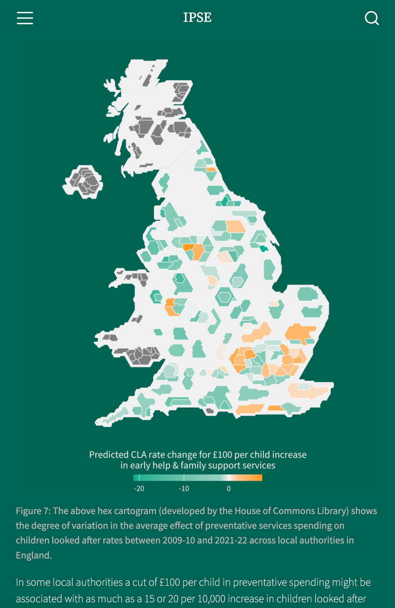

class: middle, title
background-size: contain


<br><br>

# Publishing a data visualisation
#### SMI105: Week 7

<br><br>

**Dr. Calum Webb**<br>
Sheffield Methods Institute, the University of Sheffield<br>
[c.j.webb@sheffield.ac.uk](mailto:c.j.webb@sheffield.ac.uk)

```{r setup, include=FALSE}
options(htmltools.dir.version = FALSE)

# These packages are required for creating the slides
# Many will need to be installed from Github
library(icons)
library(tidyverse)
library(xaringan)
library(xaringanExtra)
library(xaringanthemer)

# Defaults for code
knitr::opts_chunk$set(
  fig.width=9, fig.height=3.5, fig.retina=3,
  out.width = "100%",
  cache = FALSE,
  echo = TRUE,
  message = FALSE, 
  warning = FALSE,
  fig.show = TRUE,
  hiline = TRUE
)

# set global theme for ggplot to make background #F8F8F8F8 (off white),
# but otherwise keep all ggplot themes default (better for teaching)
theme_set(
  theme(plot.background = element_rect(fill = "#F8F8F8", colour = "#F8F8F8"), 
        panel.background = element_rect(fill = "#F8F8F8", colour = "#F8F8F8"),
        legend.background = element_rect(fill = "#F8F8F8", colour = "#F8F8F8")
        )
  )

```

```{r xaringan-tile-view, echo=FALSE}
# Use tile overview by hitting the o key when presenting
xaringanExtra::use_tile_view()
```

```{r xaringan-logo, echo=FALSE}
# Add logo to top right
xaringanExtra::use_logo(
  image_url = "header/smi-logo-white.png",
  exclude_class = c("inverse", "hide_logo"), 
  width = "180px", position = css_position(top = "1em", right = "2em")
)
```

```{r xaringan-themer, include=FALSE, warning=FALSE}

# Set some global objects containing the colours
# of the university's branding
primary_color <- "#131E29"
secondary_color <- "#440099"
tuos_blue <- "#9ADBE8"
white = "#F8F8F8"
tuos_yellow <- "#FCF281"
tuos_purple <- "#440099"
tuos_red <- "#E7004C"
tuos_midnight <- "#131E29"

# The bulk of the styling is handled by xaringanthemer
style_uos <- style_duo_accent(
  primary_color = "#131E29",
  secondary_color = "#440099",
  colors = c(tuos_purple = "#440099", 
             grey = "#131E2960", 
             tuos_blue ="#9ADBE8",
             tuos_mint = "#00CE7C",
             ac_yellow = '#FEC740'),
  header_font_google = xaringanthemer::google_font("Source Serif Pro", "600", "600i"),
  text_font_google   = xaringanthemer::google_font("Source Sans Pro", "300", "300i", "600", "600i"),
  code_font_google   = xaringanthemer::google_font("Lucida Console"),
  header_h1_font_size = "2rem",
  header_h2_font_size = "1.5rem", 
  header_h3_font_size = "1.25rem", 
  text_font_size = "0.9rem",
  code_font_size = "0.65rem", 
  code_inline_font_size = "0.85rem",
  inverse_text_color = "#9ADBE8", 
  background_color = "#F8F8F8", 
  text_color = "#131E29", 
  link_color = "#005A8F", 
  inverse_link_color = "#F8F8F8",
  text_slide_number_color = "#44009970",
  table_row_even_background_color = "transparent", 
  table_border_color = "#44009970",
  text_bold_font_weight = 600
)

style_uos

```


```{r xaringan-panelset, echo=FALSE}
# Allow for adding panelsets (see example on slide 2)
xaringanExtra::use_panelset()
```

```{r xaringanExtra, echo = FALSE}
# Adds white progress bar to top
xaringanExtra::use_progress_bar(color = "#F8F8F8", location = "top")
```

```{r xaringan-extra-styles, echo = FALSE}
# Allow for code to be highlighted on hover
xaringanExtra::use_extra_styles(
  hover_code_line = TRUE,         #<<
  mute_unhighlighted_code = TRUE  #<<
)
```

```{r share-again, echo=FALSE}
# Add sharing links and other embedding tools
xaringanExtra::use_share_again()
```

```{r xaringanExtra-search, echo=FALSE}
# Add magnifying glass search function to bottom left for quick
# searching of slides
xaringanExtra::use_search(show_icon = TRUE, auto_search = FALSE)
```

---

class: middle, inverse

# Sign in

---

class: middle

## Learning outcomes

.panelset[

.panel[.panel-name[What will I learn?]

By the end of this week you will know:

* How to take the publication medium your data visualisation will feature in into account when exporting and deciding on size, orientation, and so on

* How to apply different technical terms from print & design to describe differences in quality, orientation, size (e.g. aspect ratio), and method of reproduction (rasterised versus vectorised)

* How to make your data visualisation look good no matter where it's published!

]
]

---

class: inverse, middle

# That's a nice data visualisation... .tuos_purple[How does it look on your phone?]

---

class: inverse, middle

# That's a nice data visualisation... .white[How does it look on your phone?]

---

class: inverse, middle

# That's a nice data visualisation... .white[How does it look on your laptop?]

---

class: inverse, middle

# That's a nice data visualisation... .white[How does it look projected on the wall?]

---

class: inverse, middle

# That's a nice data visualisation... .white[How does it look projected in a print newspaper?]

---

class: inverse, middle

# Rarely is the same data visualisation suitable for everywhere it might be seen. 

You might need to customise your data visualisation for different mediums, or test how it looks on different publication formats.

---

class: inverse

### Don't be the person that puts a screenshot of a dashboard in your report!

.pull-left[

.center[

```{r, echo = FALSE, out.width = "60%"}


```

]

]

--

.pull-right[

.center[

```{r, echo = FALSE, out.width = "60%"}


```

Or worse!

]

]

---

class: middle

.pull-left-big[
.center[

```{r, echo = FALSE, out.width = "100%"}


```

]
]

.middle-right-small[

* An image of a Sankey plot from my personal website when viewed on a web browser...

]

---

class: middle

.pull-left-big[
.center[

```{r, echo = FALSE, out.width = "30%"}


```

]
]

.middle-right-small[

* An image of a Sankey plot from my personal website when viewed on a web browser...

* And on my mobile phone.

Luckily the same image works fairly well regardless, but maybe the text is a bit too small for phones.

]


---

class: middle

.pull-left-big[

.center[

```{r, echo = FALSE, out.width = "50%"}


```

]
]

.middle-right-small[

* Here's a graph that's from a research report I've written...

]

---

class: middle

.pull-left-big[

.center[

```{r, echo = FALSE, out.width = "100%"}


```

]
]

.middle-right-small[

* Here's a graph that's from a research report I've written...

* But here's how it looks when I present it using a slidedeck...

]

---

class: middle

.pull-left-big[

.center[

```{r, echo = FALSE, out.width = "100%"}


```

]
]

.middle-right-small[

* Here's a graph that's from a research report I've written...

* But here's how it looks when I present it using a slidedeck...

* And here's how it looks on the website

I've changed the aspect ratio so it fits the space better (not trying to squeeze a vertical image on a horizontal space), and on the website changed the theme background to blend in and make it look seamless.

]

---


class: middle

.pull-left-big[

.center[

```{r, echo = FALSE, out.width = "50%"}


```

]
]

.middle-right-small[

* Here's a map from the same report in the report

]

---


class: middle

.pull-left-big[

.center[

```{r, echo = FALSE, out.width = "50%"}



```

]
]

.middle-right-small[

* Here's a map from the same report in the report

* But here's how it looks on the website on a phone ratio

]


---


class: middle

.pull-left-big[

.center[

```{r, echo = FALSE, out.width = "100%"}


```

]
]

.middle-right-small[

* Here's a map from the same report in the report

* But here's how it looks on the website on a phone ratio

* And on my presentation slides

Again, the background changes to make it seamless and in the phone and presentation slide versions I have **removed the place names**, because that information could be hidden and only shown on tap/hover/click. I also cut off Scotland and Northern Ireland to maximise the size and give the text the best chance of being readable.

]


---

class: inverse, middle

# Publishing a data visualisation: Print


---

class: middle

.pull-left[

### How do we optimise the publication of data visualisation in print?

Things we want to consider:

* Layout, aspect ratio and orientation
* In-line versus stand-alone (splitting up the page)
* Resolution (dpi)
* Colour (or lack thereof!)
* File types (raster or vector images)

All of these sound obvious, but on a big project it can be easy for them to go wrong! **You can have beautiful design, but if it doesn't suit the publication medium, it will look bad!**

]

.pull-right[


]

---

class: middle

```{r, echo = FALSE, include=FALSE}

dsp <- read_csv(here::here("week-04/slides/data/dsp_dat_small.csv"))

names(dsp)

# Mechkova, Valeriya, Daniel Pemstein, Brigitte Seim, and Steven Wilson. 2024. "DSP Dataset v6" Digital Society Project (DSP).

# How routinely do foreign governments and their agents use social media to disseminate
# misleading viewpoints or false information to influence domestic politics in this country?

dsp <- dsp %>%
  rename(forgov_misleading_mean = v2smfordom_mean,
         polarisation_politics = v2smpolsoc_mean,
         govshutdown_socialmedia = v2smgovsm_mean,
         govmonitor_socialmedia = v2smgovsmmon_mean,
         govshutdown_internet = v2smgovfilprc_mean,
         consumption_domesticmedia = v2smonex_mean
         ) %>%
  select(country_name, year, forgov_misleading_mean, 
         polarisation_politics, 
         govshutdown_socialmedia, govmonitor_socialmedia, 
         govshutdown_internet, consumption_domesticmedia) %>%
  filter(year > 2006)

dsp 


```


.pull-left[

### How do we optimise the publication of data visualisation in print?

Things we want to consider:

* **Layout, aspect ratio and orientation**
* In-line versus stand-alone (splitting up the page)
* Resolution (dpi)
* Colour (or lack thereof!)
* File types (raster or vector images)

]

.pull-right[

* Portrait
* Landscape

]


---

class: middle

.middle-left[

### How do we optimise the publication of data visualisation in print?

Things we want to consider:

* **Layout, aspect ratio and orientation**
* In-line versus stand-alone (splitting up the page)
* Resolution (dpi)
* Colour (or lack thereof!)
* File types (raster or vector images)

]

.pull-right[

.center[

```{r, echo = FALSE, include=TRUE, fig.height = 5.5, fig.width = 4, out.height=550, out.width=400}

library(ggtext)

dsp %>%
  group_by(year) %>%
  summarise(forgov_misleading_mean = mean(forgov_misleading_mean, na.rm = TRUE)) %>%
  ggplot() +
  geom_line(aes(x = year, y = 4-forgov_misleading_mean), size = 2) +
  scale_y_continuous(breaks = c(1, 2), labels = c("Rarely", 'Sometimes'),
                     limits = c(0.7, 2)) +
  scale_x_continuous(breaks = seq(2008, 2024, 2)) +
  ggtitle(
    "Countries are increasingly lying about eachother on social media",
    subtitle = "Experts asked to rate the extent that foreign governments share misinformation about other countries on social media"
  ) +
  labs(caption = "Source: Mechkova, et al. Digital Society Survey 2024") + 
  ylab("Avg.\nExpert\nScore") +
  xlab("") +
  theme(
    plot.title = element_textbox_simple(family = "Helvetica", 
                                        size = 12, face = "bold",
                                        maxwidth = unit(5, "npc"), 
                                        margin = margin(10,0,10,0),
                                        halign = 0,
                                        colour = "#323232"
                                        ),
    plot.subtitle = element_textbox_simple(family = "Helvetica", 
                                           size = 9,
                                           maxwidth = unit(5, "npc"), 
                                           margin = margin(0,0,20,0),
                                           halign = 0,
                                        colour = "#323232"
                                           ),
    axis.title.y = element_text(family = "Helvetica", colour = "#323232", angle = 0, vjust = 0.8, size = 7),
     axis.title.x = element_text(family = "Helvetica", colour = "#323232", size = 7),
    axis.text = element_text(family = "Helvetica", colour = "#323232", size = 7),
    plot.caption = element_text(family = "Helvetica", colour = "#323232", size = 7, hjust = 1)
    )


```

]
]


---

class: middle

.middle-left[

### How do we optimise the publication of data visualisation in print?

Things we want to consider:

* **Layout, aspect ratio and orientation**
* In-line versus stand-alone (splitting up the page)
* Resolution (dpi)
* Colour (or lack thereof!)
* File types (raster or vector images)

]

.pull-right[

.center[

```{r, echo = FALSE, include=TRUE, fig.height = 3.5, fig.width = 5.5, out.height=350, out.width=550}

library(ggtext)

dsp %>%
  group_by(year) %>%
  summarise(forgov_misleading_mean = mean(forgov_misleading_mean, na.rm = TRUE)) %>%
  ggplot() +
  geom_line(aes(x = year, y = 4-forgov_misleading_mean), size = 2) +
  scale_y_continuous(breaks = c(1, 2), labels = c("Rarely", 'Sometimes'),
                     limits = c(0.7, 2)) +
  scale_x_continuous(breaks = seq(2008, 2024, 2)) +
  ggtitle(
    "Countries are increasingly lying about eachother on social media",
    subtitle = "Experts asked to rate the extent that foreign governments share misinformation about other countries on social media"
  ) +
  labs(caption = "Source: Mechkova, et al. Digital Society Survey 2024") + 
  ylab("Avg.\nExpert\nScore") +
  xlab("") +
  theme(
    plot.title = element_textbox_simple(family = "Helvetica", 
                                        size = 12, face = "bold",
                                        maxwidth = unit(5, "npc"), 
                                        margin = margin(10,0,10,0),
                                        halign = 0,
                                        colour = "#323232"
                                        ),
    plot.subtitle = element_textbox_simple(family = "Helvetica", 
                                           size = 9,
                                           maxwidth = unit(5, "npc"), 
                                           margin = margin(0,0,20,0),
                                           halign = 0,
                                        colour = "#323232"
                                           ),
    axis.title.y = element_text(family = "Helvetica", colour = "#323232", angle = 0, vjust = 0.8, size = 7),
     axis.title.x = element_text(family = "Helvetica", colour = "#323232", size = 7),
    axis.text = element_text(family = "Helvetica", colour = "#323232", size = 7),
    plot.caption = element_text(family = "Helvetica", colour = "#323232", size = 7, hjust = 1)
    )


```

]
]


---

class: middle

.middle-left[

### How do we optimise the publication of data visualisation in print?

Things we want to consider:

* Layout, aspect ratio and orientation
* **In-line versus stand-alone (splitting up the page)**
* Resolution (dpi)
* Colour (or lack thereof!)
* File types (raster or vector images)

]

.pull-right[

.sans-serif[Most attention on the issue has been focused on the spreading of misinformation by unorganised individuals, at the expense of analysing the role that governments play in disseminating misinformation.]


.center[

```{r, echo = FALSE, include=TRUE, fig.height = 3, fig.width = 5.5, out.height=300, out.width=550}

library(ggtext)

dsp %>%
  group_by(year) %>%
  summarise(forgov_misleading_mean = mean(forgov_misleading_mean, na.rm = TRUE)) %>%
  ggplot() +
  geom_line(aes(x = year, y = 4-forgov_misleading_mean), size = 2) +
  scale_y_continuous(breaks = c(1, 2), labels = c("Rarely", 'Sometimes'),
                     limits = c(0.7, 2)) +
  scale_x_continuous(breaks = seq(2008, 2024, 2)) +
  ggtitle(
    "Countries are increasingly lying about eachother on social media",
    subtitle = "Experts asked to rate the extent that foreign governments share misinformation about other countries on social media"
  ) +
  labs(caption = "Source: Mechkova, et al. Digital Society Survey 2024") + 
  ylab("Avg.\nExpert\nScore") +
  xlab("") +
  theme(
    plot.title = element_textbox_simple(family = "Helvetica", 
                                        size = 12, face = "bold",
                                        maxwidth = unit(5, "npc"), 
                                        margin = margin(10,0,10,0),
                                        halign = 0,
                                        colour = "#323232"
                                        ),
    plot.subtitle = element_textbox_simple(family = "Helvetica", 
                                           size = 9,
                                           maxwidth = unit(5, "npc"), 
                                           margin = margin(0,0,20,0),
                                           halign = 0,
                                        colour = "#323232"
                                           ),
    axis.title.y = element_text(family = "Helvetica", colour = "#323232", angle = 0, vjust = 0.8, size = 7),
     axis.title.x = element_text(family = "Helvetica", colour = "#323232", size = 7),
    axis.text = element_text(family = "Helvetica", colour = "#323232", size = 7),
    plot.caption = element_text(family = "Helvetica", colour = "#323232", size = 7, hjust = 1)
    )


```

]

.sans-serif[Experts are increasingly recognising that a tactic of foreign governments tends to include disseminating false of misleading claims about rival countries through official agencies on social media. Perhaps because social media is seen as a "less formal" means of communication, where intent can often be hard to discern...]

]


---

class: middle

.middle-left[

### How do we optimise the publication of data visualisation in print?

Things we want to consider:

* Layout, aspect ratio and orientation
* **In-line versus stand-alone (splitting up the page)**
  * More complex data visualisations (e.g. facets) showing variation may benefit from being stand-alone on their own page.
* Resolution (dpi)
* Colour (or lack thereof!)
* File types (raster or vector images)

]

.pull-right[

.center[

```{r, echo = FALSE, include=TRUE, fig.height = 5.5, fig.width = 5.5, out.height=550, out.width=550}

library(ggtext)

dsp_ukr_rus <- dsp %>%
  filter(year > 2017) %>%
  mutate(ukr_rus_else = case_when(country_name == "Ukraine" ~ "Ukraine",
                                  country_name == "Russia" ~ "Russia",
                                  TRUE ~ "Other"
                                  ),
         ukr_rus_else = factor(ukr_rus_else, levels = c("Ukraine", "Russia", "Other"))
         )
  
ggplot() +
  geom_line(data = dsp_ukr_rus %>% filter(ukr_rus_else == "Other"), 
            aes(x = year, y = 4-forgov_misleading_mean, group = country_name), size = 0.1, colour = "grey40", alpha = 0.5) +
     geom_line(data = dsp_ukr_rus %>% filter(ukr_rus_else %in% c("Ukraine")), 
            aes(x = year, y = 4-forgov_misleading_mean-0.06, group = country_name), colour = "#D8B600", size = 2, lineend = "round") +
     geom_line(data = dsp_ukr_rus %>% filter(ukr_rus_else %in% c("Russia")), 
            aes(x = year, y = 4-forgov_misleading_mean+.12, group = country_name), colour = "#D8D8D8", size = 2, lineend = "round") +
    geom_line(data = dsp_ukr_rus %>% filter(ukr_rus_else %in% c("Russia")), 
            aes(x = year, y = 4-forgov_misleading_mean+0.055, group = country_name), colour = "#00308D", size = 2, lineend = "round") +
  geom_line(data = dsp_ukr_rus %>% filter(ukr_rus_else %in% c("Ukraine", "Russia")), 
            aes(x = year, y = 4-forgov_misleading_mean, group = country_name, colour = ukr_rus_else), size = 2, lineend = "round") +
  scale_y_continuous(breaks = seq(0, 4, 1), labels = c("Never", "Rarely", 'Sometimes', "Often", "Extremely Often")) +
  scale_x_continuous(breaks = seq(2017, 2024, 1)) +
  ggtitle(
    "Foreign governments spread more misinformation about Ukraine on social media than any other country",
    subtitle = "Experts asked to rate the extent that foreign governments share misinformation about other countries on social media"
  ) +
  labs(caption = "Source: Mechkova, et al. Digital Society Survey 2024",
       colour = "Country") + 
  ylab("Avg.\nExpert\nScore") +
  xlab("") +
  scale_colour_manual(values = c("#01499B", "#B52418")) +
  ggeasy::easy_remove_legend() +
  theme(
    plot.title = element_textbox_simple(family = "Helvetica", 
                                        size = 12, face = "bold",
                                        maxwidth = unit(5, "npc"), 
                                        margin = margin(10,0,10,0),
                                        halign = 0,
                                        colour = "#323232"
                                        ),
    plot.subtitle = element_textbox_simple(family = "Helvetica", 
                                           size = 9,
                                           maxwidth = unit(5, "npc"), 
                                           margin = margin(0,0,20,0),
                                           halign = 0,
                                        colour = "#323232"
                                           ),
    axis.title.y = element_text(family = "Helvetica", colour = "#323232", angle = 0, vjust = 0.8, size = 7),
     axis.title.x = element_text(family = "Helvetica", colour = "#323232", size = 7),
    axis.text = element_text(family = "Helvetica", colour = "#323232", size = 7),
    plot.caption = element_text(family = "Helvetica", colour = "#323232", size = 7, hjust = 1),
    legend.title = element_text(family = "Helvetica", colour = "#323232", size = 7), legend.text = element_text(family = "Helvetica", colour = "#323232", size = 7)
    )


```

]

]

---

class: middle

.middle-left[

### How do we optimise the publication of data visualisation in print?

Things we want to consider:

* Layout, aspect ratio and orientation
* **In-line versus stand-alone (splitting up the page)**
  * Think about the most appropriate orientation depending on *how much of the page* your data visualisation is taking up.
* Resolution (dpi)
* Colour (or lack thereof!)
* File types (raster or vector images)

]

.pull-right[

.center[

```{r, echo = FALSE, include=TRUE, out.width="100%"}


```

]

]

---

class: middle

.middle-left[

### How do we optimise the publication of data visualisation in print?

Things we want to consider:

* Layout, aspect ratio and orientation
* In-line versus stand-alone (splitting up the page)
* **Resolution (dpi)**
  * Refers to the "quality" and detail of the image. On paper there is no loading time, so data visualisations can be as high a resolution (dpi = dots per inch) as the printer allows. Some publishers will have requirements for dpi.
* Colour (or lack thereof!)
* File types (raster or vector images)

]

.pull-right[

.center[

```{r, echo = FALSE, include=TRUE, out.width="100%"}


```

]

]


---

class: middle

.middle-left[

### How do we optimise the publication of data visualisation in print?

Things we want to consider:

* Layout, aspect ratio and orientation
* In-line versus stand-alone (splitting up the page)
* **Resolution (dpi)**
  * Refers to the "quality" and detail of the image. On paper there is no loading time, so data visualisations can be as high a resolution (dpi = dots per inch) as the printer allows. Some publishers will have requirements for dpi.
* Colour (or lack thereof!)
* File types (raster or vector images)

]

.pull-right[

.center[

```{r, echo = FALSE, include=TRUE, out.width="100%"}

# ex_plot1 <- dsp %>%
#   group_by(year) %>%
#   summarise(forgov_misleading_mean = mean(forgov_misleading_mean, na.rm = TRUE)) %>%
#   ggplot() +
#   geom_line(aes(x = year, y = 4-forgov_misleading_mean), size = 2) +
#   scale_y_continuous(breaks = c(1, 2), labels = c("Rarely", 'Sometimes'),
#                      limits = c(0.7, 2)) +
#   scale_x_continuous(breaks = seq(2008, 2024, 2)) +
#   ggtitle(
#     "Countries are increasingly lying about eachother on social media",
#     subtitle = "Experts asked to rate the extent that foreign governments share misinformation about other countries on social media"
#   ) +
#   labs(caption = "Source: Mechkova, et al. Digital Society Survey 2024") + 
#   ylab("Avg.\nExpert\nScore") +
#   xlab("") +
#   theme(
#     plot.title = element_textbox_simple(family = "Helvetica", 
#                                         size = 12, face = "bold",
#                                         maxwidth = unit(5, "npc"), 
#                                         margin = margin(10,0,10,0),
#                                         halign = 0,
#                                         colour = "#323232"
#                                         ),
#     plot.subtitle = element_textbox_simple(family = "Helvetica", 
#                                            size = 9,
#                                            maxwidth = unit(5, "npc"), 
#                                            margin = margin(0,0,20,0),
#                                            halign = 0,
#                                         colour = "#323232"
#                                            ),
#     axis.title.y = element_text(family = "Helvetica", colour = "#323232", angle = 0, vjust = 0.8, size = 7),
#      axis.title.x = element_text(family = "Helvetica", colour = "#323232", size = 7),
#     axis.text = element_text(family = "Helvetica", colour = "#323232", size = 7),
#     plot.caption = element_text(family = "Helvetica", colour = "#323232", size = 7, hjust = 1)
#     )
# 
# ggsave(plot = ex_plot1, filename = here::here("week-07/slides/images/ex_plot1_dpi50.png"), width = 4, height = 4, dpi = 100)
# 
# ggsave(plot = ex_plot1, filename = here::here("week-07/slides/images/ex_plot1_dpi400.png"), width = 4, height = 4, dpi = 400)


```

Plot at 100dpi (20kb)

]

]


---

class: middle

.middle-left[

### How do we optimise the publication of data visualisation in print?

Things we want to consider:

* Layout, aspect ratio and orientation
* In-line versus stand-alone (splitting up the page)
* **Resolution (dpi)**
  * Refers to the "quality" and detail of the image. On paper there is no loading time, so data visualisations can be as high a resolution (dpi = dots per inch) as the printer allows. Some publishers will have requirements for dpi.
* Colour (or lack thereof!)
* File types (raster or vector images)

]

.pull-right[

.center[

```{r, echo = FALSE, include=TRUE, out.width="100%"}


```

Plot at 400dpi (100kb)

]

]


---

class: middle

.middle-left[

### How do we optimise the publication of data visualisation in print?

Things we want to consider:

* Layout, aspect ratio and orientation
* In-line versus stand-alone (splitting up the page)
* **Resolution (dpi)**
  * Refers to the "quality" and detail of the image. On paper there is no loading time, so data visualisations can be as high a resolution (dpi = dots per inch) as the printer allows. Some publishers will have requirements for dpi.
* Colour (or lack thereof!)
* File types (raster or vector images)

]

.pull-right[

> "Line artwork should be supplied in tif or eps format, black and white1 (also known as 1- bit), **resolution 1200 dpi at final size**. Combination artwork (line/tone) should be supplied in tif or eps format, grayscale (also known as 8-bit), **resolution: 800 dpi at final size.**"

.right[Requirements for authors from the [Journal<br>of Social Policy](https://www.cambridge.org/core/journals/journal-of-social-policy/information/author-instructions/preparing-your-materials) (2024)]

]


---

class: middle

.middle-left[

### How do we optimise the publication of data visualisation in print?

Things we want to consider:

* Layout, aspect ratio and orientation
* In-line versus stand-alone (splitting up the page)
* Resolution (dpi)
* **Colour (or lack thereof!)**
  * Does the publication allow colour? If so, how much colour? Colour backgrounds? A limited number of colours?
* File types (raster or vector images)

]

--

.pull-right[

If colour is allowed:

* High contrast works better (at least 20% difference between colours)
* Avoid white on black for text
* Avoid text font sizes smaller than size 6 
* Avoid transparency, use low saturation shades that blend into the background instead
* **Consider the base colour of the paper it's being printed on** — if it's brilliant white, use a more grey font colour (to avoid the contrast being too high). If it's off-white (e.g. newspaper), use black. 


]


---

class: middle

.middle-left[

### How do we optimise the publication of data visualisation in print?

Things we want to consider:

* Layout, aspect ratio and orientation
* In-line versus stand-alone (splitting up the page)
* Resolution (dpi)
* Colour (or lack thereof!)
* **File types (raster or vector images)**
  * Files come in many types: .png, .jpeg/.jpg, .tif/.tiff, .svg, .eps. Some file types are *rasterised* (drawn with pixels/dots), while others are *vectorised* (drawn with maths). Raster files work better when there is a lot of unique elements and colours, vector files work better when there are fewer elements and colours. 

]

--

.pull-right[

* **.TIFF** files are still popular with print media today because they are lossless (there is no compression to make the file size smaller — remember, we don't need to worry about file size because paper doesn't need to load!) and support more colours (other file formats were designed to be used with the limitations of screens).

Saving as .tiff: `ggsave("ex_plot1.tiff"), width = 4, height = 4)`

* **.EPS** files are the vectorised file of choice for print media. They store instructions on how to reproduce the shapes on your plot by drawing them, which means the data visualisation can be reproduced with no loss in quality at any size (because the shape is not broken down into pixels).

Saving as .eps: `ggsave("ex_plot1.eps"), width = 4, height = 4)`

**However, only professionals may have the software required to view these formats. More common formats that everyone can view (e.g. on phones) might be .png or .jpeg**

]


---

class: middle

.middle-left[

### How do we optimise the publication of data visualisation in print?

Things we want to consider:

* Layout, aspect ratio and orientation
* In-line versus stand-alone (splitting up the page)
* Resolution (dpi)
* Colour (or lack thereof!)
* **File types (raster or vector images)**
  * Files come in many types: .png, .jpeg/.jpg, .tif/.tiff, .svg, .eps. Some file types are *rasterised* (drawn with pixels/dots), while others are *vectorised* (drawn with maths). Raster files work better when there is a lot of unique elements and colours, vector files work better when there are fewer elements and colours. 

]


.pull-right[

```{r, echo = FALSE, include=TRUE, out.width="100%"}


```

.center[
[Another example of a vector and raster image here](https://calumwebb.co.uk/teaching/smi105-content/week-07/slides/images/vector-raster-comparison.pdf)
]

]


---

class: inverse, middle

# Publishing a data visualisation: Web


---

class: middle

.middle-left[

Things we want to consider:

### How do we optimise the publication of data visualisation online?

* **Device (laptop/desktop, mobile, tablet)**
* Common aspect ratios and formats
* In-line versus standalone versus dashboard
* Interactive or static
* File types (raster or vector images)

]

--

.pull-right[

**What kind of device is your data visualisation intended to be viewed on?**

* Do you need a different version of your data visualisation for **mobile phones**?
* Do you need a different version of your data visualisation for **social media**?
* Do you need a different version of your data visualisation for **desktop sites**?

*More unique versions = more time, but could mean higher engagement and a more professional looking approach*. 

]

---

class: middle

.middle-left[

Things we want to consider:

### How do we optimise the publication of data visualisation online?

* Device (laptop/desktop, mobile, tablet)
* **Common aspect ratios and formats**
* In-line versus standalone versus dashboard
* Interactive or static
* File types (raster or vector images)

]

.pull-right[

Web images tend to have a fixed value of **72ppi** (pixels per inch) — much lower than the 600dpi of print media.

Rather, increased quality tends to be linked to **increased resolution** of images, for example:

* 1280 pixels (width) x 720 pixels (height), a.k.a. 720p
* 1920 x 1080 a.k.a. 1080p
* 3840 × 2160 a.k.a. 4k Ultra HD

]


---

class: middle

.center[

```{r, echo = FALSE, include=TRUE, out.width = "70%"}


```

]


---

class: middle

.center[

```{r, echo = FALSE, include=TRUE, out.width = "80%"}


```

]

---

.center[

```{r, echo = FALSE, include=TRUE, out.width = "90%"}


```

]

---

class: middle

.center[

```{r, echo = FALSE, include=TRUE, out.width = "100%"}


```

]


---

class: middle

.middle-left[

Things we want to consider:

### How do we optimise the publication of data visualisation online?

* Device (laptop/desktop, mobile, tablet)
* **Common aspect ratios and formats**
* In-line versus standalone versus dashboard
* Interactive or static
* File types (raster or vector images)

]

.pull-right[

**More pixels doesn't always mean better**, the best number of pixels is the *minimum number required to provide a clear, crisp graphic*. Too many pixels means the graphic will take longer to load, which is problematic because:

* The probability of someone giving up on the image loading increases by 32% between 1 second and 3 seconds. 
* Your graphic will take longer to load with excess resolution/file size in countries with poorer internet access
* You are trading a clear image for a *bad user experience*.


]

---

.center[

```{r, echo = FALSE, include=TRUE, out.width = "80%"}

#ggsave(filename = here::here("week-07/slides/images/ex_plot1_1080p.png"), plot = ex_plot1, width = 1920, height = 1080, units = "px")


```

]

.center[
`ggsave(filename = "ex_plot1_1080p.png", width = 1920, height = 1080, units = "px")`
]

.right[1920 x 1080 (Full HD), 16:9 Aspect Ratio]

---

.center[

```{r, echo = FALSE, include=TRUE, out.width = "90%"}

#ggsave(filename = here::here("week-07/slides/images/ex_plot1_twitter.png"), plot = ex_plot1, width = 1400, height = 700, units = "px", scale = 1.3)


```

]

.center[
`ggsave(filename = "ex_plot1_twitter.png", width = 1400, height = 700, units = "px", scale = 1.3)`
]

.right[1400 x 700 (Twitter/Facebook), 2:1 Aspect Ratio]

---

.pull-left[

.center[

```{r, echo = FALSE, include=TRUE, out.width = "65%"}

#ggsave(filename = here::here("week-07/slides/images/ex_plot1_mobileportrait.png"), plot = ex_plot1, width = 640, height = 1136, units = "px", scale = 1.7)


```

]
]

.middle-right[

.center[
`ggsave(filename = "ex_plot1_mobileportrait.png", width = 640, height = 1136, units = "px", scale = 1.7)`
]

.right[640 x 1136 (Phone Portrait), 9:16 Aspect Ratio]

]

---

class: middle

.middle-left[

Things we want to consider:

### How do we optimise the publication of data visualisation online?

* Device (laptop/desktop, mobile, tablet)
* Common aspect ratios and formats
* **In-line versus standalone versus dashboard**
* Interactive or static
* File types (raster or vector images)

]

.pull-right[


]


---

class: middle

.middle-left[

Things we want to consider:

### How do we optimise the publication of data visualisation online?

* Device (laptop/desktop, mobile, tablet)
* Common aspect ratios and formats
* In-line versus standalone versus dashboard
* **Interactive or static**
  * Web platforms allow for interactivity (additional information to be encoded into the data visualisation and displayed on click or hover)
  * This also includes reactively re-sizing to the screen size — a nice benefit of interactive visualisations!
* File types (raster or vector images)

]

.pull-right[

```{r, echo = FALSE, include=TRUE, fig.height=5, fig.width=5, out.width = 500, out.height=500}

library(plotly)

ex_plot1_interactive <- dsp %>%
  group_by(year) %>%
  summarise(forgov_misleading_mean = mean(forgov_misleading_mean, na.rm = TRUE)) %>%
  ggplot() +
  geom_line(aes(x = year, y = 4-forgov_misleading_mean
                ), size = 2) +
  geom_point(aes(x = year, y = 4-forgov_misleading_mean, 
                                 text = paste0("Year: ", year, "<br>",
                              "Score from 0-4: ", round(4-forgov_misleading_mean, 2))), 
             size = 0.5) +
  scale_y_continuous(breaks = c(1, 2), labels = c("Rarely", 'Sometimes'),
                     limits = c(0.7, 2)) +
  scale_x_continuous(breaks = seq(2008, 2024, 2)) +
  labs(caption = "Source: Mechkova, et al. Digital Society Survey 2024") +
  ylab("Avg. Expert Score") +
  xlab("") +
  theme(
    plot.title = element_textbox_simple(family = "Helvetica",
                                        size = 12, face = "bold",
                                        maxwidth = unit(5, "npc"),
                                        margin = margin(10,0,10,0),
                                        halign = 0,
                                        colour = "#323232"
                                        ),
    plot.subtitle = element_textbox_simple(family = "Helvetica",
                                           size = 9,
                                           maxwidth = unit(5, "npc"),
                                           margin = margin(0,0,20,0),
                                           halign = 0,
                                        colour = "#323232"
                                           ),
    axis.title.y = element_text(family = "Helvetica", colour = "#323232", angle = 0, vjust = 0.8, size = 7),
     axis.title.x = element_text(family = "Helvetica", colour = "#323232", size = 7),
    axis.text = element_text(family = "Helvetica", colour = "#323232", size = 7),
    plot.caption = element_text(family = "Helvetica", colour = "#323232", size = 7, hjust = 1)
    )

ggplotly(ex_plot1_interactive, tooltip = 'text') %>%
  layout(title = list(text = paste0('Countries are increasingly lying about<br>eachother on social media',
                                    '<br>'),
                      x=0.22),
                      autosize = T,
                      margin = list(l = 20,
                                r = 20,
                                b = 20,
                                t = 130,
                                pad = 4))

```


]


---

class: middle

.middle-left[

Things we want to consider:

### How do we optimise the publication of data visualisation online?

* Device (laptop/desktop, mobile, tablet)
* Common aspect ratios and formats
* In-line versus standalone versus dashboard
* Interactive or static
* **File types (raster or vector images)**

]

--

.pull-right[

**.PNG** files are the most common rasterised file format for web graphics (and for a lot of print). They support transparency and usually do not lose as much quality when compressed (file size is reduced to save space).

`ggsave("ex_plot1.png")`

**.JPG/JPEG** files are also a common rasterised file format, but is now less common than png files. 

`ggsave("ex_plot1.jpg")`

**.SVG** files are the most common vector file format found online, commonly used for text logos and infographics. Like other vectore file formats, SVG files do not support transparency.

`ggsave("ex_plot1.svg")`

]

---

class: inverse, middle

## Summary

* While the idea of taking your data visualisation from R and into publication after applying good graphic design principles may seem straightforward, there are a lot of considerations to make to ensure your data visualisation works *within* a publication.

* There are some common formats and standards that you can follow in order to identify how to size, set the quality, and include interaction or other features within your data visualisation.

* Key questions to ask yourself:
  * Print? Digital? Both?
  * Is there a one-size fits all for your audiences, or do you need some different versions?
  * How can you balance visual quality and user experience (speed of loading)?
  * Should your visualisation be viewed in-line with text, or is it standalone?

---

class: middle

.middle-left[

## Workshop this week

Let’s start drawing **maps**. We’re going to work with some existing data that includes spatial information to draw different kinds of maps, and consider the information that needs to be included when we draw maps.

]


.pull-right[

## Tasks to look at in advance of Week 8

#### Core tasks:

**Before lecture**: Find a map in the news that is being used to present some data. Then, share on **Piazza**: (i) the map you find, (ii) where it was published (if that’s not obvious) and (iii) one observation about how well, or not, you think it is integrated into the place where it has been published (one sentence will do).

**Before lecture**: Read [When maps shouldn’t be maps](http://www.ericson.net/content/2011/10/when-maps-shouldnt-be-maps/) http://www.ericson.net/content/2011/10/when-maps-shouldnt-be-maps/

**Before workshop**: Work through the task at the end of the workshop handout

**Supplementary tasks**:

* Before workshop: Read chapter 7/Draw maps of the Healy book

]

