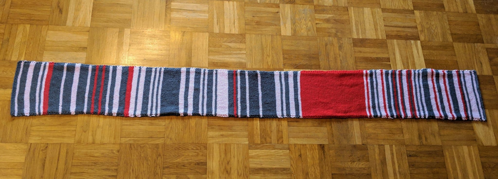

class: middle, title
background-size: contain

<!----- Make a pdf using:

decktape generic --key=ArrowRight --load-pause 1800 --slides '1-27' --size '1216x684' --url-load-timeout 80000 --page-load-timeout 40000 "week-10/slides/smi105-week-10.html" week-10/slides/smi105-week-10.pdf

----->

<br><br>

# Best Practice for Whom?
#### EDC101: Week 10

<br><br>

**Dr. Calum Webb**<br>
Sheffield Methods Institute, the University of Sheffield<br>
[c.j.webb@sheffield.ac.uk](mailto:c.j.webb@sheffield.ac.uk)

```{r setup, include=FALSE}
options(htmltools.dir.version = FALSE)

# These packages are required for creating the slides
# Many will need to be installed from Github
library(icons)
library(tidyverse)
library(xaringan)
library(xaringanExtra)
library(xaringanthemer)

# Defaults for code
knitr::opts_chunk$set(
  fig.width=9, fig.height=3.5, fig.retina=3,
  out.width = "100%",
  cache = FALSE,
  echo = TRUE,
  message = FALSE, 
  warning = FALSE,
  fig.show = TRUE,
  hiline = TRUE
)

# set global theme for ggplot to make background #F8F8F8F8 (off white),
# but otherwise keep all ggplot themes default (better for teaching)
theme_set(
  theme(plot.background = element_rect(fill = "#F8F8F8", colour = "#F8F8F8"), 
        panel.background = element_rect(fill = "#F8F8F8", colour = "#F8F8F8"),
        legend.background = element_rect(fill = "#F8F8F8", colour = "#F8F8F8")
        )
  )

```

```{r xaringan-tile-view, echo=FALSE}
# Use tile overview by hitting the o key when presenting
xaringanExtra::use_tile_view()
```

```{r xaringan-logo, echo=FALSE}
# Add logo to top right
xaringanExtra::use_logo(
  image_url = "header/smi-logo-white.png",
  exclude_class = c("inverse", "hide_logo"), 
  width = "180px", position = css_position(top = "1em", right = "2em")
)
```

```{r xaringan-themer, include=FALSE, warning=FALSE}

# Set some global objects containing the colours
# of the university's branding
primary_color <- "#131E29"
secondary_color <- "#440099"
tuos_blue <- "#9ADBE8"
white = "#F8F8F8"
tuos_yellow <- "#FCF281"
tuos_purple <- "#440099"
tuos_red <- "#E7004C"
tuos_midnight <- "#131E29"

# The bulk of the styling is handled by xaringanthemer
style_uos <- style_duo_accent(
  primary_color = "#131E29",
  secondary_color = "#440099",
  colors = c(tuos_purple = "#440099", 
             grey = "#131E2960", 
             tuos_blue ="#9ADBE8",
             tuos_mint = "#00CE7C",
             ac_yellow = '#FEC740'),
  header_font_google = xaringanthemer::google_font("Source Serif Pro", "600", "600i"),
  text_font_google   = xaringanthemer::google_font("Source Sans Pro", "300", "300i", "600", "600i"),
  code_font_google   = xaringanthemer::google_font("Lucida Console"),
  header_h1_font_size = "2rem",
  header_h2_font_size = "1.5rem", 
  header_h3_font_size = "1.25rem", 
  text_font_size = "0.9rem",
  code_font_size = "0.65rem", 
  code_inline_font_size = "0.85rem",
  inverse_text_color = "#9ADBE8", 
  background_color = "#F8F8F8", 
  text_color = "#131E29", 
  link_color = "#005A8F", 
  inverse_link_color = "#F8F8F8",
  text_slide_number_color = "#44009970",
  table_row_even_background_color = "transparent", 
  table_border_color = "#44009970",
  text_bold_font_weight = 600
)

style_uos

```


```{r xaringan-panelset, echo=FALSE}
# Allow for adding panelsets (see example on slide 2)
xaringanExtra::use_panelset()
```

```{r xaringanExtra, echo = FALSE}
# Adds white progress bar to top
xaringanExtra::use_progress_bar(color = "#F8F8F8", location = "top")
```

```{r xaringan-extra-styles, echo = FALSE}
# Allow for code to be highlighted on hover
xaringanExtra::use_extra_styles(
  hover_code_line = TRUE,         #<<
  mute_unhighlighted_code = TRUE  #<<
)
```

```{r share-again, echo=FALSE}
# Add sharing links and other embedding tools
xaringanExtra::use_share_again()
```

```{r xaringanExtra-search, echo=FALSE}
# Add magnifying glass search function to bottom left for quick
# searching of slides
xaringanExtra::use_search(show_icon = TRUE, auto_search = FALSE)
```

---

class: middle, inverse

# Sign in

---

class: middle

## Learning outcomes

.panelset[

.panel[.panel-name[What will I learn?]

By the end of this week you will know:

* So far we've been talking about best practice in terms of graphic design and coding. This week, we're going to focus specifically on good practice for critically reflecting on **the role that data visualisations play in society**.

* You'll learn some core principles from data feminism and other critical scholarly research so that we can **do better** when we make data visualisations, and **ensure that our data visualisations play a more positive role in society than a negative one**. 

]
]


---

class: middle, inverse

## Both the data used in our data visualisations, and our data visualisations themselves, often use processes that often reinforce and reproduce societal biases.

---

class: middle, inverse

## More critical awareness of those biases and their impact can help us improve our data visualisations to benefit society more equitably.

---

class: middle

.middle-left[


### (Some) Principles of Feminist Data (D'Ignazio & Klein, 2016; D'Ignazio, 2024) and further challenges (Feigenbaum & Alamalhodaei, 2020)

* Rethink binaries & classification
* Embrace pluralism
* Examine power & encourage empowerment
* Consider context
* Legitimise embodiment & affect
* Inclusion, exclusion & accessibility
* Sanitisation & impersonalisation

]

.pull-right[


.center[
```{r, echo = FALSE, out.width = "90%"}


```
]


]

---

class: middle

.middle-left[

### Rethinking binaries and classification

Often for the sake of convenience or simplicity, data collection and data visualisations will use limited numbers of categories and, often **binaries**.

**These often compress and do not fully represent peoples' opinions, identities, or experiences**

Some examples of binaries/limited classification:

* Thumbs up / Thumbs down
* Ethnicity and nationality
* Disability 
* Gender and sexuality


]

.pull-right[

```{r, echo = FALSE, out.height=500, out.width=500, fig.height=5, fig.width=5}

library(plotly)

simple_tibble <- tibble(
  ethnicity = c("White British", "Black British/Black"),
  cpp_rate = c(50, 54)
)

complex_tibble <- tibble(
    ethnicity = c("White British", "Black African", "Black Caribbean", "Black Other"),
    cpp_rate = c(50, 31, 61, 71)
)

cpp_simple <- simple_tibble %>%
  ggplot() +
  geom_col(aes(y = ethnicity, x = cpp_rate, fill = ethnicity), width = 0.8) +
  ylab("") +
  xlab("Rate of Children per 10,000 on Child Protection<br>Plans") +
  theme(legend.position = "none") +
  scale_fill_manual(values = c("#ED4A6D", "#4A87ED"))

ggplotly(cpp_simple, tooltip = NULL)

```


]

---

class: middle

.middle-left[


### Rethinking binaries and classification

Often for the sake of convenience or simplicity, data collection and data visualisations will use limited numbers of categories and, often **binaries**.

**These often compress and do not fully represent peoples' opinions, identities, or experiences**

Some examples of binaries/limited classification:

* Thumbs up / Thumbs down
* Ethnicity and nationality
* Disability 
* Gender and sexuality


]

.pull-right[

```{r, echo = FALSE, out.height=500, out.width=500, fig.height=5, fig.width=5}

cpp_complex <- complex_tibble %>%
  ggplot() +
  geom_col(aes(y = ethnicity, x = cpp_rate, fill = ethnicity), width = 0.8) +
  ylab("") +
  xlab("Rate of Children per 10,000 on Child Protection<br>Plans") +
  theme(legend.position = "none") +
  scale_fill_manual(values = c("#ED4A6D", "#ED784A", "#ED5C4A", "#4A87ED"))

ggplotly(cpp_complex, tooltip = NULL)

```

.small[
.right[
[Based on Bywaters, et al. 2019.](https://www.sciencedirect.com/science/article/abs/pii/S019074091830728X)
]
]

]

---

class: middle

.middle-left[

### Embrace pluralism

When we visualise certain data, **what is it we are actually trying to talk about**, and what other ways might it be considered?

For example, we often use GDP growth when **what we are talking about** is prosperity and quality of life; how else might these concepts be represented and **who benefits most from our emphasis on GDP**?

How can we create ranges of data visualisations that recognise multiple points of view?

]

.pull-right[

```{r, echo = FALSE, out.height=500, out.width=500, fig.height=5, fig.width=5}

library(readxl)

whr <- read_excel("data/world-happiness-report.xls")

whr %>%
  filter(`Country name` %in% c("United States", "Finland")) %>%
  ggplot() +
  aes(x = year, y = exp(`Log GDP per capita`)/1000, colour = `Country name`) +
  geom_line(linewidth = 1.5) +
  scale_y_continuous(labels = scales::dollar_format(prefix = "USD$", suffix = "k")) +
  labs(colour = "Country") +
  theme(legend.position = "bottom") +
  ylab("GDP per Capita") +
  xlab("") +
  scale_colour_manual(values = c("#002F6C", "#B31942")) 


```


.small[
.right[
[Helliwell, et al. (2024). World Happiness Report 2024.](https://worldhappiness.report/data/)
]
]


]

---

class: middle

.middle-left[

### Embrace pluralism

When we visualise certain data, **what is it we are actually trying to talk about**, and what other ways might it be considered?

For example, we often use GDP growth when **what we are talking about** is prosperity and quality of life; how else might these concepts be represented and **who benefits most from our emphasis on GDP**?

How can we create ranges of data visualisations that recognise multiple points of view?

]

.pull-right[

```{r, echo = FALSE}


```


]


---

class: middle

.middle-left[

### Embrace pluralism

When we visualise certain data, **what is it we are actually trying to talk about**, and what other ways might it be considered?

For example, we often use GDP growth when **what we are talking about** is prosperity and quality of life; how else might these concepts be represented and **who benefits most from our emphasis on GDP**?

How can we create ranges of data visualisations that recognise multiple points of view?

]

.pull-right[

```{r, echo = FALSE, out.height=500, out.width=500, fig.height=5, fig.width=5}

whr_sm <- whr %>%
  mutate(`Log GDP per capita` = exp(`Log GDP per capita`)/1000) %>%
  select(
    `Country name`, year, `Log GDP per capita`, `Social support`, `Healthy life expectancy at birth`,
    `Freedom to make life choices`
  ) %>%
  pivot_longer(c(-`Country name`, -year),
               names_to = "measure",
               values_to = "value"
               ) %>%
  filter(`Country name` %in% c("United States", "Finland")) %>%
  mutate(
    measure = factor(measure, levels = c("Log GDP per capita",
                                         "Social support",
                                         "Healthy life expectancy at birth",
                                         "Freedom to make life choices"))
  )

whr_sm %>%
  ggplot() +
  aes(x = year, y = value, colour = `Country name`) +
  geom_line(linewidth = 1.5) +
  facet_wrap(~measure, scales = "free") +
  scale_y_continuous() +
  labs(colour = "Country") +
  theme(legend.position = "bottom") +
  ylab("") +
  xlab("") +
  scale_colour_manual(values = c("#002F6C", "#B31942")) 


```


.small[
.right[
[Helliwell, et al. (2024). World Happiness Report 2024.](https://worldhappiness.report/data/)
]
]


]


---

class: middle

.middle-left[

### Embrace pluralism

When we visualise certain data, **what is it we are actually trying to talk about**, and what other ways might it be considered?

For example, we often use GDP growth when **what we are talking about** is prosperity and quality of life; how else might these concepts be represented and **who benefits most from our emphasis on GDP**?

How can we create ranges of data visualisations that recognise multiple points of view?

]

.pull-right[

```{r, echo = FALSE}


```


]


---

class: middle

.middle-left[

### Examine power & encourage empowerment

Do your data visualisations, or the data visualisations of others, consider **which groups in society might be most effected by the topic being visualised**? 

In what ways are you trying to make your data visualisations a tool that *they* can use to challenge unjust outcomes and experiences?

* **Are your data visualisations accessible**: do they clearly tell a story? Is technical language explained? Are they likely to attract the engagement of those groups most affected? Are they accessible to the groups most affected (especially in terms of publication method)?
* Is there a **call to action**? What can people do to create a change when something there is a problem in society that you have visualised?
* Are people being **included** in the process of creating and critiquing a data visualisation, or in the process of collecting data? How could they be included (e.g. through participatory methods)?


]

.pull-right[

```{r, echo = FALSE, out.height=500, out.width=500, fig.height=5, fig.width=5}

cpr_1 <- tibble(
  cpr = c("Received CPR", "Did not\nreceive CPR"),
  percent = c(71.0, 29.0)
)

# Compute percentages
cpr_1$fraction = cpr_1$percent / sum(cpr_1$percent)

# Compute the cumulative percentages (top of each rectangle)
cpr_1$ymax = cumsum(cpr_1$fraction)

# Compute the bottom of each rectangle
cpr_1$ymin = c(0, head(cpr_1$ymax, n=-1))
 
# Compute label position
cpr_1$labelPosition <- (cpr_1$ymax + cpr_1$ymin) / 2

# Compute a good label
cpr_1$label <- paste0(cpr_1$cpr, "\n", cpr_1$percent, "%")


ggplot(cpr_1, aes(ymax=ymax, ymin=ymin, xmax=4, xmin=3, fill=cpr)) +
     geom_rect() +
     geom_text( x=2, aes(y=labelPosition, label=label, color=cpr), size=3) +
      scale_fill_brewer(palette = "Set1") +
      scale_color_brewer(palette = "Set1") +
     coord_polar(theta="y") + # Try to remove that to understand how the chart is built initially
     xlim(c(-1, 4)) +
  theme_void() +
  theme(legend.position = "none",
        plot.background = element_rect(fill = white, colour = white))

```


.small[
.right[
[Munot, et al. (2024). Bystander cardiopulmonary resuscitation differences by sex.](https://www.resuscitationjournal.com/article/S0300-9572%2824%2900117-5/fulltext)
]
]


]


---

class: middle

.middle-left[

### Examine power & encourage empowerment

Do your data visualisations, or the data visualisations of others, consider **which groups in society might be most effected by the topic being visualised**? 

In what ways are you trying to make your data visualisations a tool that *they* can use to challenge unjust outcomes and experiences?

* **Are your data visualisations accessible**: do they clearly tell a story? Is technical language explained? Are they likely to attract the engagement of those groups most affected? Are they accessible to the groups most affected (especially in terms of publication method)?
* Is there a **call to action**? What can people do to create a change when something there is a problem in society that you have visualised?
* Are people being **included** in the process of creating and critiquing a data visualisation, or in the process of collecting data? How could they be included (e.g. through participatory methods)?


]

.pull-right[

```{r, echo = FALSE, out.height=500, out.width=500, fig.height=5, fig.width=5}

cpr_1 <- tibble(
  cpr = c("Received CPR", "Did not\nreceive CPR", "Received CPR", "Did not\nreceive CPR"),
  sex = c("Male", "Male", "Female", "Female"),
  percent = c(73.7, 100-73.7, 64.6, 100-64.6)
)

cpr_1 %>%
  mutate(
    sex = factor(sex, levels = c("Male", "Female"))
  ) %>%
  ggplot() +
     geom_col(aes(y = sex, fill = cpr, x = percent)) +
      annotate("text", y = -0, x = 0, label = "Men", size = 3) +
      annotate("text", y = 3, x = 0, label = "Women", size = 3) +
      scale_y_discrete(expand = c(3, -1)) +
      scale_fill_brewer(palette = "Set1") +
      scale_color_brewer(palette = "Set1") +
      coord_polar() +
  theme_void() +
  theme(legend.position = "none",
        plot.background = element_rect(fill = white, colour = white))

```


.small[
.right[
[Munot, et al. (2024). Bystander cardiopulmonary resuscitation differences by sex.](https://www.resuscitationjournal.com/article/S0300-9572%2824%2900117-5/fulltext)
]
]


]

---

class: middle

.middle-left[

### Consider context

What is the context in which data is generated, and **how would better engagement with the people who the data represents change our understanding of the data being generated** and what matters to them?

For what reason is the data collected, why are some types of data not collected, and who does that benefit or disadvantage?

Could we do the following:

* Work together with the people who the data is about to find out what things matter to them and how they should be measured and visualised?
* Consider the complexity of the data that *is* collected: e.g. when a child is truant from school, do we assume that this is misbehaviour/bad parenting and ignore that it might be related to factors such as having to care for relatives, avoiding bullying, or social anxiety?


]

.pull-right[

```{r, echo = FALSE, out.height=500, out.width=500, fig.height=5, fig.width=5}

set.seed(10)
truancy <- tibble(
  year = seq(2009, 2024, 1),
  truancy = rnorm(16, 6, 0.5)
  ) %>%
  mutate(
    `Caring for relatives` = 0.2*truancy,
    `Avoiding bullying` = 0.6*truancy,
    `Social anxiety` = 0.2*truancy
  )

truancy %>%
  ggplot() +
  geom_line(aes(x = year, y = truancy), linewidth = 1.5) +
  scale_y_continuous(limits = c(0, 10)) +
  xlab("") +
  ylab("Average number of days truant") +
  ggtitle("The average child misses 6 school days per year")


```


]

---

class: middle

.middle-left[

### Consider context

What is the context in which data is generated, and **how would better engagement with the people who the data represents change our understanding of the data being generated** and what matters to them?

For what reason is the data collected, why are some types of data not collected, and who does that benefit or disadvantage?

Could we do the following:

* Work together with the people who the data is about to find out what things matter to them and how they should be measured and visualised?
* Consider the complexity of the data that *is* collected: e.g. when a child is truant from school, do we assume that this is misbehaviour/bad parenting and ignore that it might be related to factors such as having to care for relatives, avoiding bullying, or social anxiety?


]

.pull-right[

```{r, echo = FALSE, out.height=500, out.width=500, fig.height=5, fig.width=5}


truancy %>%
  pivot_longer(cols = c(`Caring for relatives`:`Social anxiety`)) %>%
  ggplot() +
  geom_line(aes(x = year, y = truancy), linewidth = 1.5) +
  geom_area(aes(x = year, y = value, fill = name)) +
  scale_y_continuous(limits = c(0, 10)) +
  scale_fill_brewer(palette = "Set2") +
  xlab("") +
  ylab("Average number of days truant") +
  ggtitle("The average child misses 6 school days per year", 
          subtitle = "How do we help them feel welcomed and supported?") +
  labs(fill = "Why?") +
  theme(legend.position = "bottom")


```


]


---

class: middle

.middle-left[

### Legitimise embodiment and affect

**Don't be a data visualisation snob**.

The principles and practice of data visualisation can be applied to many different materialities that draw upon individual peoples' skills and strengths. 

Data visualisation is often a rapid, fast process of creating and publishing data visualisations — that may be good for some things, but as part of the way that data and data visualisation fits within our daily lives, "slow" forms of data science and analysis can also help is "**reflect on everyday events that happen all around us**" ([Schoof, 2022](https://datasciencebydesign.org/blog/the-future-of-data-science-includes-slow-data-science))

These types of "**data visceralisations**" can also cause people who might otherwise not be engaged with data visualisations to **feel** engaged and curious about what they represent. 


]

.pull-right[

> This graph shows the length of daily delays on one woman’s 40-minute commute between Munich and a town in the German countryside during 2018... <br><br> The commuter knitted two rows each day. Gray for delays under five minutes, pink for up to 30 minutes, and red for a delay of more than a half-hour or delays in both directions.

```{r, echo = FALSE}



```


.small[
.right[
[New York Times (2019). What’s Going On in This Graph? | Feb. 27, 2019](https://www.nytimes.com/2019/02/21/learning/whats-going-on-in-this-graph-feb-27-2019.html)
]
]


]


---

class: middle

.middle-left[

### Legitimise embodiment and affect

**Don't be a data visualisation snob**.

The principles and practice of data visualisation can be applied to many different materialities that draw upon individual peoples' skills and strengths. 

Data visualisation is often a rapid, fast process of creating and publishing data visualisations — that may be good for some things, but as part of the way that data and data visualisation fits within our daily lives, "slow" forms of data science and analysis can also help is "**reflect on everyday events that happen all around us**" ([Schoof, 2022](https://datasciencebydesign.org/blog/the-future-of-data-science-includes-slow-data-science))

These types of "**data visceralisations**" can also cause people who might otherwise not be engaged with data visualisations to **feel** engaged and curious about what they represent. 

]

.pull-right[

> Just 158 families have provided nearly half of the early money for efforts to capture the White House. 

```{r, echo = FALSE}


```


.small[
.right[
[New York Times (Oct. 10, 2015). Buying Power](https://www.nytimes.com/interactive/2015/10/11/us/politics/2016-presidential-election-super-pac-donors.html?mtrref=www.google.com&assetType=REGIWALL&mtrref=undefined&gwh=092CFD934F2939747834F4BA0B6A5FCB&gwt=pay&assetType=REGIWALL)
]
]


]


---

class: middle

.middle-left[

### Legitimise embodiment and affect

**Don't be a data visualisation snob**.

The principles and practice of data visualisation can be applied to many different materialities that draw upon individual peoples' skills and strengths. 

Data visualisation is often a rapid, fast process of creating and publishing data visualisations — that may be good for some things, but as part of the way that data and data visualisation fits within our daily lives, "slow" forms of data science and analysis can also help is "**reflect on everyday events that happen all around us**" ([Schoof, 2022](https://datasciencebydesign.org/blog/the-future-of-data-science-includes-slow-data-science))

These types of "**data visceralisations**" can also cause people who might otherwise not be engaged with data visualisations to **feel** engaged and curious about what they represent. 

]

.pull-right[

> This group of students in my class decided to experiment with flavor as a way to represent air quality data. ... To surprise the audience they invite participants to taste different brownies but didn’t telling them that the amount of salt had been increased based on how much pollution in the air there is in different cities. 

```{r, echo = FALSE}


```


.small[
.right[
[Rahul Bhargava, MIT Media Lab (2019). Thoughts On Designing Data Sculptures](https://civic.mit.edu/index.html%3Fp=2555.html)
]
]


]


---

class: middle

.middle-left[

### Inclusion, exclusion & accessibility

What don't you need to make data visualisations and tell stories using data?

**You don't need to be a statistician, computer scientist, a graphic designer, or to have a lot of money to make data visualisations.**

**You are all proof of this.**

* R is free
* RStudio is free
* All of the data we have been visualising is free
* Many of the books we have been using (e.g. [Healy, 2018](https://socviz.co), [Wickham, et al., 2023](https://r4ds.hadley.nz)) have free versions online.


]

--

.pull-right[

What **do** you need to make data visualisations and tell stories using data?

* A story that you want to tell.
* A willingness to learn how to create.
* A commitment to representing data in an accessible, fair, way.
* The empathy to put yourselves into the shoes of your audience.

<br><br><br><br>

]

---

class: middle

.middle-left[

### Sanitisation & impersonalisation

The process of data collection, analysis and visualisation often **divorces the data subjects from their data**. Data become sterilised: we often lose any sense of identity, personality, or emotion from the "data subjects" — a.k.a. the people who the data is about.

This means that typical *best practice* approaches to data visualisations often make it **difficult or impossible to develop empathy for the people whom it is about** — removing us from the positionalities of the subjects ([Kennedy, et al. 2016](https://doi.org/10.1080/1369118X.2016.1153126)). Data depersonalises individuals.

Lack of incorporation of voice and identity invites us to project our own, or dominant, narratives about the people concerned. Interactivity is one (limited) way to incorporate voice into visualisation.

]


.pull-right[


```{r, echo = FALSE, out.height=500, out.width=500, fig.height=5, fig.width=5}

library(sf)
migration_dat <- read_rds("data/migration_incidents_spatialdata.rds")

migration_dat <- migration_dat %>%
  filter(region_of_incident == "Europe")

migration_dat <- migration_dat %>%
  filter(incident_year == 2023)

migration_dat <- migration_dat %>%
  filter(migration_route == "English Channel to the UK")

# drop any rows with missing coordinates and then
# create a spatial dataset using the longitude and latitude
# columns
migration_dat <- migration_dat %>%
  ungroup() %>%
  drop_na(coordinates) %>%
  st_as_sf(coords = c("longitude", "latitude")) %>%
  st_set_crs(4326) # sets the coordinate reference system

# re-create the longitude and latitude columns in case they are needed for
# anything else (e.g. filtering)
migration_dat <- migration_dat %>%
  mutate(
    latitude  = parse_number(str_split(coordinates, ",", simplify = TRUE)[,1]),
    longitude = parse_number(str_split(coordinates, ",", simplify = TRUE)[,2])
  ) 

library(rnaturalearth)

wm <- ne_countries(scale = "medium", returnclass = 'sf')
wm <- st_set_crs(wm, 4326)

#st_bbox(migration_dat)
wm_crop <- st_crop(wm, c(xmin = 1.580050-2, ymin = 50.462936-1,
                    xmax = 2.225489+1, ymax = 51.0570260+1))

migration_dat2 <- migration_dat

mplot <- ggplot() +
  geom_sf(data = wm_crop, fill = "#1C455C", colour = white) +
  geom_sf(data = migration_dat2, size = 4, colour = white) +
  geom_sf(data = migration_dat, size = 2, colour = "#DF266C", aes(text = "")) +
  theme_void() +
  theme(plot.background = element_rect(fill = "black", colour = "black"),
        title = element_text(colour = white)) +
  ggtitle(
    "  Thirteen people were reported as having died trying<br>to cross the English channel in 2023."
  )

ggplotly(mplot, tooltip = "text") %>% 
layout(plot_bgcolor='rgb(0, 0, 0)') %>% 
  layout(
    margin = list(l = 20, t = 120, r = 20, b = 10)
  )

```


.small[
.right[
Data on incidents from [The Missing Migrants Project](https://missingmigrants.iom.int/downloads)
]
]

]


---

class: middle

.middle-left[

### Sanitisation & impersonalisation

The process of data collection, analysis and visualisation often **divorces the data subjects from their data**. Data become sterilised: we often lose any sense of identity, personality, or emotion from the "data subjects" — a.k.a. the people who the data is about.

This means that typical *best practice* approaches to data visualisations often make it **difficult or impossible to develop empathy for the people whom it is about** — removing us from the positionalities of the subjects ([Kennedy, et al. 2016](https://doi.org/10.1080/1369118X.2016.1153126)). Data depersonalises individuals.

Lack of incorporation of voice and identity invites us to project our own, or dominant, narratives about the people concerned. Interactivity is one (limited) way to incorporate voice into visualisation.

]


.pull-right[


```{r, echo = FALSE, out.height=475, out.width=500, fig.height=4.75, fig.width=5}

# https://www.itv.com/news/meridian/2022-10-04/asylum-seeker-thought-he-was-going-to-die-crossing-english-channel
# https://www.bigissue.com/opinion/afghanistan-refugee-channel-crossing-small-boat-uk-asylum/
# https://www.migrantvoice.org/home/editorials/channel-crossings-what-about-the-261121141118
# https://www.migrantvoice.org/articles/a-year-ago-i-crossed-241122110021 
# https://thevoicesnetwork.org/reports/

voices <- c("It has to be better than here.",
            "People who come here are looking to you as their last chance – they hope you respect humanity.",
            "...if there was no war, no Taliban, we would never come here.",
            "If I wanted to go back to my country - what would be waiting for me? A cruel government, and their welcome would be bullets.",
            "I have no other option. My husband is in UK, and I’ve been in a refugee camp for a long time. I can’t survive without him. I need to join him.",
            "I have family members in the UK who could support me once I arrived: far from home and unable to return, I wouldn’t be all alone.",
            "I had a profession, a community, a good life, an identity, I had everything. I am here not by choice.",
            "We are treated like we don't matter and that hurts. Nobody plans to leave their home countries to seek asylum. Our situations are not in our control, but we get blamed and scorned for seeking safety. We thrive in our communities if given the chance.")

voices <- str_wrap(voices, 50)
migration_dat$voices <- voices


mplot <- ggplot() +
  geom_sf(data = wm_crop, fill = "#1C455C", colour = white) +
  geom_sf(data = migration_dat, size = 4, colour = white) +
  geom_sf(data = migration_dat, size = 2, colour = "#DF266C",
          aes(text = voices)) +
  theme_void() +
  theme(plot.background = element_rect(fill = "black", colour = "black"),
        title = element_text(colour = white)) +
  ggtitle(
    "  Thirteen people were reported as having died trying<br>to cross the English channel in 2023."
  )

ggplotly(mplot, tooltip = "text") %>% 
layout(plot_bgcolor='rgb(0, 0, 0)') %>% 
  layout(
    margin = list(l = 20, t = 100, r = 20, b = 10)
  )

```


.small[
.right[
Data on incidents from [The Missing Migrants Project](https://missingmigrants.iom.int/downloads), overlayed with quotes from migrants and refugees sourced from [ITV.com](https://www.itv.com/news/meridian/2022-10-04/asylum-seeker-thought-he-was-going-to-die-crossing-english-channel), [Big Issue](https://www.bigissue.com/opinion/afghanistan-refugee-channel-crossing-small-boat-uk-asylum/), [Migrant Voice](https://www.migrantvoice.org/home/editorials/channel-crossings-what-about-the-261121141118), [The Voices Network](https://thevoicesnetwork.org/reports/), [Ordinary Things](https://www.youtube.com/watch?v=nlncZp1iJks)
]
]

]

---

class: middle, inverse


## It's impossible to make a perfect data visualisation. But thinking about these things can help us *do better*. 

---

class: middle, inverse


## Best practice is not just about good design principles, but being a good and conscientious member of society. That means paying due respect to all of the people who are affected by data visualisation.


---


class: middle

.middle-left[

## Workshop this week

This week — our last workshop where we'll be learning something new — I promised you a novel approach to data visualisation. We'll be learning how to scrape data from the internet — **without getting into trouble** — and how to create interactive data visualisations using the `plotly` package. 


]


.pull-right[

#### TASKS TO LOOK AT IN ADVANCE OF WEEK 11:

**Core tasks:**

* **Before lecture**: Read the assessment brief for assessment 2, including any articles you might be asked to critique. This will mean that you can come prepared for week 11. (I’m not expecting as much from you this week, as I know you've got imminent deadlines.)

]


